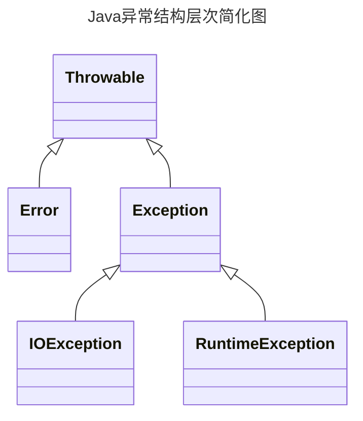

# 7.1 处理错误

Java允许每个方法有一个候选的退出路径，如果这个方法不能以正常的方式完成它的任务，就会选择这个退出路径。在这种情况下，方法不会返回一个值，而是抛出(throw)一个封装了错误信息的对象。需要注意的是，这个方法会立刻退出，并不返回正常值(或任何值)。此外，也不会从调用这个方法的代码继续执行，取而代之的是，异常处理机制开始搜索一个能够处理这种异常状况的异常处理器(excepinbandler)异常有自己的语法和一个特殊的继承层次结构。

## 7.1.1 异常分类



1. **检查型错误（Checked Exceptions）**：这些是在编译时期就会被检查的错误，这类异常难以避免，如果你的代码抛出了检查型异常，那么你必须处理这个异常，否则代码无法编译通过。例如，IOException、SQLException等都是检查型异常。

   例如：一个读取文件的方法代码逻辑没有错误，但程序运行时可能会因为文件找不到而抛出FileNotFoundException，如果不处理这些异常，程序将来肯定会出错。所以编译器会提示你要去捕获并处理这种可能发生的异常，不处理就不能通过编译。

2. **非检查型错误（Unchecked Exceptions）**：派生于`Error`类或`RuntimeException`的是`非检查型错误`这些是在运行时期才会被检查的错误，你的代码可以不处理这种异常，代码仍然可以编译通过。这种异常通常是由编程错误引起的，例如，NullPointerException、ArrayIndexOutOfBoundsException等。

   例如：你的程序逻辑本身有问题，比如数组越界、访问null对象，这种错误你自己是可以避免的。编译器不会强制你检查这种异常。

   常见的NullPointException，ClassCastException是常见的非检查型异常。

> 如果出现RuntimeException异常,那么一定是你的问题

Java语言规范将派生于`Error`类或`RuntimeException`类的所有异常称为`非检查型异常`，其他异常称为`检查型异常`

> 编译器将会检查你是否为所有的检查型异常提供了异常处理器

## 7.1.2 声明检查型错误

在以下四种情况下会抛出异常:

1. 调用一个抛出检查型异常的方法，例如FileInputStream构造器
2. 检查到一个错误，并利用throw语句抛出一个检查型异常
3. 程序出现错误，例如a[-1]=0会抛出一个非检查型异常
4. Java虚拟机或运行库内出现内部错误

如果出现前两种情况，则必须告诉使用这个方法的程序员会抛出可能抛出异常，如果没有处理器捕获这个异常，当前执行线程就会终止。

一个方法必须声明所有可能抛出的检查型异常，而非检查型异常要么在你控制之外`(Error)`，要么是由一开始就应该避免的情况导致的`(RuntimeException)`

```java
class MyAnimation{
    public Image loadImage(String s) throws IOException{
        ...
    }
}
```

## 7.1.3 抛出异常

如果有一个合适的异常类能够满足你的要求，抛出这个异常需要三步

1. 找到一个合适的异常类
2. 创建这个类的一个对象
3. 将对象抛出

```java
public static void main(String[] args) throws Exception {
    throw new Exception("抛出异常");
}
```

## 7.1.4 创建异常

当代码遇到任何标准类异常都无法描述清楚的问题，这种情况下创建自己的异常类就是顺理成章的事了

```java
public static void main(String[] args) throws Exception {
    class WwhException extends Exception {
        public WwhException(String message) {
            super(message);
        }
    }
    var exception = new WwhException("自定义异常");
    throw exception;
}
```

# 7.2 捕获异常

## 7.2.1 捕获异常概述

如果try语句块中的任何代码抛出了catch子句中指定的一个异常类，那么

1. 程序将跳过try语句块中的其余代码
2. 程序将执行catch子句中的处理器代码

如下是try/catch的格式

```java
public static void main(String[] args) {
    try {
        throw new Exception("抛出异常");
    } catch (Exception e) {
        e.printStackTrace();
    }
}
```

不过，通常可以选择直接抛出异常

让调用者处理异常

一般来说，去捕获你所知道并能处理的异常，并抛出你所无法处理的异常是最正确的

## 7.2.2 捕获多个异常

可以为每个异常单独使用一个catch

```java
try {
    int a = 1 / 0;
} catch (ArithmeticException e) {
    System.out.println("除数不能为0");
} catch (Exception e) {
    System.out.println("其他异常");
}
```

要想获得这个对象的更多信息可以使用

> e.getMessage()

获得错误具体类型可以用

> e.getClass().getName()

若两种异常的动作相同则可以合并catch子句:

```java
try {
    int a = 1 / 0;
} catch (Exception e | ArithmeticException e) {
    System.out.println("有异常");
}
```

## 7.2.3 再次抛出异常与异常链

```java
public static void main(String[] args) {
    try {
        int a = 1 / 0;
    } catch (ArithmeticException e) {
        throw new ArithmeticException("除数不能为0");
    } 
}
```

当异常发生时,我们不处理而选择抛出

这里的错误提供了异常的消息文本

不过还有一种更好的想法，可以把原始异常设置为新异常的`原因`

```java
public static void main(String[] args) throws Exception {
    try {
        int a = 1 / 0;
    } catch (ArithmeticException original) {
        var e = new Exception("除数不能为0");
        e.initCause(original);
        throw e;
    }
}
```

当在调用者处捕获到这个异常时

可以用下面这条语句获取原始异常

> Throwable original = caughtException.getCause();

强烈建议使用这种包装技术，可以在子系统抛出高层异常而不丢失原始异常信息

## 7.2.4 finally子句

finally子句中的语句无论如何都会被执行，可以用来关闭一些输入输出流

```java
public static void main(String[] args) throws Exception {
    FileInputStream file = new FileInputStream("a.txt");
    try {
        file.read();
    } catch (Exception e) {
        e.printStackTrace();
    } finally {
        System.out.println("finally");
        file.close();
    }
}
```

## 7.2.5 try-with-Resource语句

```java
public static void main(String[] args) throws Exception {
    try(var in = new FileInputStream("test.txt")) {
        int ch;
        while ( (ch = in.read()) != -1 ) {
            System.out.println((char) ch);
        }
    }
}
```

当这个块正常退出或存在一个异常时都会调用`in.close()`方法，就好像使用了finally一样

## 7.2.6 分析栈轨迹元素

栈轨迹（Stack Trace）是一个非常有用的调试工具，它提供了程序执行的历史记录。当程序抛出异常时，Java虚拟机（JVM）会产生一个栈轨迹，它记录了方法调用的顺序。这个顺序从方法开始（在栈的顶部）到方法结束（在栈的底部）。  栈轨迹包含了方法调用的详细信息，包括方法名、所在的类名、文件名以及代码行号。这些信息可以帮助开发者找到并解决问题。

在Java中，你可以使用Throwable类的printStackTrace方法来打印异常的栈轨迹。例如：

```java
var t = new Throwable();
var out = new StringWriter();
t.printStackTrace();
```

更灵活的方式是使用StackWalker类，它会生成一个StackWalker.StackFrame示例流，其中每个实例分别描述一个栈帧

其中包含正在执行的代码行的文件名和行号，以及类对象和方法名

以下代码打印了递归斐波那契数列的栈轨迹

```java
public class 递归斐波那契数列栈轨迹 {
    public static void main(String[] args) {
        try(var in = new Scanner(System.in)) {
            System.out.println("Enter n: ");
            int n = in.nextInt();
            int f = fibonacci(n);
        }
    }

    public static int fibonacci(int n) {
        System.out.println("factorial(" + n + "):");
        var walker = StackWalker.getInstance();
        walker.forEach(System.out::println);
        int r;
        if (n <= 1) {
            r = 1;
        } else {
            r = fibonacci(n - 1) + fibonacci(n - 2);
            System.out.println("return " + r);
        }
        return r;
    }
}
```

打印内容如下:

```java
Enter n: 
3
factorial(3):
Chapter_7.递归斐波那契数列栈轨迹.fibonacci(递归斐波那契数列栈轨迹.java:24)
Chapter_7.递归斐波那契数列栈轨迹.main(递归斐波那契数列栈轨迹.java:17)
factorial(2):
Chapter_7.递归斐波那契数列栈轨迹.fibonacci(递归斐波那契数列栈轨迹.java:24)
Chapter_7.递归斐波那契数列栈轨迹.fibonacci(递归斐波那契数列栈轨迹.java:29)
Chapter_7.递归斐波那契数列栈轨迹.main(递归斐波那契数列栈轨迹.java:17)
factorial(1):
Chapter_7.递归斐波那契数列栈轨迹.fibonacci(递归斐波那契数列栈轨迹.java:24)
Chapter_7.递归斐波那契数列栈轨迹.fibonacci(递归斐波那契数列栈轨迹.java:29)
Chapter_7.递归斐波那契数列栈轨迹.fibonacci(递归斐波那契数列栈轨迹.java:29)
Chapter_7.递归斐波那契数列栈轨迹.main(递归斐波那契数列栈轨迹.java:17)
factorial(0):
Chapter_7.递归斐波那契数列栈轨迹.fibonacci(递归斐波那契数列栈轨迹.java:24)
Chapter_7.递归斐波那契数列栈轨迹.fibonacci(递归斐波那契数列栈轨迹.java:29)
Chapter_7.递归斐波那契数列栈轨迹.fibonacci(递归斐波那契数列栈轨迹.java:29)
Chapter_7.递归斐波那契数列栈轨迹.main(递归斐波那契数列栈轨迹.java:17)
return 2
factorial(1):
Chapter_7.递归斐波那契数列栈轨迹.fibonacci(递归斐波那契数列栈轨迹.java:24)
Chapter_7.递归斐波那契数列栈轨迹.fibonacci(递归斐波那契数列栈轨迹.java:29)
Chapter_7.递归斐波那契数列栈轨迹.main(递归斐波那契数列栈轨迹.java:17)
return 3
```

# 7.3 使用异常的技巧

1. **异常处理不能代替简单的测试**

若我们有一个空栈，我们尝试将其弹出10000000次

我们有两种做法

```java
public class 异常使用的技巧 {
    public static void main(String[] args) {
        LocalDateTime start = LocalDateTime.now();
        TryPopWithException();
        LocalDateTime end = LocalDateTime.now();
        System.out.println("TryPopWithOutException: " + ChronoUnit.MILLIS.between(start, end));
    }

    //查看栈是否为空
    public static void TryPopWithOutException() {
        Stack<Integer> stack = new Stack<>();
        for ( int i = 0; i < 10000000; i++ ) {
            if(!stack.isEmpty()) {
                stack.pop();
            }
        }
    }
    //捕获异常
    public static void TryPopWithException() {
        Stack<Integer> stack = new Stack<>();
        for ( int i = 0; i < 10000000; i++ ) {
            try{
                stack.pop();
            } catch (Exception e) {
                // do nothing
            }
        }
    }
}
```

查看栈是否为空仅用50ms而捕获异常方式使用了4517ms，相差90倍

所以使用异常的基本规则是:只在必要时使用异常

2. **不要过分细化异常**

对于一段可能发生错误的代码，应该使用如下形式

将可能出错的部分包裹在try块内，根据可能出现的异常写出对应的catch块来进行处理

```java
public static void main(String[] args) throws FileNotFoundException {
    FileOutputStream fileOutputStream = new FileOutputStream("test.txt");
    Stack<Integer> stack = new Stack<>();
    try{
        for ( int i = 0; i < 10000000; i++ ) {
            var n = stack.pop();
            fileOutputStream.write(n);

        }
    } catch (IOException e) {
        throw new RuntimeException(e);
    } catch (EmptyStackException e){
        throw new RuntimeException(e);
    }
}
```

3. **合理利用异常层次结构**

不要只抛出RuntimeException异常，应该找合适的子类或创建你自己的异常类

不要只捕获Throwable异常，否则会降低代码可读性

检查型异常通常开销较大，不要为逻辑错误抛出这类异常

如果能将某类异常转换为更适合的异常，请不要犹豫

4. **不要压制异常**

在 Java 中，往往强烈地倾向关闭异常。如果编写了一个调用另一个方法的方法，而这个方法有可能 100 年才抛出一个异常， 那么， 编译器会因为没有将这个异常列在 throws 表中产生抱怨。而没有将这个异常列在 throws 表中主要出于编译器将会对所有调用这个方法的方法进行异常处理的考虑。因此，应该将这个异常关闭：

复制代码

```java
public Image loadImage(String s) {
    try
    { 
        // code that threatens to throw checked exceptions
    }
    catch (Exception e) {

    } // so there
}
```

5. **在检查到错误时,"苛责"比放任更好**

在出错的地方尽量抛出异常，以防止在调用这个方法后在其他地方产生异常

比如空栈时弹出应该抛出空栈异常而不是自己设定返回值，有可能会导致空指针异常

6. **不要羞于传递异常**

很多时候异常并非程序员可以处理，比如FileInputStream相关异常，此时不要尝试自己捕获，请将其抛出

7. **使用标准方法报告Null指针和越界异常**

```java
public void putData(int position,Object newValue){
    Objects.checkIndex(position, data.length);
	Objects.requireNonNull(newValue);
}
```

Objects类有很多类似的工具类，这种时候请用Java库来抛出异常

8. **不要向用户展示栈轨迹**

这会让程序不安全，会暴露你的库的版本，调用的方法等


