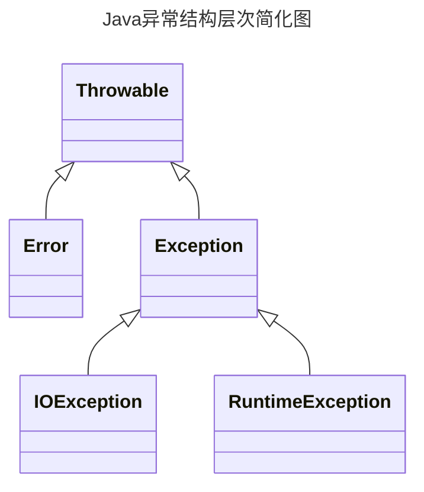

# 7.1 处理错误

Java允许每个方法有一个候选的退出路径，如果这个方法不能以正常的方式完成它的任务，就会选择这个退出路径。在这种情况下，方法不会返回一个值，而是抛出(throw)一个封装了错误信息的对象。需要注意的是，这个方法会立刻退出，并不返回正常值(或任何值)。此外，也不会从调用这个方法的代码继续执行，取而代之的是，异常处理机制开始搜索一个能够处理这种异常状况的异常处理器(excepinbandler)异常有自己的语法和一个特殊的继承层次结构。

## 7.1.1 异常分类



1. **检查型错误（Checked Exceptions）**：这些是在编译时期就会被检查的错误，这类异常难以避免，如果你的代码抛出了检查型异常，那么你必须处理这个异常，否则代码无法编译通过。例如，IOException、SQLException等都是检查型异常。

   例如：一个读取文件的方法代码逻辑没有错误，但程序运行时可能会因为文件找不到而抛出FileNotFoundException，如果不处理这些异常，程序将来肯定会出错。所以编译器会提示你要去捕获并处理这种可能发生的异常，不处理就不能通过编译。

2. **非检查型错误（Unchecked Exceptions）**：派生于`Error`类或`RuntimeException`的是`非检查型错误`这些是在运行时期才会被检查的错误，你的代码可以不处理这种异常，代码仍然可以编译通过。这种异常通常是由编程错误引起的，例如，NullPointerException、ArrayIndexOutOfBoundsException等。

   例如：你的程序逻辑本身有问题，比如数组越界、访问null对象，这种错误你自己是可以避免的。编译器不会强制你检查这种异常。

   常见的NullPointException，ClassCastException是常见的非检查型异常。

> 如果出现RuntimeException异常,那么一定是你的问题

Java语言规范将派生于`Error`类或`RuntimeException`类的所有异常称为`非检查型异常`，其他异常称为`检查型异常`

> 编译器将会检查你是否为所有的检查型异常提供了异常处理器

## 7.1.2 声明检查型错误

在以下四种情况下会抛出异常:

1. 调用一个抛出检查型异常的方法，例如FileInputStream构造器
2. 检查到一个错误，并利用throw语句抛出一个检查型异常
3. 程序出现错误，例如a[-1]=0会抛出一个非检查型异常
4. Java虚拟机或运行库内出现内部错误

如果出现前两种情况，则必须告诉使用这个方法的程序员会抛出可能抛出异常，如果没有处理器捕获这个异常，当前执行线程就会终止。

一个方法必须声明所有可能抛出的检查型异常，而非检查型异常要么在你控制之外`(Error)`，要么是由一开始就应该避免的情况导致的`(RuntimeException)`

```java
class MyAnimation{
    public Image loadImage(String s) throws IOException{
        ...
    }
}
```

## 7.1.3 抛出异常

如果有一个合适的异常类能够满足你的要求，抛出这个异常需要三步

1. 找到一个合适的异常类
2. 创建这个类的一个对象
3. 将对象抛出

```java
public static void main(String[] args) throws Exception {
    throw new Exception("抛出异常");
}
```

## 7.1.4 创建异常

当代码遇到任何标准类异常都无法描述清楚的问题，这种情况下创建自己的异常类就是顺理成章的事了

```java
public static void main(String[] args) throws Exception {
    class WwhException extends Exception {
        public WwhException(String message) {
            super(message);
        }
    }
    var exception = new WwhException("自定义异常");
    throw exception;
}
```

# 7.2 捕获异常

## 7.2.1 捕获异常概述

如果try语句块中的任何代码抛出了catch子句中指定的一个异常类，那么

1. 程序将跳过try语句块中的其余代码
2. 程序将执行catch子句中的处理器代码

如下是try/catch的格式

```java
public static void main(String[] args) {
    try {
        throw new Exception("抛出异常");
    } catch (Exception e) {
        e.printStackTrace();
    }
}
```

不过，通常可以选择直接抛出异常

让调用者处理异常

一般来说，去捕获你所知道并能处理的异常，并抛出你所无法处理的异常是最正确的


