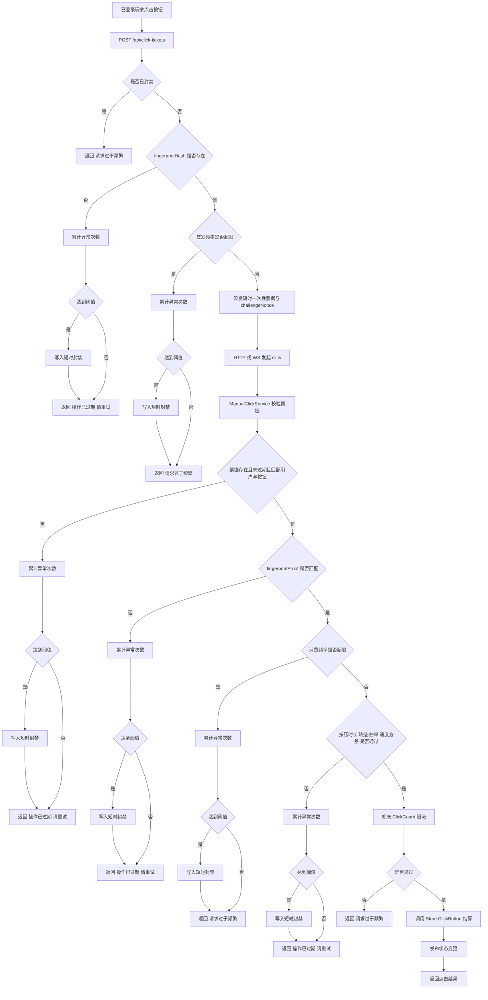
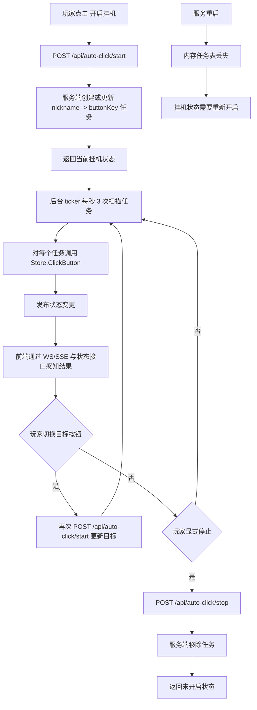

---
tags:
  - long-game
  - archive
---

> **⚠️ 本文档已废弃**（2026-04-30 核查：与当前代码不符）
>
> 反脚本协议（ticket/fingerprint/trajectory）完全未实施，仅挂机改造部分实现

# 单体版点击反脚本与官方挂机改造

## 背景与目标

现有点击链路把“入口校验、频率兜底、业务结算、前端本地挂机”混在一起，容易出现两个问题：

- 手动点击缺少短时一次性凭证，HTTP 和 WebSocket 入口都能被直接脚本化调用。
- 官方挂机依赖前端 `setTimeout` 本地轮询，本质上仍然是客户端代点，和手动点击难以区分。

本次改造以“低误杀优先”为原则，在单体部署前提下完成两件事：

- 手动点击改为“先取票据，再提交点击”的受控协议。
- 官方挂机改为服务端托管，每秒固定 3 次，不再通过前端周期性点击接口。

## 现状风险点

- 点击接口之前只有旧的单机内存限流，无法覆盖票据失效、重复消费、按钮不匹配等场景。
- WebSocket `click` 与 HTTP `/api/buttons/:slug/click` 入口的保护口径不一致时，容易留下绕过点。
- 前端挂机循环即使挂着“官方”名义，本质仍是浏览器代点，断线、关页、脚本重放都不受控。

## 改造后手动点击协议

### 服务边界

- `Store.ClickButton`：只负责点击结算核心。
- `ManualClickService`：负责票据签发、票据消费、频率校验、异常累计、短时封禁、风险事件记录。
- `ClickGuard`：保留为兜底限流，位于票据校验之后。

### 新接口

- `POST /api/click-tickets`
  - 请求体：`{ "slug": "feel", "fingerprintHash": "..." }`
  - 响应体：`{ "ticket": "...", "issuedAt": 1710000000, "expiresAt": 1710000002, "challengeNonce": "..." }`
- `POST /api/buttons/:slug/click`
  - 请求体改为：`{ "ticket": "...", "realtimeConnected": true, "pointerType": "mouse", "pressDurationMs": 120, "trajectory": [{ "x": 10, "y": 10, "t": 0 }], "fingerprintHash": "...", "fingerprintProof": "..." }`
- WebSocket `click`
  - 消息体改为：`{ "type": "click", "slug": "feel", "ticket": "...", "pointerType": "mouse", "pressDurationMs": 120, "trajectory": [{ "x": 10, "y": 10, "t": 0 }], "fingerprintHash": "...", "fingerprintProof": "..." }`

### 协议约束

- 票据与登录玩家、按钮、签发时间、过期时间、随机 nonce 绑定。
- 票据签发阶段额外绑定前端 `fingerprintHash`，点击消费阶段必须提交匹配的 `fingerprintProof`。
- 票据单次消费后立即失效，重复消费会被拒绝。
- 票据过期、用户不匹配、按钮不匹配、票据缺失都统一返回“操作已过期，请重试”。
- 点击必须同时携带行为采样：指针类型、按压时长、轨迹点序列。
- 服务端首版硬校验行为信号：
  - 按压时长上下限
  - 最少/最多轨迹点
  - 最短轨迹长度
  - 最短位移
  - 最低曲率
  - 最低速度方差
- 高频签发或高频消费先返回“请求过于频繁，请稍后再试”，连续异常达到阈值后进入短时封禁。
- HTTP 与 WebSocket 共用同一套 `ManualClickService.Click` 校验逻辑。

### 当前内存态

单体版全部保存在服务进程内存：

- 点击票据表
- 用户签发节奏窗口
- 用户消费节奏窗口
- 异常累计计数
- 短时封禁截止时间
- 风险事件列表

服务重启后这些状态全部丢失，这是当前版本接受的实现约束。

## 改造后官方挂机协议

### 新接口

- `GET /api/auto-click`
- `POST /api/auto-click/start`
  - 请求体：`{ "slug": "feel" }`
- `POST /api/auto-click/stop`

### 调度模型

- `AutoClickService` 在服务端内存里维护 `nickname -> buttonKey` 的挂机任务表。
- 后台 ticker 固定按每秒 3 次执行 `Store.ClickButton`。
- 挂机点击与手动点击共用同一结算核心，暴击、星光、Boss 伤害、掉落全部沿用原公式。
- 挂机不走手动票据校验，也不依赖浏览器定时器。

### 生命周期

- 开始挂机：创建或更新当前账号的挂机目标。
- 切换按钮：再次调用 `start`，直接覆盖目标按钮。
- 停止挂机：显式调用 `stop` 后移除任务。
- 页面关闭、前端断线、登出：不会自动停止挂机。
- 账号无效或服务端策略决定时，任务可被服务端移除。

## 风控状态机与封禁策略

- 单次失败优先降级，不暴露具体命中规则。
- 风险事件按“玩家、IP、按钮、入口类型、失败分类、累计次数、封禁区间”记录到内存事件列表，并同步打日志。
- 当前可调参数：
  - `ticket_ttl_ms`
  - `issue_limit_per_second`
  - `consume_limit_per_second`
  - `risk_threshold`
  - `ban_ms`
  - `min_press_duration_ms`
  - `max_press_duration_ms`
  - `min_trajectory_points`
  - `max_trajectory_points`
  - `min_path_distance`
  - `min_displacement`
  - `min_curvature`
  - `min_speed_variance`
- 上述参数全部来自配置文件 `manual_click` 段，当前版本不再在代码里保留运行时默认值。

## 前后端接口变化清单

### 后端

- 新增手动点击票据接口 `POST /api/click-tickets`
- 新增挂机控制接口 `GET/POST /api/auto-click*`
- 点击接口与实时点击消息都要求携带 `ticket + fingerprintHash + fingerprintProof + behavior`
- 新增 `ManualClickService` 与 `AutoClickService` 两个边界

### 前端

- 点击前先请求 `/api/click-tickets`
- 点击前收集浏览器指纹摘要，并根据 `ticket + challengeNonce` 生成一次性挑战证明
- 手动点击时记录按压时长与最近轨迹，整理成 `pointerType + pressDurationMs + trajectory`
- WebSocket `sendClick` 改为发送 `slug + ticket + fingerprint + behavior`
- HTTP 点击兜底请求改为发送 `ticket + realtimeConnected + fingerprint + behavior`
- 删除本地 `setTimeout` 挂机循环，改为调用服务端挂机控制接口
- 登录恢复后主动查询当前挂机状态

## 拦截流程图

## 挂机流程图

## 回归验证要点

- 合法票据的 HTTP 与 WebSocket 点击都能正常结算。
- 合法的 `fingerprintHash + fingerprintProof` 能通过，缺失或不匹配会被拒绝。
- 按压时长、轨迹点数、路径长度、位移、曲率、速度方差命中阈值时都会被拒绝。
- 缺票据、过期票据、重复票据、按钮不匹配都会被拒绝且不进入结算。
- 高频签发/消费先降级，再在达到阈值后进入短时封禁。
- 挂机开始、切换目标、停止、重新登录后恢复查询都按预期工作。
- 挂机与手动点击共用同一结算核心，不破坏 Boss、暴击、星光和掉落口径。
- 服务重启后票据、封禁、挂机状态全部丢失，这是当前单体版设计约束。
