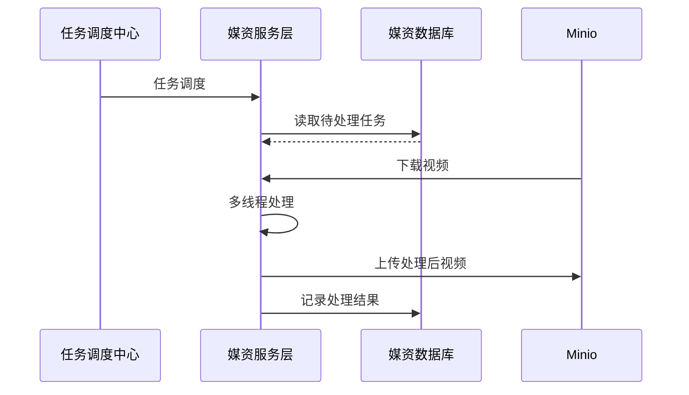

# 学成在线Day07


# 技术方案

## 作业分片方案

任务添加成功后，对于要处理的任务会添加到待处理任务表中，现在启动多个执行器实例去查询这些待处理任务

***此时如何保证多个执行器不会查询到重复的任务呢？***

XXL-JOB并不直接提供数据处理的功能，它只会给执行器分配好分片序号，在向执行器任务调度的同时下发分片总数以及分片序号等参数，执行器收到这些参数根据自己的业务需求去利用这些参数。

每个执行器收到广播任务有两个参数：分片总数、分片序号。每个执行从数据表取任务时可以让任务id 模上 分片总数，如果等于分片序号则执行此任务。

上边两个执行器实例那么分片总数为2，序号为0、1，从任务1开始，如下：

1 % 2 = 1  执行器2执行

2 % 2 = 0  执行器1执行

3 % 2 = 1   执行器2执行

以此类推

## 保证任务不重复执行

### 1.调度过期策略

***通过作业分片方案保证了执行器之间查询到不重复的任务，如果一个执行器在处理一个视频还没有完成，此时调度中心又一次请求调度，为了不重复处理同一个视频该怎么办？***

首先配置调度过期策略：

查看文档如下：

调度过期策略：调度中心错过调度时间的补偿处理策略，包括：忽略、立即补偿触发一次等；
-  忽略：调度过期后，忽略过期的任务，从当前时间开始重新计算下次触发时间；
-  立即执行一次：调度过期后，立即执行一次，并从当前时间开始重新计算下次触发时间；
-  阻塞处理策略：调度过于密集执行器来不及处理时的处理策略；

这里我们选择忽略，如果立即执行一次就可能重复执行相同的任务。

### 2.阻塞处理策略

其次，再看阻塞处理策略，阻塞处理策略就是当前执行器正在执行任务还没有结束时调度中心进行任务调度，此时该如何处理。

查看文档如下：
- 单机串行（默认）：调度请求进入单机执行器后，调度请求进入FIFO队列并以串行方式运行；
- 丢弃后续调度：调度请求进入单机执行器后，发现执行器存在运行的调度任务，本次请求将会被丢弃并标记为失败；
- 覆盖之前调度：调度请求进入单机执行器后，发现执行器存在运行的调度任务，将会终止运行中的调度任务并清空队列，然后运行本地调度任务；

这里如果选择覆盖之前调度则可能重复执行任务，这里选择 丢弃后续调度或单机串行方式来避免任务重复执行。

### 3.只做这些配置可以保证任务不会重复执行吗？

做不到，还需要保证任务处理的`幂等性`，什么是任务的`幂等性`？任务的`幂等性`是指：对于数据的操作不论多少次，操作的结果始终是一致的。在本项目中要实现的是不论多少次任务调度同一个视频只执行一次成功的转码。

什么是幂等性？

它描述了一次和多次请求某一个资源对于资源本身应该具有同样的结果。

幂等性是为了解决重复提交问题，比如：恶意刷单，重复支付等。

解决幂等性常用的方案：

1. 数据库约束，比如：唯一索引，主键。

2. 乐观锁，常用于数据库，更新数据时根据乐观锁状态去更新。

3. 唯一序列号，操作传递一个唯一序列号，操作时判断与该序列号相等则执行。

基于以上分析，在执行器接收调度请求去执行视频处理任务时要实现视频处理的幂等性，要有办法去判断该视频是否处理完成，如果正在处理中或处理完则不再处理。这里我们在数据库视频处理表中添加处理状态字段，视频处理完成更新状态为完成，执行视频处理前判断状态是否完成，如果完成则不再处理。

## 视频处理方案


视频处理的详细流程如下：



1. 任务调度中心广播作业分片。

2. 执行器收到广播作业分片，从数据库读取待处理任务，读取未处理及处理失败的任务。

3. 执行器更新任务为处理中，根据任务内容从MinIO下载要处理的文件。

4. 执行器启动多线程去处理任务。

5. 任务处理完成，上传处理后的视频到MinIO。

6. 将更新任务处理结果，如果视频处理完成除了更新任务处理结果以外还要将文件的访问地址更新至任务处理表及文件表中，最后将任务完成记录写入历史表。

# 查询待处理任务

## 需求分析

查询待处理任务只处理未提交及处理失败的任务，任务处理失败后进行重试，最多重试3次。

任务处理成功将待处理记录移动到历史任务表。

下图是待处理任务表：


历史任务表与待处理任务表的结构相同。

## 添加待处理任务

上传视频成功向视频处理待处理表添加记录，暂时只添加对avi视频的处理记录。

根据MIME Type去判断是否是avi视频，下边列出部分MIME Type


avi视频的MIME Type是video/x-msvideo

```java
/**
 * 记录待处理任务
 * @param mediaFiles 文件信息
 */
public void addWitingTask(MediaFiles mediaFiles) {
    //获取文件名
    String filename = mediaFiles.getFilename();
    //获取拓展名
    String extension = filename.substring(filename.lastIndexOf("."));
    //获取mimeType类型
    String mimeType = getMimeType(extension);
    if(mimeType.equals("video/x-msvideo")){         //如果是avi文件，记录待处理任务
        MediaProcess mediaProcess = new MediaProcess();
        BeanUtils.copyProperties(mediaFiles, mediaProcess);
        //状态
        mediaProcess.setStatus("");
        mediaProcess.setCreateDate(LocalDateTime.now());
        mediaProcess.setFailCount(0);
        //处理完成后再设置url
        mediaProcess.setUrl(null);
        mediaProcessMapper.insert(mediaProcess);
    }
}
```

## 查询待处理任务

如何保证查询到的待处理视频记录不重复？

编写根据分片参数获取待处理任务的DAO方法，定义DAO接口如下

```java
@Select("select * from media_process m " +
            "where (m.status = 1 or m.status = 3) " +
            "and m.fail_count < 3 " +
            "and m.id % #{sharedTotal} = #{shardIndex} limit #{failCount}")
    List<MediaProcess> selectProcessByShardIndex(int sharedTotal, int shardIndex,int failCount);
```

# 开始执行任务

## 1.分布式锁

为了避免多线程去争抢同一个任务可以使用synchronized同步锁去解决，如下代码：

```java
synchronized(锁对象){
   执行任务...
}
```

synchronized只能保证同一个虚拟机中多个线程去争抢锁。


如果是多个执行器分布式部署，并不能保证同一个视频只有一个执行器去处理。

现在要实现分布式环境下所有虚拟机中的线程去同步执行就需要让多个虚拟机去共用一个锁，虚拟机可以分布式部署，锁也可以分布式部署，如下图：


虚拟机都去抢占同一个锁，锁是一个单独的程序提供加锁、解锁服务。

该锁已不属于某个虚拟机，而是分布式部署，由多个虚拟机所共享，这种锁叫`分布式锁`。

实现分布式锁的方案有很多，常用的如下：

1. 基于`数据库`实现分布锁

利用数据库`主键唯一性`的特点，或利用数据库唯一索引、行级锁的特点，多个线程同时去更新相同的记录，谁更新成功谁就抢到锁。

2. 基于`redis`实现锁

redis提供了分布式锁的实现方案，比如：SETNX、set nx、redisson等。

拿SETNX举例说明，SETNX命令的工作过程是去set一个不存在的key，多个线程去设置同一个key只会有一个线程设置成功，设置成功的的线程拿到锁。

3. 使用`zookeeper`实现

zookeeper是一个分布式协调服务，主要解决分布式程序之间的同步的问题。zookeeper的结构类似的文件目录，多线程向zookeeper创建一个子目录(节点)只会有一个创建成功，利用此特点可以实现分布式锁，谁创建该结点成功谁就获得锁。

## 2.开启任务

什么是`乐观锁`、`悲观锁`？

`synchronized`是一种`悲观锁`，在执行被synchronized包裹的代码时需要首先获取锁，没有拿到锁则无法执行，是总悲观的认为别的线程会去抢，所以叫悲观锁。

`乐观锁`的思想是它不认为会有线程去争抢，尽管去执行，如果没有**执行成功就再去重试**。

# 更新任务状态

任务处理完成需要更新任务处理结果，任务执行成功更新视频的URL、及任务处理结果，将待处理任务记录删除，同时向历史任务表添加记录。

在MediaFileProcessService接口添加方法

# 视频处理

视频采用并发处理，每个视频使用一个线程去处理，每次处理的视频数量不要超过cpu核心数。

所有视频处理完成结束本次执行，为防止代码异常出现无限期等待则添加超时设置，到达超时时间还没有处理完成仍结束任务。

获取电脑核心数量：

```java
int processors = Runtime.getRuntime().availableProcessors();
```

视频处理任务代码:

```java
@XxlJob("videoJobHandler")
    public void shardingJobHandler() throws Exception {

        // 分片参数
        int shardIndex = XxlJobHelper.getShardIndex();  //执行器的序号, 从0开始编号
        int shardTotal = XxlJobHelper.getShardTotal();  //执行器的总数

        //确定cpu核心数量
        int processors = Runtime.getRuntime().availableProcessors();


        //查询待处理任务
        List<MediaProcess> mediaProcessList = mediaFileProcessService
                .getProcessByShardIndex(shardTotal, shardIndex, processors);
        int size = mediaProcessList.size();
        log.debug("查询到任务数量:{}", size);
        if ( size == 0 ) {
            return;
        }
        //计数器数量为任务数量
        CountDownLatch countDownLatch = new CountDownLatch(size);
        //启动一个线程池
        //线程池参数是任务数量
        ExecutorService executorService = Executors.newFixedThreadPool(size);
        mediaProcessList.forEach(mediaProcess -> {
            executorService.execute(() -> {
                try {
                    Long taskId = mediaProcess.getId();
                    boolean b = mediaFileProcessService.startTask(taskId);
                    //====抢占任务失败=====
                    if ( !b ) {
                        log.debug("抢占任务失败:{}", taskId);
                        return;
                    }
                    //====抢占任务成功=====


                    //文件ID就是md5值
                    String fileId = mediaProcess.getFileId();
                    //桶
                    String bucket = mediaProcess.getBucket();
                    //文件名称
                    String objectName = mediaProcess.getFilePath();
                    //下载minio文件到本地
                    File file = mediaFileService.downloadFileFromMinIO(bucket, objectName);
                    if ( file == null ) {
                        log.debug("下载文件失败,任务id:{},buckerName:{},objectName:{}", taskId, bucket, objectName);
                        //保存任务失败的结果
                        mediaFileProcessService.saveProcessFinishStatus(taskId, "3", fileId, null, "下载视频到本地失败");
                        return;
                    }
                    //源avi视频路径
                    String videoPath = file.getAbsolutePath();
                    //替换后的mp4视频名称
                    String mp4Name = fileId + ".mp4";
                    //先创建一个临时文件作为转换后的文件
                    File mp4File = null;
                    try {
                        mp4File = File.createTempFile("minio", ".mp4");
                    } catch (IOException e) {
                        log.info("创建临时文件失败:{}", e.getMessage());
                        //保存任务失败的结果
                        mediaFileProcessService.saveProcessFinishStatus(taskId, "3", fileId, null, "创建临时文件失败");
                        return;
                    }
                    String mp4Path = mp4File.getAbsolutePath();
                    //创建工具类对象
                    //成功返回success,失败返回失败原因
                    Mp4VideoUtil mp4VideoUtil = new Mp4VideoUtil(ffmpegPath, videoPath, mp4Name, mp4Path);
                    String result = mp4VideoUtil.generateMp4();
                    if ( !result.equals("success") ) {
                        log.debug("视频转码失败,失败原因:{},buketName:{},objectName:{}", result, bucket, objectName);
                        mediaFileProcessService.saveProcessFinishStatus(taskId, "3", fileId, null, "视频转码失败");
                    }
                    //上传到minio
                    boolean b1 = false;
                    try {
                        b1 = mediaFileService.addMediaFilesToMinIO(mp4File.getAbsolutePath(), "video/mp4", bucket, objectName);
                    } catch (Exception e) {
                        log.debug("上传到minio失败,任务id:{},buckerName:{},objectName:{}", taskId, bucket, objectName);
                        throw new RuntimeException(e);
                    }
                    if ( !b1 ) {
                        log.debug("上传到minio失败,任务id:{},buckerName:{},objectName:{}", taskId, bucket, objectName);
                        //保存任务失败的结果
                        mediaFileProcessService.saveProcessFinishStatus(taskId, "3", fileId, null, "上传到minio失败");
                        return;
                    }
                    //拼装地址
                    String url = getFilePath(fileId, "mp4");

                    //保存任务成功的结果
                    mediaFileProcessService.saveProcessFinishStatus(taskId, "2", fileId, url, "任务成功");
                } finally {
                    //计数器减一
                    countDownLatch.countDown();
                }
            });
        });
        //阻塞
        //当计数器为0则继续执行
        //出现部分异常时,最多阻塞30分钟
        countDownLatch.await(30, TimeUnit.MINUTES);
    }
```

发现重大bug，由于获取文件类型错误，所以不会使mp4以外的视频格式的转码任务存储到数据库中，错误出现在：

```java
private String getMimeType(String extension) {
        if ( extension == null ) {
            extension = "";
        }
        
        =========================================================================
        ContentInfo mimeTypeMatch = ContentInfoUtil.findMimeTypeMatch(extension);
        =========================================================================
        
        String mimeType = MediaType.APPLICATION_OCTET_STREAM_VALUE;//通用mineType,也叫字节流
        if ( mimeTypeMatch != null ) {
            mimeType = mimeTypeMatch.getMimeType();
        }
        return mimeType;
    }
```

应该为`ContentInfo mimeTypeMatch = ContentInfoUtil.findExtensionMatch(extension);`

```java
b1 = mediaFileService.addMediaFilesToMinIO(mp4File.getAbsolutePath(), "video/mp4", bucket, objectName);
```

修改为:

```java
b1 = mediaFileService.addMediaFilesToMinIO(mp4File.getAbsolutePath(), "video/mp4", bucket, mp4Name);
```

只有mp4Name对应的路径是正确的

保存后更新media_file中的文件路径和url

```java
//更新media_file中的url地址和文件路径
MediaFiles mediaFiles = new MediaFiles();
mediaFiles.setId(fileId);
mediaFiles.setUrl(url);
mediaFiles.setFilePath(mp4Name);
mediaFileService.updateById(mediaFiles);
```

## 视频处理其他问题(待完善)

### 1.任务补偿机制

如果有线程抢占了某个视频的处理任务，如果线程处理过程中挂掉了，该视频的状态将会一直是处理中，其它线程将无法处理，这个问题需要用补偿机制。

单独启动一个任务找到待处理任务表中超过执行期限但仍在处理中的任务，将任务的状态改为执行失败。

任务执行期限是处理一个视频的最大时间，比如定为30分钟，通过任务的启动时间去判断任务是否超过执行期限。

大家思考这个sql该如何实现？

大家尝试自己实现此任务补偿机制。

### 2.达到最大失败次数

当任务达到最大失败次数时一般就说明程序处理此视频存在问题，这种情况就需要人工处理，在页面上会提示失败的信息，人工可手动执行该视频进行处理，或通过其它转码工具进行视频转码，转码后直接上传mp4视频。

### 3.分块文件清理问题

上传一个文件进行分块上传，上传一半不传了，之前上传到minio的分块文件要清理吗？怎么做的？

1、在数据库中有一张文件表记录minio中存储的文件信息。

2、文件开始上传时会写入文件表，状态为上传中，上传完成会更新状态为上传完成。

3、当一个文件传了一半不再上传了说明该文件没有上传完成，会有定时任务去查询文件表中的记录，如果文件未上传完成则删除minio中没有上传成功的文件目录。

# 绑定媒资

基础增删改查内容，详细内容查看内容模块代码

# 实战

根据接口定义实现解除绑定功能。

前端文件course-add-step2-outline.vue中作如下修改:

```typescript
private async handleDeleteMedia(node: ICourseOutlineTreeNode) {
    console.log(node)
    console.log(node.id)
    try {
      if (
        node.teachplanMedia === undefined ||
        node.teachplanMedia.id === undefined
      ) {
        return
      }
      await this.showDeleteConfirm()
      await mediaUnAssociation(
        node.id,
        node.teachplanMedia.mediaId,
        this.courseBaseId
      )
      this.getList()
    } catch (error) {}
  }
```

后端基础增删查改即可

# 课程发布

作为课程制作方即教学机构，在课程发布前通过课程预览功能可以看到课程发布后的效果，哪里的课程信息存在问题方便查看，及时修改。

下图是课程预览的效果图，也是课程正式发布后的课程详情界面：


教学机构确认课程内容无误，提交审核，平台运营人员对课程内容审核，审核通过后教学机构人员发布课程成功。

课程发布模块共包括三块功能：

1、课程预览

2、课程审核

3、课程发布

## 模板引擎

根据前边的数据模型分析，课程预览就是把课程的相关信息进行整合，在课程预览界面进行展示，课程预览界面与课程发布的课程详情界面一致。

项目采用模板引擎技术实现课程预览界面。什么是模板引擎？

早期我们采用的jsp技术就是一种模板引擎技术，如下图：


1、浏览器请求web服务器

2、服务器渲染页面，渲染的过程就是向jsp页面(模板)内填充数据(模型)。

3、服务器将渲染生成的页面返回给浏览器。

所以模板引擎就是：模板+数据=输出，Jsp页面就是模板，页面中嵌入的jsp标签就是数据，两者相结合输出html网页。

 

常用的java模板引擎还有哪些？

Jsp、Freemarker、Thymeleaf 、Velocity 等。

本项目采用Freemarker作为模板引擎技术。

Freemarker官方地址：http://freemarker.foofun.cn/

Maven依赖:

```xml
<!-- Spring Boot 对结果视图 Freemarker 集成 -->
<dependency>
    <groupId>org.springframework.boot</groupId>
    <artifactId>spring-boot-starter-freemarker</artifactId>
</dependency>
```

配置文件:

```yaml
spring:
  freemarker:
    enabled: true
    cache: false   #关闭模板缓存，方便测试
    settings:
      template_update_delay: 0
    suffix: .ftl   #页面模板后缀名
    charset: UTF-8
    template-loader-path: classpath:/templates/   #页面模板位置(默认为 classpath:/templates/)
    resources:
      add-mappings: false   #关闭项目中的静态资源映射(static、resources文件夹下的资源)
```

