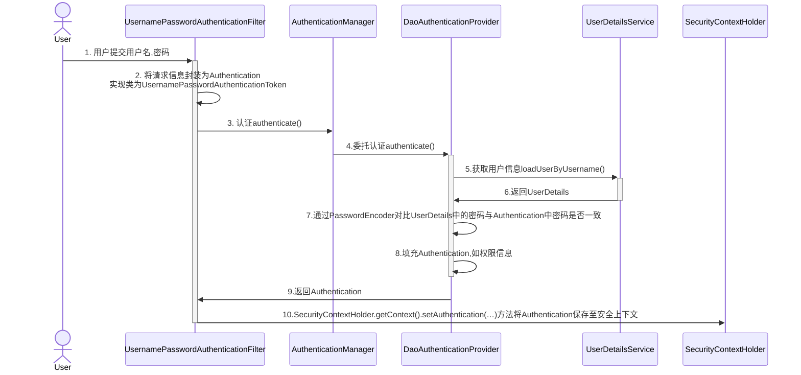
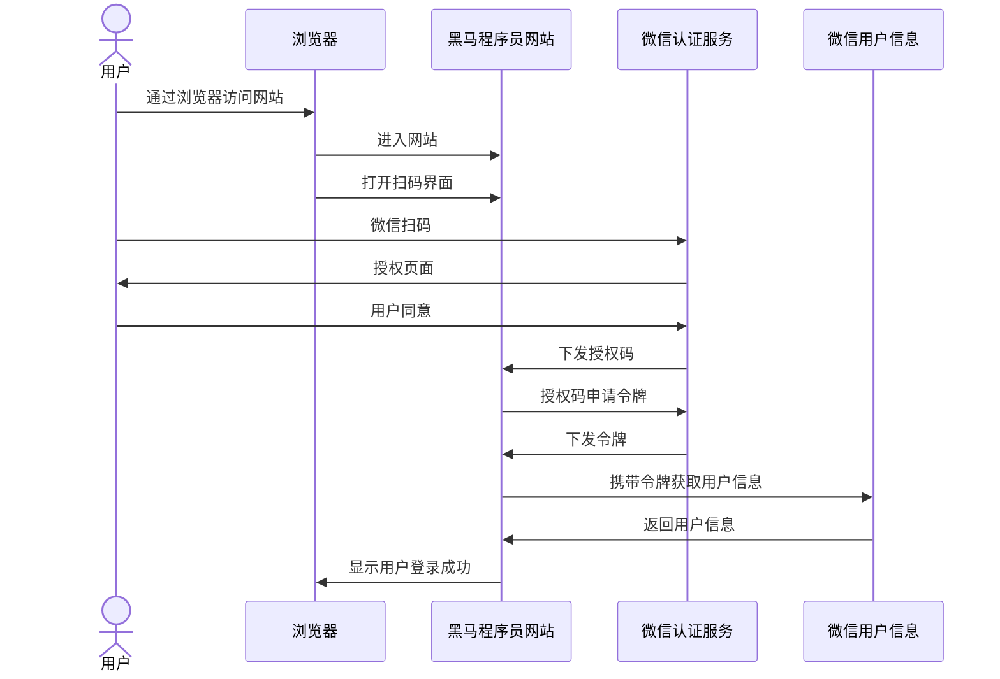

# 学成在线Day09


# 页面静态化

## 页面静态化概念

根据课程发布的操作流程，执行课程发布后要将课程详情信息页面静态化，生成html页面上传至文件系统。

什么是页面静态化？

课程预览功能通过模板引擎技术在页面模板中填充数据，生成html页面，这个过程是当客户端请求服务器时服务器才开始渲染生成html页面，最后响应给浏览器，服务端渲染的并发能力是有限的。

页面静态化则强调将生成html页面的过程提前，提前使用模板引擎技术生成html页面，当客户端请求时直接请求html页面，由于是静态页面可以使用nginx、apache等高性能的web服务器，并发性能高。

什么时候能用页面静态化技术？

当数据变化不频繁，一旦生成静态页面很长一段时间内很少变化，此时可以使用页面静态化。因为如果数据变化频繁，一旦改变就需要重新生成静态页面，导致维护静态页面的工作量很大。

根据课程发布的业务需求，虽然课程发布后仍可以修改课程信息，但需要经过课程审核，且修改频度不大，所以适合使用页面静态化。

## 页面静态化测试

maven依赖:

```xml
<dependency>
    <groupId>org.springframework.boot</groupId>
    <artifactId>spring-boot-starter-freemarker</artifactId>
</dependency>
```

测试类代码:

```java
@Test
    public void testGenerateHtmlByTemplate() throws IOException, TemplateException {
        //配置freemarker
        Configuration configuration = new Configuration(Configuration.VERSION_2_3_30);

        //加载模板
        //选指定模板路径,classpath下templates下
        //得到classpath路径
        String classpath = this.getClass().getResource("/").getPath();
        configuration.setDirectoryForTemplateLoading(new File(classpath + "/templates/"));
        //设置字符编码
        configuration.setDefaultEncoding("utf-8");

        //指定模板文件名称
        Template template = configuration.getTemplate("course_template.ftl");

        //准备数据
        CoursePreviewDTO coursePreviewInfo = coursePublishService.getCoursePreviewInfo(26L);

        Map<String, Object> map = new HashMap<>();
        map.put("model", coursePreviewInfo);

        //静态化
        //参数1：模板，参数2：数据模型
        String content = FreeMarkerTemplateUtils.processTemplateIntoString(template, map);
        System.out.println(content);
        //将静态化内容输出到文件中
        InputStream inputStream = IOUtils.toInputStream(content);
        //输出流

        //再用拷贝流输出
        FileOutputStream fileOutputStream = new FileOutputStream("D:\\Programming_Learning\\Project\\freemaker\\" + 25 + ".html");
        IOUtils.copy(inputStream, fileOutputStream);
    }
```

## 上传文件测试

maven依赖:

```xml
<dependency>
    <groupId>com.alibaba.cloud</groupId>
    <artifactId>spring-cloud-starter-alibaba-nacos-discovery</artifactId>
</dependency>
<!-- Spring Cloud 微服务远程调用 -->
<dependency>
    <groupId>org.springframework.cloud</groupId>
    <artifactId>spring-cloud-starter-openfeign</artifactId>
</dependency>
<dependency>
    <groupId>io.github.openfeign</groupId>
    <artifactId>feign-httpclient</artifactId>
</dependency>
<!--feign支持Multipart格式传参-->
<dependency>
    <groupId>io.github.openfeign.form</groupId>
    <artifactId>feign-form</artifactId>
    <version>3.8.0</version>
</dependency>
<dependency>
    <groupId>io.github.openfeign.form</groupId>
    <artifactId>feign-form-spring</artifactId>
    <version>3.8.0</version>
</dependency>
```

feign-dev.yaml配置添加：

```yaml
feign:
  hystrix:
    enabled: true
  circuitbreaker:
    enabled: true
hystrix:
  command:
    default:
      execution:
        isolation:
          thread:
            timeoutInMilliseconds: 30000  #熔断超时时间
ribbon:
  ConnectTimeout: 60000 #连接超时时间
  ReadTimeout: 60000 #读超时时间
  MaxAutoRetries: 0 #重试次数
  MaxAutoRetriesNextServer: 1 #切换实例的重试次数
```

现在需要将课程的静态文件上传到minio，单独存储到course目录下，文件的objectname为"课程id.html"，原有的上传文件接口需要增加一个参数 objectname。

注意feign的配置不能有错

feign上的请求地址与原api有所差异，有时需要单独更改

原api:

```java
@RequestMapping(value = "/upload/coursefile",consumes = MediaType.MULTIPART_FORM_DATA_VALUE)
```

feign客户端:

```java
@PostMapping(value = "/media/upload/coursefile",consumes = MediaType.MULTIPART_FORM_DATA_VALUE)
```

意外BUG

前端工程启动不了发现是修改feign相关配置时删除了原有的配置，下次应该仔细点

MD其实并没有错，由于测试类和实际类名字相同，我启动了半天`测试类`...

# 此处插入重点NGINX内容

我修改配置后使用：

```shell
nginx.exe -s reload
```

后发现配置并未修改。

**经过调试**后发现，nginx在根目录使用关闭指令后，**并未按照预期关闭**

应使用

```shell
tasklist /fi "imagename eq nginx.exe"
```

查询所有nginx进程并使用

```shell
taskkill /pid PID /f
```

全部关闭，新打开的才是能正常使用的

浪费我俩小时服了

## 熔断降级处理

微服务中难免存在服务之间的远程调用，比如：内容管理服务远程调用媒资服务的上传文件接口，当微服务运行不正常会导致无法正常调用微服务，此时会出现异常，如果这种异常不去处理可能导致雪崩效应。

微服务的雪崩效应表现在服务与服务之间调用，当其中一个服务无法提供服务可能导致其它服务也死掉，比如：服务B调用服务A，由于A服务异常导致B服务响应缓慢，最后B、C等服务都不可用，像这样由一个服务所引起的一连串的多个服务无法提供服务即是微服务的雪崩效应，如下图：


如何解决由于微服务异常引起的雪崩效应呢？

可以采用熔断、降级的方法去解决。

熔断降级的相同点都是为了解决微服务系统崩溃的问题，但它们是两个不同的技术手段，两者又存在联系。

熔断：

当下游服务异常而断开与上游服务的交互，它就相当于保险丝，下游服务异常触发了熔断，从而保证上游服务不受影响。


降级：

当下游服务异常触发熔断后，上游服务就不再去调用异常的微服务而是执行了降级处理逻辑，这个降级处理逻辑可以是本地一个单独的方法。


两者都是为了保护系统，熔断是当下游服务异常时一种保护系统的手段，降级是熔断后上游服务处理熔断的方法。

### Hystrix

项目使用**Hystrix**框架实现熔断、降级处理，在feign-dev.yaml中配置

### 定义降级逻辑

1. fallback

```java
@FeignClient(value = "media-api",configuration = MultipartSupportConfig.class,fallback = MediaServiceClientFallback.class)
@RequestMapping("/media")
public interface MediaServiceClient{
    ...
}
```

定义时指定回调接口fallback

定义一个fallback类MediaServiceClientFallback，此类实现了MediaServiceClient接口。

第一种方法无法取出熔断所抛出的异常，第二种方法定义MediaServiceClientFallbackFactory 可以解决这个问题。

2. fallbackFactory 

   第二种方法在FeignClient中指定fallbackFactory ，如下：

   ```java
   @FeignClient(value = "media-api",configuration = MultipartSupportConfig.class,fallbackFactory = MediaServiceClientFallbackFactory.class)
   ```

​	降级处理逻辑：

​	返回一个null对象，上游服务请求接口得到一个null说明执行了降级处理。

​	测试：

​	停止媒资管理服务或人为制造异常观察是否执行降级逻辑。

fallbackFactory代码如下:

```java
@Slf4j
@Component
public class SearchServiceClientFallbackFactory implements FallbackFactory<SearchServiceClient> {
    @Override
    public SearchServiceClient create(Throwable throwable) {

        return new SearchServiceClient() {

            @Override
            public Boolean add(CourseIndex courseIndex) {
                throwable.printStackTrace();
                log.debug("调用搜索发生熔断走降级方法,熔断异常:", throwable.getMessage());

                return false;
            }
        };
    }
}
```


```java
//生成课程静态化页面并上传至文件系统
    public void generateCourseHtml(MqMessage mqMessage, long courseId) throws Exception {
        log.info("开始执行课程静态化任务,id:{}", mqMessage.getId());
        Long taskId = mqMessage.getId();
        MqMessageService mqMessageService = this.getMqMessageService();
        //任务幂等性处理
        //取出当前阶段执行状态
        int stageOne = mqMessageService.getStageOne(taskId);
        if(stageOne > 0){
            //已经执行过了
            log.info("课程静态化完成,无需处理");
            return ;
        }
        //生成html页面
        File file = coursePublishService.generateCourseHtml(courseId);
        if(file == null){
            XueChengPlusException.cast("生成课程静态化页面为空");
        }
        //上传到minio
        coursePublishService.uploadCourseHtml(courseId,file);


        //将任务状态设置为完成
        mqMessageService.completedStageOne(taskId);
    }
```

生成静态页面部分完成


# 课程搜索

## 模块介绍

搜索功能是一个系统的重要功能，是信息查询的方式。课程搜索是课程展示的渠道，用户通过课程搜索找到课程信息，进一步去查看课程的详细信息，进行选课、支付、学习。

本项目的课程搜索支持全文检索技术，什么是全文检索？

[全文检索](https://baike.baidu.com/item/全文检索/8028630?fromModule=lemma_inlink)是指计算机索引程序通过扫描文章中的每一个词，对每一个词建立一个索引，指明该词在文章中出现的次数和位置，当用户查询时，检索程序就根据事先建立的索引进行查找，并将查找的结果反馈给用户的检索方式。这个过程类似于通过字典中的检索字表查字的过程。

全文检索可以简单理解为通过索引搜索文章。


全文检索的速度非常快，早期应用在搜索引擎技术中，比如：百度、google等，现在通常一些大型网站的搜索功能都是采用全文检索技术。


课程搜索也要将课程信息建立索引，在课程发布时建立课程索引，索引建立好用户可通过搜索网页去查询课程信息。


所以，课程搜索模块包括两部分：课程索引、课程搜索。

课程索引是将课程信息建立索引。

课程搜索是通过前端网页，通过关键字等条件去搜索课程。


## 业务流程

根据模块介绍的内容，课程搜索模块包括课程索引、课程搜索两部分。

1、课程索引

在课程发布操作执行后通过消息处理方式创建课程索引，如下图：


本项目使用elasticsearch作为索引及搜索服务。

 

2、课程搜索

课程索引创建完成，用户才可以通过前端搜索课程信息。

课程搜索可以从首页进入搜索页面。


下图是搜索界面，可以通过课程分类、课程难度等级等条件进行搜索。

# 课程信息索引同步

### 1、针对实时性非常高的场景需要满足数据的及时同步，可以同步调用，或使用Canal去实现。

1）同步调用即在向MySQL写数据后远程调用搜索服务的接口写入索引，此方法简单但是耦合代码太高。

2）可以使用一个中间的软件canal解决耦合性的问题，但存在学习与维护成本。

canal主要用途是基于 MySQL 数据库增量日志解析，并能提供增量数据订阅和消费，实现将MySQL的数据同步到消息队列、Elasticsearch、其它数据库等，应用场景十分丰富。 


它的地址：

github地址：https://github.com/alibaba/canal 

版本下载地址：https://github.com/alibaba/canal/releases

文档地址：https://github.com/alibaba/canal/wiki/Docker-QuickStart

 

Canal基于mysql的binlog技术实现数据同步，什么是binlog，它是一个文件，二进制格式，记录了对数据库更新的SQL语句，向数据库写数据的同时向binlog文件里记录对应的sql语句。当数据库服务器发生了故障就可以使用binlog文件对数据库进行恢复。

所以，使用canal是需要开启mysql的binlog写入功能，Canal工作原理如下：


1、canal 模拟 MySQL slave 的交互协议，伪装自己为 MySQL slave ，向 MySQL master 发送dump 

协议 

2、MySQL master 收到 dump 请求，开始推送 binary log 给 slave (即 canal ) 

3、canal 解析 binary log 对象(原始为 byte 流)

详细使用Canal进行索引同步的步骤参考：Canal实现索引同步.pdf

### 2、当索引同步的实时性要求不高时可用的技术比较多，比如：MQ、Logstash、任务调度等。

MQ：向mysql写数据的时候向mq写入消息，搜索服务监听MQ，收到消息后写入索引。使用MQ的优势是代码解耦，但是需要处理消息可靠性的问题有一定的技术成本，做到消息可靠性需要做到生产者投递成功、消息持久化以及消费者消费成功三个方面，另外还要做好消息幂等性问题。

Logstash： 开源实时日志分析平台 ELK包括Elasticsearch、Kibana、Logstash，Logstash负责收集、解析和转换日志信息，可以实现MySQL与Elasticsearch之间的数据同步。也可以实现解耦合并且是官方推荐，但需要增加学习与维护成本。

任务调度：向mysql写数据的时候记录修改记录，开启一个定时任务根据修改记录将数据同步到Elasticsearch。

 

根据本项目的需求，课程发布后信息同步的实时性要求不高，从提交审核到发布成功一般两个工作日完成。综合比较以上技术方案本项目的索引同步技术使用任务调度的方法。

如下图：


1、课程发布向消息表插入记录。

2、由任务调度程序通过消息处理SDK对消息记录进行处理。

3、向elasticsearch索引中保存课程信息。

如何向向elasticsearch索引中保存课程信息？

执行流程如下：

由内容管理服务远程调用搜索服务添加课程信息索引，搜索服务再请求elasticsearch向课程索引中添加文档。

# 认证授权

截至目前，项目已经完成了课程发布功能，课程发布后用户通过在线学习页面点播视频进行学习。如何去记录学生的学习过程呢？要想掌握学生的学习情况就需要知道用户的身份信息，记录哪个用户在什么时间学习什么课程，如果用户要购买课程也需要知道用户的身份信息。所以，去管理学生的学习过程最基本的要实现用户的身份认证。

认证授权模块实现平台所有用户的身份认证与用户授权功能。

什么是用户身份认证？

​    用户身份认证即用户去访问系统资源时系统要求验证用户的身份信息，身份合法方可继续访问。常见的用户身份认证的表现形式有：用户名密码登录，微信扫码等方式。

项目包括学生、学习机构的老师、平台运营人员三类用户，不管哪一类用户在访问项目受保护资源时都需要进行身份认证。比如：发布课程操作，需要学习机构的老师首先登录系统成功，然后再执行发布课程操作。创建订单，需要学生用户首先登录系统，才可以创建订单。如下图：


什么是用户授权？

​    用户认证通过后去访问系统的资源，系统会判断用户是否拥有访问资源的权限，只允许访问有权限的系统资源，没有权限的资源将无法访问，这个过程叫用户授权。比如：用户去发布课程，系统首先进行用户身份认证，认证通过后继续判断用户是否有发布课程的权限，如果没有权限则拒绝继续访问系统，如果有权限则继续发布课程。如下图：


  ## 业务流程

### 1.统一认证

项目包括学生、学习机构的老师、平台运营人员三类用户，三类用户将使用统一的认证入口，如下图：


用户输入账号和密码提交认证，认证通过则继续操作。

项目由统一认证服务受理用户的认证请求，如下图：


认证通过由认证服务向给用户颁发令牌，相当于访问系统的通行证，用户拿着令牌去访问系统的资源。

### 2.单点登录

本项目基于微服务架构构建，微服务包括：内容管理服务、媒资管理服务、学习中心服务、系统管理服务等，为了提高用户体验性，用户只需要认证一次便可以在多个拥有访问权限的系统中访问，这个功能叫做单点登录。

引用百度百科：单点登录（Single Sign On），简称为 SSO，是目前比较流行的企业业务整合的解决方案之一。SSO的定义是在多个应用系统中，用户只需要登录一次就可以访问所有相互信任的应用系统。

如下图，用户只需要认证一次，便可以在多个拥有访问权限的系统中访问。


 

### 3.第三方认证

为了提高用户体验，很多网站有扫码登录的功能，如：微信扫码登录、QQ扫码登录等。扫码登录的好处是用户不用输入账号和密码，操作简便，另外一个好处就是有利于用户信息的共享，互联网的优势就是资源共享，用户也是一种资源，对于一个新网站如果让用户去注册是很困难的，如果提供了微信扫码登录将省去用户注册的成本，是一种非常有效的推广手段。

微信扫码登录其中的原理正是使用了第三方认证，如下图：


# **Spring Security** **认证研究**(重点)

## 1. **Spring Security**介绍

认证功能几乎是每个项目都要具备的功能，并且它与业务无关，市面上有很多认证框架，如：Apache Shiro、CAS、Spring Security等。由于本项目基于Spring Cloud技术构建，Spring Security是spring家族的一份子且和Spring Cloud集成的很好，所以本项目选用Spring Security作为认证服务的技术框架。

Spring Security 是一个功能强大且高度可定制的身份验证和访问控制框架，它是一个专注于为 Java 应用程序提供身份验证和授权的框架。

项目主页：https://spring.io/projects/spring-security

Spring cloud Security： https://spring.io/projects/spring-cloud-security

## 2. **认证授权入门**

**maven**依赖：

```xml
<dependency>
    <groupId>org.springframework.cloud</groupId>
    <artifactId>spring-cloud-starter-security</artifactId>
</dependency>
<dependency>
    <groupId>org.springframework.cloud</groupId>
    <artifactId>spring-cloud-starter-oauth2</artifactId>
</dependency>
```

启动auth项目后进入网站:http://localhost:63070/auth/r/r1

有如下界面:


账号和密码是多少呢？下一步需要进行安全配置。

配置文件如下:

```java
@EnableWebSecurity
@EnableGlobalMethodSecurity(securedEnabled = true, prePostEnabled = true)
public class WebSecurityConfig extends WebSecurityConfigurerAdapter {


    //配置用户信息服务
    @Bean
    public UserDetailsService userDetailsService() {
        //这里配置用户信息,这里暂时使用这种方式将用户存储在内存中
        InMemoryUserDetailsManager manager = new InMemoryUserDetailsManager();
        manager.createUser(User.withUsername("zhangsan").password("123").authorities("p1").build());
        manager.createUser(User.withUsername("lisi").password("456").authorities("p2").build());
        return manager;
    }
 
    @Bean
    public PasswordEncoder passwordEncoder() {
        //        //密码为明文方式
        return NoOpPasswordEncoder.getInstance();
        //        return new BCryptPasswordEncoder();
    }

    //配置安全拦截机制
    @Override
    protected void configure(HttpSecurity http) throws Exception {
        http
            .authorizeRequests()
            .antMatchers("/r/**").authenticated()//访问/r开始的请求需要认证通过
            .anyRequest().permitAll()//其它请求全部放行
            .and()
            .formLogin().successForwardUrl("/login-success");//登录成功跳转到/login-success
    }
}
```

可以看到账号:zhangsan,密码:123

账号:lisi,密码:456

### 认证授权测试

用户认证通过去访问系统资源时spring security进行授权控制，判断用户是否有该资源的访问权限，如果有则继续访问，如果没有则拒绝访问。

下边测试授权功能：

1、配置用户拥有哪些权限。

在WebSecurityConfig类配置zhangsan拥有p1权限，lisi拥有p2权限。

```java
@Bean
public UserDetailsService userDetailsService() {
    //这里配置用户信息,这里暂时使用这种方式将用户存储在内存中
    InMemoryUserDetailsManager manager = new InMemoryUserDetailsManager();
    manager.createUser(User.withUsername("zhangsan").password("123").authorities("p1").build());
    manager.createUser(User.withUsername("lisi").password("456").authorities("p2").build());
    return manager;
}
```

2、指定资源与权限的关系。

什么是系统的资源？

比如：查询一个用户的信息，用户信息就是系统的资源，要访问资源需要通过URL，所以我们在controller中定义的每个http的接口就是访问资源的接口。

下边在controller中配置/r/r1需要p1权限，/r/r2需要p2权限。

hasAuthority('p1')表示拥有p1权限方可访问。

代码如下：

```java
@RestController
public class LoginController {
    @RequestMapping("/r/r1")
    @PreAuthorize("hasAuthority('p1')")//拥有p1权限方可访问
    public String r1(){
        return "访问r1资源";
    }

    @RequestMapping("/r/r2")
    @PreAuthorize("hasAuthority('p2')")//拥有p2权限方可访问
    public String r2(){
        return "访问r2资源";
    }
}

```

当访问以/r/开头的url时会判断用户是否认证，如果没有认证则跳转到登录页面，如果已经认证则判断用户是否具有该URL的访问权限，如果具有该URL的访问权限则继续，否则拒绝访问。

例如：

访问/r/r1，使用zhangsan登录可以正常访问，因为在/r/r1的方法上指定了权限p1，zhangsan用户拥有权限p1,所以可以正常访问。

访问/r/r1，使用lisi登录则拒绝访问，由于lisi用户不具有权限p1需要拒绝访问

注意：如果访问上不加@PreAuthorize，此方法没有授权控制。

整理授权的过程见下图所示：


### 工作原理

通过测试认证和授权两个功能，我们了解了Spring Security的基本使用方法，下边了解它的工作流程。

Spring Security所解决的问题就是**安全访问控制**，而安全访问控制功能其实就是对所有进入系统的请求进行拦截，校验每个请求是否能够访问它所期望的资源。根据前边知识的学习，可以通过Filter或AOP等技术来实现，Spring Security对Web资源的保护是靠Filter实现的，所以从这个Filter来入手，逐步深入Spring Security原理。

​    当初始化Spring Security时，会创建一个名为SpringSecurityFilterChain的Servlet过滤器，类型为 org.springframework.security.web.FilterChainProxy，它实现了javax.servlet.Filter，因此外部的请求会经过此类，下图是Spring Security过虑器链结构图：


FilterChainProxy是一个代理，真正起作用的是FilterChainProxy中SecurityFilterChain所包含的各个Filter，同时这些Filter作为Bean被Spring管理，它们是Spring Security核心，各有各的职责，但他们并不直接处理用户的**认证**，也不直接处理用户的**授权**，而是把它们交给了认证管理器（AuthenticationManager）和决策管理器（AccessDecisionManager）进行处理。

spring Security功能的实现主要是由一系列过滤器链相互配合完成。


下面介绍过滤器链中主要的几个过滤器及其作用：

**SecurityContextPersistenceFilter** 这个Filter是整个拦截过程的入口和出口（也就是第一个和最后一个拦截器），会在请求开始时从配置好的 SecurityContextRepository 中获取 SecurityContext，然后把它设置给 SecurityContextHolder。在请求完成后将 SecurityContextHolder 持有的 SecurityContext 再保存到配置好的 SecurityContextRepository，同时清除 securityContextHolder 所持有的 SecurityContext；

**UsernamePasswordAuthenticationFilter** 用于处理来自表单提交的认证。该表单必须提供对应的用户名和密码，其内部还有登录成功或失败后进行处理的 AuthenticationSuccessHandler 和 AuthenticationFailureHandler，这些都可以根据需求做相关改变；

**FilterSecurityInterceptor** 是用于保护web资源的，使用AccessDecisionManager对当前用户进行授权访问，前面已经详细介绍过了；

**ExceptionTranslationFilter** 能够捕获来自 FilterChain 所有的异常，并进行处理。但是它只会处理两类异常：AuthenticationException 和 AccessDeniedException，其它的异常它会继续抛出。

Spring Security的执行流程如下：




1. 用户提交用户名、密码被SecurityFilterChain中的UsernamePasswordAuthenticationFilter过滤器获取到，封装为请求Authentication，通常情况下是UsernamePasswordAuthenticationToken这个实现类。
2. 然后过滤器将Authentication提交至认证管理器（AuthenticationManager）进行认证
3. 认证成功后，AuthenticationManager身份管理器返回一个被填充满了信息的（包括上面提到的权限信息，身份信息，细节信息，但密码通常会被移除）Authentication实例。
4. SecurityContextHolder安全上下文容器将第3步填充了信息的Authentication，通过SecurityContextHolder.getContext().setAuthentication(…)方法，设置到其中。
5. 可以看出AuthenticationManager接口（认证管理器）是认证相关的核心接口，也是发起认证的出发点，它的实现类为ProviderManager。而Spring Security支持多种认证方式，因此ProviderManager维护着一个List&lt;AuthenticationProvider&gt列表，存放多种认证方式，最终实际的认证工作是由AuthenticationProvider完成的。咱们知道web表单的对应的AuthenticationProvider实现类为DaoAuthenticationProvider，它的内部又维护着一个UserDetailsService负责UserDetails的获取。最终AuthenticationProvider将UserDetails填充至Authentication。

## 3.OAuth2

**OAuth2**认证流程

在前边我们提到微信扫码认证，这是一种第三方认证的方式，这种认证方式是基于OAuth2协议实现，

OAUTH协议为用户资源的授权提供了一个安全的、开放而又简易的标准。同时，任何第三方都可以使用OAUTH认证服务，任何服务提供商都可以实现自身的OAUTH认证服务，因而OAUTH是开放的。业界提供了OAUTH的多种实现如PHP、JavaScript，Java，Ruby等各种语言开发包，大大节约了程序员的时间，因而OAUTH是简易的。互联网很多服务如Open API，很多大公司如Google，Yahoo，Microsoft等都提供了OAUTH认证服务，这些都足以说明OAUTH标准逐渐成为开放资源授权的标准。

​    Oauth协议目前发展到2.0版本，1.0版本过于复杂，2.0版本已得到广泛应用。

参考：https://baike.baidu.com/item/oAuth/7153134?fr=aladdin

Oauth协议：https://tools.ietf.org/html/rfc6749

下边分析一个Oauth2认证的例子，黑马程序员网站使用微信认证扫码登录的过程：



具体流程如下：

1、用户点击微信扫码

用户进入黑马程序的登录页面，点击微信的图标开打微信扫码界面。


微信扫码的目的是通过微信认证登录黑马程序员官网，黑马程序员网站需要从微信获取当前用户的身份信息才会让当前用户在黑马网站登录成功。

现在搞清楚几个概念：

资源：用户信息，在微信中存储。

资源拥有者：用户是用户信息资源的拥有者。

认证服务：微信负责认证当前用户的身份，负责为客户端颁发令牌。

客户端：客户端会携带令牌请求微信获取用户信息，黑马程序员网站即客户端，黑马网站需要在浏览器打开。

2、用户授权黑马网站访问用户信息

资源拥有者扫描二维码表示资源拥有者请求微信进行认证，微信认证通过向用户手机返回授权页面，如下图：


询问用户是否授权黑马程序员访问自己在微信的用户信息，用户点击“确认登录”表示同意授权，微信认证服务器会颁发一个授权码给黑马程序员的网站。

只有资源拥有者同意微信才允许黑马网站访问资源。

3、黑马程序员的网站获取到授权码

4、携带授权码请求微信认证服务器申请令牌

此交互过程用户看不到。

5、微信认证服务器向黑马程序员的网站响应令牌

此交互过程用户看不到。

6、黑马程序员网站请求微信资源服务器获取资源即用户信息。

黑马程序员网站携带令牌请求访问微信服务器获取用户的基本信息。

7、资源服务器返回受保护资源即用户信息

8、黑马网站接收到用户信息，此时用户在黑马网站登录成功。

理解了微信扫码登录黑马网站的流程，接下来认识Oauth2.0的认证流程，如下：

引自Oauth2.0协议rfc6749 https://tools.ietf.org/html/rfc6749


Oauth2包括以下角色：

1、客户端

本身不存储资源，需要通过资源拥有者的授权去请求资源服务器的资源，比如：手机客户端、浏览器等。

上边示例中黑马网站即为客户端，它需要通过浏览器打开。

2、资源拥有者

通常为用户，也可以是应用程序，即该资源的拥有者。

A表示 客户端请求资源拥有者授权。

B表示 资源拥有者授权客户端即黑马网站访问自己的用户信息。

3、授权服务器（也称认证服务器）

认证服务器对资源拥有者进行认证，还会对客户端进行认证并颁发令牌。

C 客户端即黑马网站携带授权码请求认证。

D 认证通过颁发令牌。

4、资源服务器

存储资源的服务器。

E 表示客户端即黑马网站携带令牌请求资源服务器获取资源。

F 表示资源服务器校验令牌通过后提供受保护资源。

### **OAuth2**在本项目的应用

Oauth2是一个标准的开放的授权协议，应用程序可以根据自己的要求去使用Oauth2，本项目使用Oauth2实现如下目标：

1、学成在线访问第三方系统的资源。

本项目要接入微信扫码登录所以本项目要使用OAuth2协议访问微信中的用户信息。

2、外部系统访问学成在线的资源 。

同样当第三方系统想要访问学成在线网站的资源也可以基于OAuth2协议。

3、学成在线前端（客户端） 访问学成在线微服务的资源。

本项目是前后端分离架构，前端访问微服务资源也可以基于OAuth2协议进行认证。

### **OAuth2**的授权模式

Spring Security支持OAuth2认证，OAuth2提供授权码模式、密码模式、简化模式、客户端模式等四种授权模式，前边举的微信扫码登录的例子就是基于授权码模式，这四种模式中授权码模式和密码模式应用较多，本节使用Spring Security演示授权码模式、密码模式，其余两种请自行查阅相关资料。

#### **授权码模式**

OAuth2的几个授权模式是根据不同的应用场景以不同的方式去获取令牌，最终目的是要获取认证服务颁发的令牌，最终通过令牌去获取资源。

授权码模式简单理解是使用授权码去获取令牌，要想获取令牌先要获取授权码，授权码的获取需要资源拥有者亲自授权同意才可以获取。

下图是授权码模式的交互图：


要想测试授权模式首先要配置授权服务器即上图中的认证服务器，需要配置授权服务及令牌策略。

1、从课程资料中拷贝 AuthorizationServer.java、TokenConfig.java到认证服务的config包下。

说明“：AuthorizationServer用 @EnableAuthorizationServer 注解标识并继承AuthorizationServerConfigurerAdapter来配置OAuth2.0 授权服务器。

在WebSecurityConfig配置认证管理bean

```java
@Bean
public AuthenticationManager authenticationManagerBean() throws Exception {
    return super.authenticationManagerBean();
}
```

重启认证服务

1、get请求获取授权码

地址: http://localhost:63070/auth/oauth/authorize?client_id=XcWebApp&response_type=code&scope=all&redirect_uri=http://www.51xuecheng.cn

参数列表如下：

•     client_id：客户端准入标识。

•     response_type：授权码模式固定为code。

•     scope：客户端权限。

•     redirect_uri：跳转uri，当授权码申请成功后会跳转到此地址，并在后边带上code参数（授权码）。

输入账号zhangsan、密码123登录成功，输入localhost:63070/auth/oauth/authorizeclient_id=XcWebApp&response_type=code&scope=all&redirect_uri=http://www.51xuecheng.cn

注意登录后才能进入这个页面

显示授权页面


授权“XcWebApp”访问自己的受保护资源?

选择同意。

2、请求成功，重定向至http://www.51xuecheng.cn/?code=授权码，比如：http://www.51xuecheng.cn/?code=Wqjb5H

3、使用httpclient工具post申请令牌

/oauth/token?client_id=XcWebApp&client_secret=XcWebApp&grant_type=authorization_code&code=授权码&redirect_uri=http://www.51xuecheng.cn/

参数列表如下

•     client_id：客户端准入标识。

•     client_secret：客户端秘钥。

•     grant_type：授权类型，填写authorization_code，表示授权码模式

•     code：授权码，就是刚刚获取的授权码，注意：授权码只使用一次就无效了，需要重新申请。

•     redirect_uri：申请授权码时的跳转url，一定和申请授权码时用的redirect_uri一致。

httpclient脚本如下：

```http
### 授权码模式
### 第一步申请授权码(浏览器请求)/oauth/authorize?client_id=c1&response_type=code&scope=all&redirect_uri=http://www.51xuecheng.cn
### 第二步申请令牌
POST {{auth_host}}/auth/oauth/token?client_id=XcWebApp&client_secret=XcWebApp&grant_type=authorization_code&code=a1s5mu&redirect_uri=http://www.51xuecheng.cn
```

成功后返回结果如下:

```json
{
  "access_token": "69abe6b8-7fe3-43d1-bfeb-7701a6fce80d",
  "token_type": "bearer",
  "refresh_token": "c6e06588-1b0a-4a3c-9c40-e3111fc8c1f8",
  "expires_in": 7199,
  "scope": "all"
}
```

说明“：AuthorizationServer用 @EnableAuthorizationServer 注解标识并继承AuthorizationServerConfigurerAdapter来配置OAuth2.0 授权服务器。

```java
@Configuration
@EnableAuthorizationServer
public class AuthorizationServer extends AuthorizationServerConfigurerAdapter {...}
```

AuthorizationServerConfigurerAdapter要求配置以下几个类：

```java
public class AuthorizationServerConfigurerAdapter implements AuthorizationServerConfigurer {
    public AuthorizationServerConfigurerAdapter() {}
    public void configure(AuthorizationServerSecurityConfigurer security) throws Exception {}
    public void configure(ClientDetailsServiceConfigurer clients) throws Exception {}
    public void configure(AuthorizationServerEndpointsConfigurer endpoints) throws Exception {}
}
```

**1**)ClientDetailsServiceConfigurer：用来配置客户端详情服务（ClientDetailsService），

随便一个客户端都可以随便接入到它的认证服务吗？答案是否定的，服务提供商会给批准接入的客户端一个身份，用于接入时的凭据，有客户端标识和客户端秘钥，在这里配置批准接入的客户端的详细信息。

**2**)AuthorizationServerEndpointsConfigurer：用来配置令牌（token）的访问端点和令牌服务(token services)。

**3**)AuthorizationServerSecurityConfigurer：用来配置令牌端点的安全约束.


2. **TokenConfig**为令牌策略配置类

暂时先使用InMemoryTokenStore在内存存储令牌，令牌的有效期等信息配置如下：

```java
//令牌管理服务
@Bean(name="authorizationServerTokenServicesCustom")
public AuthorizationServerTokenServices tokenService() {
    DefaultTokenServices service=new DefaultTokenServices();
    service.setSupportRefreshToken(true);//支持刷新令牌
    service.setTokenStore(tokenStore);//令牌存储策略
    service.setAccessTokenValiditySeconds(7200); // 令牌默认有效期2小时
    service.setRefreshTokenValiditySeconds(259200); // 刷新令牌默认有效期3天
    return service;
}
```

#### **密码模式**

密码模式相对授权码模式简单，授权码模式需要借助浏览器供用户亲自授权，密码模式不用借助浏览器，如下图：


1、资源拥有者提供账号和密码

2、客户端向认证服务申请令牌，请求中携带账号和密码

3、认证服务校验账号和密码正确颁发令牌。

开始测试：

1、POST请求获取令牌

/oauth/token?client_id=XcWebApp&client_secret=XcWebApp&grant_type=password&username=shangsan&password=123

参数列表如下：

•     client_id：客户端准入标识。

•     client_secret：客户端秘钥。

•     grant_type：授权类型，填写password表示密码模式

•     username：资源拥有者用户名。

•     password：资源拥有者密码。

2、授权服务器将令牌（access_token）发送给client

使用httpclient进行测试

```
POST {{auth_host}}/auth/oauth/token?client_id=XcWebApp&client_secret=XcWebApp&grant_type=password&username=zhangsan&password=123
```

返回：

```json
{
  "access_token": "69abe6b8-7fe3-43d1-bfeb-7701a6fce80d",
  "token_type": "bearer",
  "refresh_token": "c6e06588-1b0a-4a3c-9c40-e3111fc8c1f8",
  "expires_in": 6770,
  "scope": "all"
}
```

这种模式十分简单，但是却意味着直接将用户敏感信息泄漏给了client，因此这就说明这种模式只能用于client是我们自己开发的情况下。
