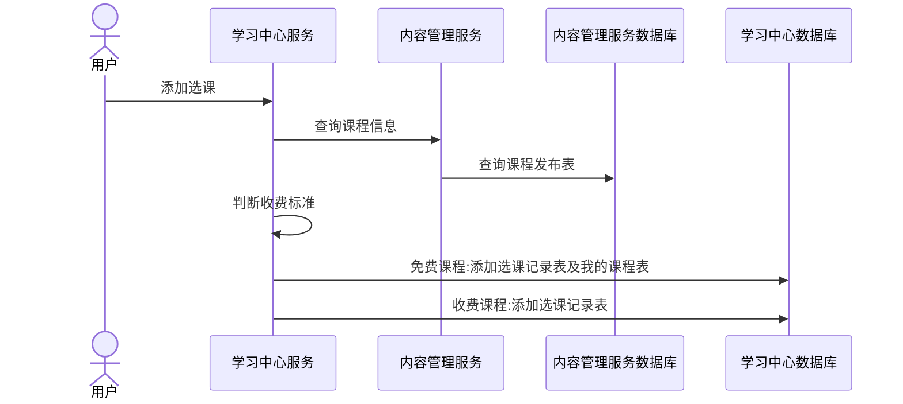

# 学成在线Day11

# 用户授权

## RBAC

如何实现授权？业界通常基于RBAC实现授权。

RBAC分为两种方式：

基于角色的访问控制（Role-Based Access Control）

基于资源的访问控制（Resource-Based Access Control）

角色的访问控制（Role-Based Access Control）是按角色进行授权，比如：主体的角色为总经理可以查询企业运营报表，查询员工工资信息等，访问控制流程如下：


根据上图中的判断逻辑，授权代码可表示如下：

```java
if(主体.hasRole("总经理角色id")){
	查询工资
}
```

如果上图中查询工资所需要的角色变化为总经理和部门经理，此时就需要修改判断逻辑为“判断用户的角色是否是总经理或部门经理”，修改代码如下：

```java
if(主体.hasRole("总经理角色id") ||  主体.hasRole("部门经理角色id")){
    查询工资
}
```

根据上边的例子发现，当需要修改角色的权限时就需要修改授权的相关代码，系统可扩展性差。

基于资源的访问控制（Resource-Based Access

Control）是按资源（或权限）进行授权，比如：用户必须具有查询工资权限才可以查询员工工资信息等，访问控制流程如下：


根据上图中的判断，授权代码可以表示为：

```java
if(主体.hasPermission("查询工资权限标识")){
    查询工资
}
```

优点：系统设计时定义好查询工资的权限标识，即使查询工资所需要的角色变化为总经理和部门经理也不需要修改授权代码，系统可扩展性强。

## 资源服务授权流程

本项目在资源服务内部进行授权，基于资源的授权模式，因为接口在资源服务，通过在接口处添加授权注解实现授权。

在资源服务集成Spring Security

在需要授权的接口处使用@PreAuthorize("hasAuthority('权限标识符')")进行控制

下边代码指定/course/list接口需要拥有xc_teachmanager_course_list 权限。


设置了@PreAuthorize表示执行此方法需要授权，如果当前用户请求接口没有权限则抛出异常

org.springframework.security.access.AccessDeniedException: 不允许访问

在统一异常处理处处理异常

```java
@ResponseBody
@ExceptionHandler(Exception.class)
@ResponseStatus(HttpStatus.INTERNAL_SERVER_ERROR)
public RestErrorResponse exception(Exception e) {
    log.error("【系统异常】{}",e.getMessage(),e);
    e.printStackTrace();
    if(e.getMessage().equals("不允许访问")){
        return new RestErrorResponse("没有操作此功能的权限");
    }
    return new RestErrorResponse(CommonError.UNKOWN_ERROR.getErrMessage());
}
```

重启资源服务进行测试

使用教学机构用户登录系统

这里使用t1用户登录，账号:t1、密码：111111

登录成功，点击“教学机构”


如何给用户分配权限呢？

首先要学习数据模型，本项目授权相关的数据表如下：


xc_user：用户表，存储了系统用户信息，用户类型包括：学生、老师、管理员等

xc_role：角色表，存储了系统的角色信息，学生、老师、教学管理员、系统管理员等。

xc_user_role：用户角色表，一个用户可拥有多个角色，一个角色可被多个用户所拥有

xc_menu:模块表，记录了菜单及菜单下的权限

xc_permission:角色权限表，一个角色可拥有多个权限，一个权限可被多个角色所拥有

本项目要求掌握基于权限数据模型（5张数据表），要求在数据库中操作完成给用户分配权限、查询用户权限等需求。

1、查询用户所拥有的权限

步骤：

查询用户的id

查询用户所拥有的角色

查询用户所拥有的权限

例子：

```mysql
SELECT * FROM xc_menu WHERE id IN(
    SELECT menu_id FROM xc_permission WHERE role_id IN(
        SELECT role_id FROM xc_user_role WHERE user_id = '49'
    )
)
```

2、给用户分配权限

1）添加权限

查询用户的id

查询权限的id

查询用户的角色，如果没有角色需要先给用户指定角色

向角色权限表添加记录

2）删除用户权限

本项目是基于角色分配权限，如果要删除用户的权限可以给用户换角色，那么新角色下的权限就是用户的权限；如果不换用户的角色可以删除角色下的权限即删除角色权限关系表相应记录，这样操作是将角色下的权限删除，属于该角色的用户都将删除此权限。

## 查询用户权限

使用Spring Security进行授权，首先在生成jwt前会查询用户的权限，如下图


接下来需要修改UserServiceImpl和PasswordAuthServiceImpl从数据库查询用户的权限。

1. 定义mapper接口

```java
public interface XcMenuMapper extends BaseMapper<XcMenu> {
    @Select("SELECT    * FROM xc_menu WHERE id IN (SELECT menu_id FROM xc_permission WHERE role_id IN ( SELECT role_id FROM xc_user_role WHERE user_id = #{userId} ))")
    List<XcMenu> selectPermissionByUserId(@Param("userId") String userId);
}
```

2. 修改PasswordAuthServiceImpl

修改UserServiceImpl类的getUserPrincipal方法，查询权限信息

```java
//查询用户身份
public UserDetails getUserPrincipal(XcUserExt user){
    String password = user.getPassword();
    //查询用户权限
    List<XcMenu> xcMenus = menuMapper.selectPermissionByUserId(user.getId());
    List<String> permissions = new ArrayList<>();
    if(xcMenus.size()<=0){
        //用户权限,如果不加则报Cannot pass a null GrantedAuthority collection
        permissions.add("p1");
    }else{
        xcMenus.forEach(menu->{
            permissions.add(menu.getCode());
        });
    }
    //将用户权限放在XcUserExt中
    user.setPermissions(permissions);

    //为了安全在令牌中不放密码
    user.setPassword(null);
    //将user对象转json
    String userString = JSON.toJSONString(user);
    String[] authorities = permissions.toArray(new String[0]);
    UserDetails userDetails = User.withUsername(userString).password(password).authorities(authorities).build();
    return userDetails;
}
```

将xc_teachmanager_course_list权限分配给用户。

1）首先找到当前用户的角色

2）找到xc_teachmanager_course_list权限的主键

3）在角色权限关系表中添加记录

分配完权限需要重新登录

由于用户分配了xc_teachmanager_course_list权限，用户具有访问课程查询接口的权限。

## 细粒度授权

### **什么是细粒度授权**

什么是细粒度授权？

细粒度授权也叫数据范围授权，即不同的用户所拥有的操作权限相同，但是能够操作的数据范围是不一样的。一个例子：用户A和用户B都是教学机构，他们都拥有“我的课程”权限，但是两个用户所查询到的数据是不一样的。

本项目有哪些细粒度授权？

比如：

我的课程，教学机构只允许查询本教学机构下的课程信息。

我的选课，学生只允许查询自己所选课。

如何实现细粒度授权？

细粒度授权涉及到不同的业务逻辑，通常在`service`层实现，根据不同的用户进行校验，根据不同的参数查询不同的数据或操作不同的数据。

### 教学机构细粒度授权

教学机构在维护课程时只允许维护本机构的课程，教学机构细粒度授权过程如下：

1. 获取当前登录的用户身份

2. 得到用户所属教育机构的Id

3. 查询该教学机构下的课程信息

最终实现了用户只允许查询自己机构的课程信息。

根据公司Id查询课程，流程如下：

1. 教学机构用户登录系统，从用户身份中取出所属机构的id,在用户表中设计了company_id字段存储该用户所属的机构id.

2. 接口层取出当前登录用户的身份，取出机构id

3) 将机构id传入service方法。
4) service方法将机构id传入Dao方法，最终查询出本机构的课程信息。

代码实现如下：

```java
@ApiOperation("课程查询接口")
@PreAuthorize("hasAuthority('xc_teachmanager_course_list')")//拥有课程列表查询的权限方可访问
@PostMapping("/course/list")
public PageResult<CourseBase> list(PageParams pageParams, @RequestBody QueryCourseParamsDto queryCourseParams){
    //取出用户身份
    XcUser user = SecurityUtil.getUser();
    //机构id
    String companyId = user.getCompanyId();
    return courseBaseInfoService.queryCourseBaseList(Long.parseLong(companyId),pageParams,queryCourseParams);
}
```

Service层:

```java
@Transactional
@Override
public PageResult<CourseBase> queryCourseBaseList(Long companyId, PageParams pageParams, QueryCourseParamsDTO queryCourseParamsDto) {
    //构建查询条件对象
    LambdaQueryWrapper<CourseBase> queryWrapper = new LambdaQueryWrapper<>();
    //构建查询条件，根据课程名称查询
    queryWrapper.like(StringUtils.isNotEmpty(queryCourseParamsDto.getCourseName()), CourseBase::getName, queryCourseParamsDto.getCourseName());
    //构建查询条件，根据课程审核状态查询
    queryWrapper.eq(StringUtils.isNotEmpty(queryCourseParamsDto.getAuditStatus()), CourseBase::getAuditStatus, queryCourseParamsDto.getAuditStatus());
    //构建查询条件，根据课程发布状态查询
    queryWrapper.eq(StringUtils.isNotEmpty(queryCourseParamsDto.getPublishStatus()), CourseBase::getStatus, queryCourseParamsDto.getPublishStatus());
    //构建查询条件，根据课程所属机构查询
    queryWrapper.eq(CourseBase::getCompanyId, companyId);
    //分页对象
    Page<CourseBase> page = new Page<>(pageParams.getPageNo(), pageParams.getPageSize());
    // 查询数据内容获得结果
    Page<CourseBase> pageResult = courseBaseMapper.selectPage(page, queryWrapper);
    // 获取数据列表
    List<CourseBase> list = pageResult.getRecords();
    // 获取数据总数
    long total = pageResult.getTotal();
    // 构建结果集
    PageResult<CourseBase> courseBasePageResult = new PageResult<>(list, total, pageParams.getPageNo(), pageParams.getPageSize());
    return courseBasePageResult;
}
```

`启动后出现配置类重名情况`

原因:因为我前面没写工具类导致引入的工具类是其他包的工具类顺便在maven导入了其他模块进而导致了类名重复无法运行,下次可以先从maven依赖开始检查

# 找回密码实战

## 找回密码接口文档

**只做邮箱找回密码**

>- 需求：忘记密码需要找回，可以通过邮箱找回密码
>- 页面访问地址：localhost/findpassword.html

接口:

>邮箱验证码：/api/checkcode/phone?param1=电子邮箱地址
>
>找回密码：/api/auth/findpassword

请求:

```json
{
    cellphone:'',
    email:'',
    checkcodekey:'',
    checkcode:'',
    confirmpwd:'',
    password:''
}
```

响应：

200: 找回成功

其它：找回失败，失败原因使用统一异常处理返回的信息格式

执行流程

1. 校验验证码，不一致则抛出异常

2. 判断两次密码是否一致，不一致则抛出异常

3. 根据手机号和邮箱查询用户

4. 如果找到用户更新为新密码

## 找回密码代码开发

### 1. 安装相关依赖

邮箱相关依赖:

```xml
<!-- https://mvnrepository.com/artifact/javax.activation/activation -->
<dependency>
    <groupId>javax.activation</groupId>
    <artifactId>activation</artifactId>
    <version>1.1.1</version>
</dependency>
<!-- https://mvnrepository.com/artifact/javax.mail/mail -->
<dependency>
    <groupId>javax.mail</groupId>
    <artifactId>mail</artifactId>
    <version>1.4.7</version>
</dependency>
<!-- https://mvnrepository.com/artifact/org.apache.commons/commons-email -->
<dependency>
    <groupId>org.apache.commons</groupId>
    <artifactId>commons-email</artifactId>
    <version>1.4</version>
</dependency>
```

### 2. 编写邮箱工具类

```java
package com.xuecheng.checkcode.utils;

import javax.mail.*;
import javax.mail.internet.InternetAddress;
import javax.mail.internet.MimeMessage;
import javax.mail.internet.MimeMessage.RecipientType;
import java.util.Arrays;
import java.util.Collections;
import java.util.List;
import java.util.Properties;

public class MailUtil {


    private MimeMessage mimeMsg; // 邮件对象
    private Multipart mp;// 附件添加的组件

    public static void main(String[] args) throws MessagingException {
        //可以在这里直接测试方法，填自己的邮箱即可
        sendTestMail("a1605691832@163.com", achieveCode());
    }

    /**
     * 发送邮件
     * @param email 收件邮箱号
     * @param code  验证码
     * @throws MessagingException 邮件异常
     */
    public static void sendTestMail(String email, String code) throws MessagingException {
        /* 创建Properties 类用于记录邮箱的一些属性
         * 1.邮件服务器
         * 2.发件人邮箱
         * 3.发件人的授权密码
         * 4.邮件主题
         * 5.收件人，多个收件人以半角逗号分隔
         * 6.抄送，多个抄送以半角逗号分隔
         * 7.正文，可以用html格式的哟
         */
        Properties props = new Properties();
        // 表示SMTP发送邮件，必须进行身份验证
        props.put("mail.smtp.auth", "true");
        //此处填写SMTP服务器
        props.put("mail.smtp.host", "smtp.163.com");
        //端口号，QQ邮箱端口587
        props.put("mail.smtp.port", "25");
        // 此处填写，写信人的账号
        props.put("mail.user", "a1605691832@163.com");
        // 此处填写16位STMP口令
        props.put("mail.password", "CZLXNYOVEHHUQRXB");
        // 构建授权信息，用于进行SMTP进行身份验证
        Authenticator authenticator = new Authenticator() {
            protected PasswordAuthentication getPasswordAuthentication() {
                // 用户名、密码
                String userName = props.getProperty("mail.user");
                String password = props.getProperty("mail.password");
                return new PasswordAuthentication(userName, password);
            }
        };
        // 使用环境属性和授权信息，创建邮件会话
        Session mailSession = Session.getInstance(props, authenticator);
        // 创建邮件消息
        MimeMessage message = new MimeMessage(mailSession);
        // 设置发件人
        InternetAddress from = new InternetAddress(props.getProperty("mail.user"));
        message.setFrom(from);
        // 设置收件人的邮箱
        InternetAddress to = new InternetAddress(email);
        message.setRecipient(RecipientType.TO, to);
        // 设置邮件标题
        message.setSubject("Wwhds 学成在线实战邮件测试");
        // 设置邮件的内容体
        message.setContent("尊敬的用户:你好!\n注册验证码为:" + code + "(有效期为一分钟,请勿告知他人)", "text/html;charset=UTF-8");
        // 最后当然就是发送邮件啦
        Transport.send(message);
    }

    /**
     *  生成验证码
     * @return 验证码
     */
    public static String achieveCode() {  //由于数字 1 、 0 和字母 O 、l 有时分不清楚，所以，没有数字 1 、 0
        String[] beforeShuffle = new String[]{"2", "3", "4", "5", "6", "7", "8", "9", "A", "B", "C", "D", "E", "F",
                "G", "H", "I", "J", "K", "L", "M", "N", "O", "P", "Q", "R", "S", "T", "U", "V", "W", "X", "Y", "Z", "a",
                "b", "c", "d", "e", "f", "g", "h", "i", "j", "k", "l", "m", "n", "o", "p", "q", "r", "s", "t", "u", "v",
                "w", "x", "y", "z"};
        List<String> list = Arrays.asList(beforeShuffle);//将数组转换为集合
        Collections.shuffle(list);  //打乱集合顺序
        StringBuilder sb = new StringBuilder();
        for (String s : list) {
            sb.append(s); //将集合转化为字符串
        }
        return sb.substring(3, 8);
    }
}
```

### 3. 发送验证码接口

**Controller层:**

```java
@ApiOperation(value = "发送邮箱验证码", tags = "发送邮箱验证码")
@PostMapping("/phone")
public void sendEMail(@RequestParam("param1") String email) throws MessagingException {
    String code = MailUtil.achieveCode();
    sendCodeService.sendCodeToEmail(email, code);
}
```

**Service接口:**

```java
public interface SendCodeService {

        /**
        * 发送验证码
        * @param email 目标邮箱
        * @param code 验证码
        */
        void sendCodeToEmail(String email,String code);
}
```

**Service实现类:**

```java
@Service
@Slf4j
public class SendCodeServiceImpl implements SendCodeService {

    @Autowired
    RedisTemplate<String, String> redisTemplate;

    @Override
    public void sendCodeToEmail(String email, String code) {
        log.info("发送验证码到邮箱：{}，验证码：{}", email, code);
        try {
            //1.发送邮件
            MailUtil.sendTestMail(email, code);
        } catch (MessagingException e) {
            log.info("发送验证码到邮箱失败：{}，验证码：{}", email, code);
            XueChengPlusException.cast("发送验证码到邮箱失败");
        }
        //2.将验证码存入redis
        long CODE_EXPIRE_TIME = 2 * 60L;
        redisTemplate.opsForValue().set(email, code, CODE_EXPIRE_TIME);
    }
}
```

### 4. 验证验证码接口

密码找回DTO类:

```java
@Data
@NoArgsConstructor
@AllArgsConstructor
public class FindPswDto {

    String cellphone;

    String email;

    String checkcodekey;

    String checkcode;

    String password;

    String confirmpwd;
}
```

**Controller层:**

```java
@ApiOperation(value = "验证验证码是否正确", tags = "验证验证码是否正确")
@PostMapping("/findpassword")
public void verifyCode(@RequestBody FindPswDto findPswDto) {
    log.info("验证验证码:{}", findPswDto);
    verifyService.findPassword(findPswDto);
}
```

**Service接口:**

```java
public interface VerifyService {
    void findPassword(FindPswDto findPswDto);
}
```

**Service实现类:**

```java
@Service
@Slf4j
public class VerifyServiceImpl implements VerifyService {

    @Autowired
    private RedisTemplate<String,String> redisTemplate;

    @Autowired
    private XcUserMapper userMapper;
    @Override
    public void findPassword(FindPswDto findPswDto) {
        //获取redis中的验证码
        String code = redisTemplate.opsForValue().get(findPswDto.getEmail());
        if (code == null) {
            log.info("验证码已过期");
            XueChengPlusException.cast("验证码已过期");
        }
        if (!code.equals(findPswDto.getCheckcode())) {
            log.info("验证码错误");
            XueChengPlusException.cast("验证码已过期");
        }
        String password = findPswDto.getPassword();
        String confirmpwd = findPswDto.getConfirmpwd();
        if (!password.equals(confirmpwd)) {
            log.info("两次密码不一致");
            XueChengPlusException.cast("两次密码不一致");
        }
        //修改密码
        LambdaQueryWrapper<XcUser> wrapper = new LambdaQueryWrapper<>();
        wrapper.eq(XcUser::getEmail,findPswDto.getEmail());
        wrapper.eq(XcUser::getCellphone,findPswDto.getCellphone());
        XcUser xcUser = userMapper.selectOne(wrapper);
        if (xcUser == null) {
            log.info("用户不存在");
            XueChengPlusException.cast("用户不存在");
        }
        xcUser.setPassword(new BCryptPasswordEncoder().encode(password));
        userMapper.updateById(xcUser);
    }
}
```

# 注册实战

## 注册接口文档

需求：为学生提供注册入口，通过此入口注册的用户为学生用户。

界面访问地址：http://www.51xuecheng.cn/register.html


接口：

手机验证码：/api/checkcode/phone?param1=手机号

注册：/api/auth/register

请求：

```json
{
    cellphone:'',
    username:'',
    email:'',
    nickname:'',
    password:'',
    confirmpwd:'',
    checkcodekey:'',
    checkcode:''
}
```

响应：

200: 注册成功

其它：注册失败，失败原因使用统一异常处理返回的信息格式

执行流程：

1. 校验验证码，如果不一致则抛出异常

2. 校验两次密码是否一致，如果不一致则抛出异常

3. 校验用户是否存在，如果存在则抛出异常

4. 向用户表、用户角色关系表添加数据。角色为学生角色。

## 代码开发

### 1. 准备DTO类接受注册参数

```java
@Data
@NoArgsConstructor
@AllArgsConstructor
public class RegisterDto {

    private String cellphone;

    private String checkcode;

    private String checkcodekey;

    private String confirmpwd;

    private String email;

    private String nickname;

    private String password;

    private String username;
}
```

### 2. 注册接口

**Controller层:**

```java
@ApiOperation(value = "注册", tags = "注册")
@RequestMapping("/register")
public void register(@RequestBody RegisterDto registerDto) {
    verifyService.register(registerDto);
}
```

**Sevice接口:**

```java
public interface VerifyService {
    void register(RegisterDto registerDto);
}
```

**Service接口实现类:**

```java
@Override
@Transactional
public void register(RegisterDto registerDto) {
    String id = UUID.randomUUID().toString();
    String email = registerDto.getEmail();
    String password = registerDto.getPassword();
    String confirmpwd = registerDto.getConfirmpwd();
    String checkcode = registerDto.getCheckcode();
    Boolean verify = verify(email, checkcode);
    //验证码错误
    if ( !verify ) {
        throw new RuntimeException("验证码输入错误");
    }
    //两次密码不一致
    if ( !password.equals(confirmpwd) ) {
        throw new RuntimeException("两次密码不一致");
    }
    LambdaQueryWrapper<XcUser> wrapper = new LambdaQueryWrapper<>();
    wrapper.eq(XcUser::getEmail, email);
    XcUser xcUser = userMapper.selectOne(wrapper);
    if ( xcUser != null ) {
        throw new RuntimeException("邮箱已被注册,一个账号只能有一个用户");
    }
    XcUser user = new XcUser();
    BeanUtils.copyProperties(registerDto, user);
    user.setPassword(new BCryptPasswordEncoder().encode(password));
    user.setId(id);
    user.setUtype("101001");
    user.setStatus("1");
    user.setName(registerDto.getNickname());
    user.setCreateTime(LocalDateTime.now());
    user.setUpdateTime(LocalDateTime.now());
    int insert = userMapper.insert(user);
    if ( insert <= 0 ) {
        XueChengPlusException.cast("注册失败");
    }
    XcUserRole userRole = new XcUserRole();
    userRole.setUserId(id);
    userRole.setRoleId("17");
    userRole.setId(id);
    userRole.setCreateTime(LocalDateTime.now());
    int insert1 = userRoleMapper.insert(userRole);
    if ( insert1 <= 0 ) {
        XueChengPlusException.cast("注册失败");
    }
}
```

### 3. 问题整理

### 3.1. Spring Security问题:

```java
@ApiOperation(value = "修改密码", tags = "修改密码")
@RequestMapping("/findpassword")
public void verifyCode(@RequestBody FindPswDto findPswDto) {
    log.info("修改密码:{}", findPswDto);
    verifyService.findPassword(findPswDto);
}

@ApiOperation(value = "注册", tags = "注册")
@RequestMapping("/register")
public void register(@RequestBody RegisterDto registerDto) {
    verifyService.register(registerDto);
}
```

这部分api接口一开始发送请求无论何种内容均会被返回403(Forbidden)

原因和`Spring Security`有关

在WebSecurityConfig中

原安全拦截机制代码如下:

```java
//配置安全拦截机制
@Override
protected void configure(HttpSecurity http) throws Exception {
    http
        .authorizeRequests()
        .antMatchers("/r/**").authenticated()//访问/r开始的请求需要认证通过
        .anyRequest().permitAll()//其它请求全部放行
        .and()
        .formLogin().successForwardUrl("/login-success");//登录成功跳转到/login-success
    http.logout().logoutUrl("/logout");//退出地址
}
```

修改后的安全拦截机制如下:

```java
@Override
protected void configure(HttpSecurity http) throws Exception {
    http
        .csrf().disable()
        .authorizeRequests()
        .anyRequest().permitAll()
        .and()
        .formLogin().successForwardUrl("/login-success");
}
```

可以看到`csrf().disable()`，我们让csrf失效使得注册和找回密码需求可以正常运行

### 3.2 redis缓存提前删除

```java
public Boolean verify(String email, String checkcode) {
    // 1. 从redis中获取缓存的验证码
    String codeInRedis = redisTemplate.opsForValue().get(email);
    // 2. 判断是否与用户输入的一致
    if ( codeInRedis != null && codeInRedis.equalsIgnoreCase(checkcode) ) {
        redisTemplate.delete(email);
        return true;
    }
    return false;
}
```

`redisTemplate.delete(email);`由于在调用`verify`方法的方法中后续插入数据库可能导致失败，但是这步却成功了，导致删除了验证码却无法成功注册，只能重新生成验证码，可以考虑在结尾删除验证码

### 3.3 SMTP泄露

首先感谢Git邮件提醒

、

解决方法就是通过nacos发布配置替代硬编码

#### 3.3.1 在nacos发布配置

```yaml
spring:
  mail:
    host: smtp.**.com
    port: **
    username: *********@163.com
    password: CZL**********XNY
```

#### 3.3.2 设置配置读取配置类

```java
@Configuration
public class MailSendConfigProperties {


    @Value(value = "${spring.mail.host}")
    public String host;

    @Value(value = "${spring.mail.port}")
    public String port;

    @Value(value = "${spring.mail.username}")
    public String username;

    @Value(value = "${spring.mail.password}")
    public String password;
}
```

`@Configuration`即可，不用其他注解。

#### 3.3.3 工具类修改

```java
@Component
public class MailUtil {

    @Autowired
    private MailSendConfigProperties mailProperties;

    private static MailSendConfigProperties MailProperties;
    //提前读取配置文件
    @PostConstruct
    public void init(){
        //        System.out.println("mailProperties.host = " + mailProperties.host);
        //        System.out.println("mailProperties.port = " + mailProperties.port);
        //        System.out.println("mailProperties.username = " + mailProperties.username);
        //        System.out.println("mailProperties.password = " + mailProperties.password);
        MailProperties = mailProperties;
    }

    public static void main(String[] args) throws MessagingException {
        //可以在这里直接测试方法，填自己的邮箱即可
        sendTestMail(MailProperties.host, achieveCode());
    }
    ...
}
```

- 首先将工具类加入`@Component`使得其可以进行自动注入

- 然后注入配置类并设置一个静态配置类

- 设置`init()`方法然后加上`@PostConStruct`注解使得其能在静态方法前加载完成

- 用`@PostConStruct`一定要在`bootstrap.yml`文件开启配置

  ```yaml
  spring:
    main:
  	allow-bean-definition-overriding: true
  ```

  
  
  
  
# 选课学习

  # 模块需求分析

  ## 模块介绍

  本模块实现了学生选课、下单支付、学习的整体流程。

  网站的课程有免费和收费两种，对于免费课程学生选课后可直接学习，对于收费课程学生需要下单且支付成功方可选课、学习。

  选课：是将课程加入我的课程表的过程。

  我的课程表：记录我在网站学习的课程，我的课程表中有免费课程和收费课程两种，对于免费课程可直接添加到我的课程表，对于收费课程需要下单、支付成功后自动加入我的课程表。

  模块整体流程如下：

  

## 业务流程

### 学习引导

用户通过搜索课程、课程推荐等信息进入课程详情页面，点击“马上学习” 引导进入学习界面去学习。

流程如下：


 

1、进入课程详情点击马上学习


2、课程免费时引导加入我的课程表、或进入学习界面。


3、课程收费时引导去支付、或试学。


 

### 选课流程

选课是将课程加入我的课程表的过程。

对免费课程选课后可直接加入我的课程表，对收费课程选课后需要下单支付成功系统自动加入我的课程表。

流程如下：


### 支付流程

本项目与第三方支付平台对接完成支付操作。

流程如下：


 

### 在线学习

选课成功用户可以在线学习，对于免费课程无需选课即可在线学习。

流程如下：


### 免费课程续期

免费课程加入我的课程表默认为1年有效期，到期用户可申请续期，流程如下：


# 添加选课

## 需求分析

### 数据模型

选课是将课程加入我的课程表的过程，根据选课的业务流程进行详细分析，业务流程如下：


选课信息存入选课记录表，免费课程被选课除了进入选课记录表同时进入我的课程表，收费课程进入选课记录表后需要经过下单、支付成功才可以进入我的课程表。

我的课程表记录了用户学习的课程，包括免费课程、收费课程（已经支付）。

1、选课记录表

当用户将课程添加到课程表时需要先创建选课记录。

结构如下：


选课类型：免费课程、收费课程。

选课状态：选课成功、待支付、选课删除。

对于免费课程：课程价格为0，有效期默认365，开始服务时间为选课时间，结束服务时间为选课时间加1年后的时间，选课状态为选课成功。

对于收费课程：按课程的现价、有效期确定开始服务时间、结束服务时间，选课状态为待支付。

收费课程的选课记录需要支付成功后选课状态为成功。

 

2、我的课程表

我的课程表中记录了用户选课成功的课程，所以我的课程表的数据来源于选课记录表。 

对于免费课程创建选课记录后同时向我的课程表添加记录。

对于收费课程创建选课记录后需要下单支付成功后自动向我的课程表添加记录。


### 执行流程



## 接口开发

### 添加查询课程接口

**Controller**

```java
/**
     * @description 课程预览，发布，内部调用不用token
     * @param courseId 课程id
     * @return void
     */
@ApiOperation("课程发布")
@PostMapping("/r/coursepublish/{courseId}")
public CoursePublish getCoursepublish(@PathVariable("courseId") Long courseId) {
    return coursePublishService.getCoursePublish(courseId);
}
```

**Service接口**

```java
CoursePublish getCoursePublish(Long courseId);
```

**Service实现方法**

```java
@Override
public CoursePublish getCoursePublish(Long courseId) {
    return coursePublishMapper.selectById(courseId);
}
```

由于是在网关处进行令牌校验，所以在微服务处不再校验令牌的合法性，修改内容管理content-api工程的ResouceServerConfig类，屏蔽authenticated()。

```java
@Override
public void configure(HttpSecurity http) throws Exception {
    http.csrf().disable()
        .authorizeRequests()
        //          .antMatchers("/r/**","/course/**").authenticated()//所有/r/**的请求必须认证通过
        .anyRequest().permitAll();
}
```

测试类

```java
@SpringBootTest
public class FeignClientTest {
    @Autowired
    ContentServiceClient contentServiceClient;
    @Test
    public void testContentServiceClient() {
        CoursePublish coursepublish = contentServiceClient.getCoursepublish(125L);
        Assertions.assertNotNull(coursepublish);
    }
}
```

在进行feign远程调用时会将字符串转成LocalDateTime，在CoursePublish 类中LocalDateTime的属性上边添加如下代码：

```java
@JsonFormat(shape = JsonFormat.Shape.STRING,pattern = "yyyy-MM-dd HH:mm:ss")
```

`@JsonFormat说明:`
该注解可用于返回日期数据时的时间格式化。
如果前端传来的为字符串格式的日期：“2022年07月29日 09时41分22秒”，则需要如下配置：
@JsonFormat(pattern = “yyyy年MM月dd日 HH时mm分ss秒”)
private Date createTime;

解析后存入DB中的则为：2022-07-29 09:41:22，而在查询时返回的数据则为：“2022年07月29日 09时41分22秒”

### 添加选课接口

#### 接口分析

本接口支持免费课程选课、收费课程选课。

免费课程选课：添加选课记录、添加我的课程表。

收费课程选课：添加选课记录。

**接口定义**

1、请求参数：课程id、当前用户id

2、响应结果：选课记录信息、学习资格

#### 接口定义

学习资格：

```json
[
    {"code":"702001","desc":"正常学习"},
    {"code":"702002","desc":"没有选课或选课后没有支付"},
    {"code":"702003","desc":"已过期需要申请续期或重新支付"}
]
```

接口定义如下：

**Controller**

```java
@ApiOperation("添加选课")
@PostMapping("/choosecourse/{courseId}")
public XcChooseCourseDto addChooseCourse(@PathVariable("courseId") Long courseId) {
    //获取用户信息
    SecurityUtil.XcUser user = SecurityUtil.getUser();
    if(user == null){
        XueChengPlusException.cast("请登录后再操作");
    }
    //获取用户id
    String userId = user.getId();
    //选课
    XcChooseCourseDto xcChooseCourseDto = myCourseTableService.addChooseCourse(userId, courseId);
    return xcChooseCourseDto;
}
```

**Service接口**

```java
public interface MyCourseTableService {
    /**
     * @param userId   用户id
     * @param courseId 课程id
     * @return com.xuecheng.learning.model.dto.XcChooseCourseDto
     * @description 添加选课
     * @author Mr.M
     * @date 2022/10/24 17:33
     */
    XcChooseCourseDto addChooseCourse(String userId, Long courseId);

    /**
     * @param userId   用户id
     * @param courseId 课程id
     * @return com.xuecheng.learning.model.dto.XcCourseTablesDto
     * @description 查询学习资格，是否可以学习课程，是否已经选课，是否已经支付等等信息，返回给前端，前端根据这些信息决定是否可以学习课程，是否可以支付等等操作
     * @date 2022/10/24 17:33
     */
    XcCourseTablesDto getLearningStatus(String userId, Long courseId);

}
```

**添加免费课程**

```java
//添加免费课程,免费课程加入选课记录表、我的课程表
public XcChooseCourse addFreeCoruse(String userId, CoursePublish coursepublish) {
    //如果存在免费选课记录且选课为成功状态,直接返回
    LambdaQueryWrapper<XcChooseCourse> eq = new LambdaQueryWrapper<XcChooseCourse>()
        .eq(XcChooseCourse::getUserId, userId)
        .eq(XcChooseCourse::getCourseId, coursepublish.getId())
        .eq(XcChooseCourse::getOrderType, "700001") //免费课程
        .eq(XcChooseCourse::getStatus, "701001");//选课成功
    List<XcChooseCourse> xcChooseCourses = xcChooseCourseMapper.selectList(eq);
    //同一个人同一门课程只能选一次,但数据库没有主键约束可能有多次,这里只取第一次
    if( !xcChooseCourses.isEmpty() ){
        return xcChooseCourses.get(0);
    }
    //向选课记录写数据
    XcChooseCourse xcChooseCourse = new XcChooseCourse();
    xcChooseCourse.setCourseId(coursepublish.getId());
    xcChooseCourse.setCourseName(coursepublish.getName());
    xcChooseCourse.setUserId(userId);
    xcChooseCourse.setCompanyId(coursepublish.getCompanyId());
    xcChooseCourse.setOrderType("700001");//免费课程
    xcChooseCourse.setCreateDate(LocalDateTime.now());
    xcChooseCourse.setCoursePrice(coursepublish.getPrice());
    xcChooseCourse.setValidDays(365); //暂时硬编码
    xcChooseCourse.setStatus("701001");//选课成功
    xcChooseCourse.setValidtimeStart(LocalDateTime.now());
    xcChooseCourse.setValidtimeEnd(LocalDateTime.now().plusDays(365));
    int insert = xcChooseCourseMapper.insert(xcChooseCourse);
    if( insert <= 0 ){
        XueChengPlusException.cast("添加选课失败");
    }
    return xcChooseCourse;
}
```

**添加收费课程**

```java
//添加收费课程
public XcChooseCourse addChargeCoruse(String userId, CoursePublish coursepublish) {
    //如果存在收费选课记录且选课状态为待支付，直接返回
    LambdaQueryWrapper<XcChooseCourse> eq = new LambdaQueryWrapper<XcChooseCourse>()
        .eq(XcChooseCourse::getUserId, userId)
        .eq(XcChooseCourse::getCourseId, coursepublish.getId())
        .eq(XcChooseCourse::getOrderType, "700002") //收费课程
        .eq(XcChooseCourse::getStatus, "701002");//选课成功
    List<XcChooseCourse> xcChooseCourses = xcChooseCourseMapper.selectList(eq);
    //同一个人同一门课程只能选一次,但数据库没有主键约束可能有多次,这里只取第一次
    if( !xcChooseCourses.isEmpty() ){
        return xcChooseCourses.get(0);
    }
    //向选课记录写数据
    XcChooseCourse xcChooseCourse = new XcChooseCourse();
    xcChooseCourse.setCourseId(coursepublish.getId());
    xcChooseCourse.setCourseName(coursepublish.getName());
    xcChooseCourse.setUserId(userId);
    xcChooseCourse.setCompanyId(coursepublish.getCompanyId());
    xcChooseCourse.setOrderType("700002");//免费课程
    xcChooseCourse.setCreateDate(LocalDateTime.now());
    xcChooseCourse.setCoursePrice(coursepublish.getPrice());
    xcChooseCourse.setValidDays(365); //暂时硬编码
    xcChooseCourse.setStatus("701002");//选课成功
    xcChooseCourse.setValidtimeStart(LocalDateTime.now());
    xcChooseCourse.setValidtimeEnd(LocalDateTime.now().plusDays(365));
    int insert = xcChooseCourseMapper.insert(xcChooseCourse);
    if( insert <= 0 ){
        XueChengPlusException.cast("添加选课失败");
    }
    return xcChooseCourse;
}
```

**添加到我的课程表:**

```java
//添加到我的课程表
public XcCourseTables addCourseTabls(XcChooseCourse xcChooseCourse) {
    //选课成功才能向我的课程表添加数据
    if( !xcChooseCourse.getStatus().equals("701001") ){
        XueChengPlusException.cast("选课失败,无法添加到我的课程表");
    }
    XcCourseTables xcCourseTables = getXcCourseTables(xcChooseCourse.getUserId(), xcChooseCourse.getCourseId());
    if( xcCourseTables != null ){
        return xcCourseTables;
    }
    xcCourseTables = new XcCourseTables();
    BeanUtils.copyProperties(xcChooseCourse, xcCourseTables);
    xcCourseTables.setChooseCourseId(xcChooseCourse.getId());//记录选课记录id
    xcCourseTables.setCourseType(xcChooseCourse.getOrderType());//课程类型
    xcCourseTables.setUpdateDate(LocalDateTime.now());
    int insert = xcCourseTablesMapper.insert(xcCourseTables);
    if( insert <= 0 ){
        XueChengPlusException.cast("添加我的课程表失败");
    }
    return xcCourseTables;
}
```

**获取学习资格**

```java
@Override
public XcCourseTablesDto getLearningStatus(String userId, Long courseId) {
    //查询我的课程表,查不到说明没有资格学习
    XcCourseTables xcCourseTables = getXcCourseTables(userId, courseId);
    //最终返回结果
    XcCourseTablesDto xcCourseTablesDto = new XcCourseTablesDto();
    if( xcCourseTables == null ){
        //{"code":"702002","desc":"没有选课或选课后没有支付"}
        xcCourseTablesDto.setLearnStatus("702002");
        return xcCourseTablesDto;
    }
    //查询到了之后,判断是否过期
    LocalDateTime validtimeEnd = xcCourseTables.getValidtimeEnd();
    if( validtimeEnd.isBefore(LocalDateTime.now()) ){
        //{"code":"702003","desc":"选课已过期"}
        xcCourseTablesDto.setLearnStatus("702003");
        BeanUtils.copyProperties(xcCourseTables, xcCourseTablesDto);
    }else{
        xcCourseTablesDto.setLearnStatus("702001");
        BeanUtils.copyProperties(xcCourseTables, xcCourseTablesDto);
    }
    return xcCourseTablesDto;
}
```

**addChooseCourse接口完善**

```java
@Transactional
@Override
public XcChooseCourseDto addChooseCourse(String userId, Long courseId) {
    //远程调用服务查看课程收费规则
    CoursePublish coursepublish = contentServiceClient.getCoursepublish(courseId);
    if ( coursepublish == null ) {
        //课程不存在
        XueChengPlusException.cast("课程不存在");
    }
    //获取收费规则
    String charge = coursepublish.getCharge();
    XcChooseCourse xcChooseCourse = null;
    if ( charge.equals("201000") ) {
        //免费课程
        //向选课记录表添加数据
        xcChooseCourse = addFreeCoruse(userId, coursepublish);
        //向我的课程表添加数据
        XcCourseTables xcCourseTables = addCourseTabls(xcChooseCourse);

    } else {
        //收费课程
        //向选课记录表添加数据
        xcChooseCourse = addChargeCoruse(userId, coursepublish);
    }
    //判断学生学习资格
    XcCourseTablesDto learningStatus = getLearningStatus(userId, courseId);
    //构造返回结果
    XcChooseCourseDto xcChooseCourseDto = new XcChooseCourseDto();
    BeanUtils.copyProperties(xcChooseCourse, xcChooseCourseDto);
    //设置学习状态
    xcChooseCourseDto.setLearnStatus(learningStatus.getLearnStatus());
    return xcChooseCourseDto;
}
```

**Controller查询学习资格接口**

```java
@ApiOperation("查询学习资格")
@PostMapping("/choosecourse/learnstatus/{courseId}")
public XcCourseTablesDto getLearnstatus(@PathVariable("courseId") Long courseId) {
    //获取用户信息
    SecurityUtil.XcUser user = SecurityUtil.getUser();
    if(user == null){
        XueChengPlusException.cast("请登录后再操作");
    }
    //获取用户id
    String userId = user.getId();
    //查询学习状态
    return myCourseTableService.getLearningStatus(userId, courseId);
}
```

## 接口测试

测试通过,这里就不截图了

# 支付

## 需求分析

### 执行流程

用户去学习收费课程时引导其去支付，如下图：


当用户点击“微信支付”或支付宝支付时执行流程如下：


1. 请求学习中心服务创建选课记录

2. 请求订单服务创建商品订单、生成支付二维码。

3. 用户扫码请求订单支付服务，订单支付服务请求第三方支付平台生成支付订单。

4. 前端唤起支付客户端，用户输入密码完成支付。

5. 第三方支付平台支付完成发起支付通知。

6. 订单支付服务接收第三方支付通知结果。

7. 用户在前端查询支付结果，请求订单支付服务查询支付结果。

8. 订单支付服务向学习中心服务通知支付结果。

9. 学习中心服务收到支付结果，如果支付成功则更新选课记录，并添加到我的课程表。

### 通用订单服务设计

在本项目中不仅选课需要下单、购买学习资料、老师一对一答疑等所以收费项目都需要下单支付。

所以本项目设计通用的订单服务，通用的订单服务承接各业务模块的收费支付需求，当用户需要交费时统一生成商品订单并进行支付。


所有收费业务最终转换为商品订单记录在订单服务的商品订单表。


以选课为例，选课记录表的ID记录在商品订单表的out_business_id字段。


## 支付接口调研

### 微信支付接口调研

一般情况下，一个网站要支持在线支付功能通常接入第三方支付平台，比如：微信支付、支付宝、其它的聚合支付平台。

本项目的需求实现手机扫码支付，现在对微信、支付宝的支付接口进行调研。

微信目前提供的支付方式如下：

地址：https://pay.weixin.qq.com/static/product/product_index.shtml


1、付款码支付是指用户展示微信钱包内的“付款码”给商户系统扫描后直接完成支付，适用于线下场所面对面收银的场景，例如商超、便利店、餐饮、医院、学校、电影院和旅游景区等具有明确经营地址的实体场所。


2、JSAPI支付是指商户通过调用微信支付提供的JSAPI接口，在支付场景中调起微信支付模块完成收款

线下场所：调用接口生成二维码，用户扫描二维码后在微信浏览器中打开页面后完成支付

公众号场景：用户在微信公众账号内进入商家公众号，打开某个主页面，完成支付

PC网站场景：在网站中展示二维码，用户扫描二维码后在微信浏览器中打开页面后完成支付


3、小程序支付是指商户通过调用微信支付小程序支付接口，在微信小程序平台内实现支付功能；用户打开商家助手小程序下单，输入支付密码并完成支付后，返回商家小程序。


4、Native支付是指商户系统按微信支付协议生成支付二维码，用户再用微信“扫一扫”完成支付的模式。该模式适用于PC网站、实体店单品或订单、媒体广告支付等场景。


5、APP支付是指商户通过在移动端应用APP中集成开放SDK调起微信支付模块来完成支付。适用于在移动端APP中集成微信支付功能的场景。


 

6、刷脸支付是指用户在刷脸设备前通过摄像头刷脸、识别身份后进行的一种支付方式，安全便捷。适用于线下实体场所的收银场景，如商超、餐饮、便利店、医院、学校等。


 

以上接口native和JSAPI都可以实现pc网站实现扫码支付，两者区别是什么？怎么选择？

JSAPI除了在pc网站扫码支付还可以实现公众号页面内支付，可以实现在手机端H5页面唤起微信客户端完成支付。

本项目选择JSAPI支付接口。

接口文档：https://pay.weixin.qq.com/wiki/doc/apiv3/apis/chapter3_1_1.shtml

如何开通JSAPI支付接口?

以企业身份注册微信公众号https://mp.weixin.qq.com/


登录公众号，点击左侧菜单“微信支付”开通微信支付，如下：

需要提供营业执照、身份证等信息。


点击申请接入，需要注册微信商户号。


注册微信商户号的过程请参考官方文档，本文档略。参考地址如下：

https://pay.weixin.qq.com/index.php/apply/applyment_home/guide_normal#none

开通微信支付后即可在微信商户平台（pay.weixin.qq.com）开通JSAPI支付。

登录商品平台，进入产品中心，开通JSAPI支付：


注意：JSAPI支付方式需要在公众号配置回调域名，此域名为已经备案的外网域名。

最后在公众号开发信息中获取：开发者id、开发者密码。

### 支付宝接口调研

支付宝支付产品如下：

文档：https://b.alipay.com/signing/productSetV2.htm


与本项目需求相关的接口：电脑网站支付、手机网站支付。

1、电脑网站支付

PC网站轻松收款，资金马上到账：用户在商家PC网站消费，自动跳转支付宝PC网站收银台完成付款。 交易资金直接打入商家支付宝账户，实时到账。


2、手机网站支付

用户在商家手机网站消费，通过浏览器自动跳转支付宝APP或支付宝网页完成付款。 轻松实现和APP支付相同的支付体验。


对比两种支付方式：手机网站支付方式可以在H5网页唤起支付宝，手机扫码支付可以使用手机网站支付方式来完成，相比电脑网站支付形式更灵活。

本项目选择手机网站支付方式。

文档：https://opendocs.alipay.com/open/02ivbt

如何开通支付宝手机网站支付接口？

进入网址：https://b.alipay.com/signing/productDetailV2.htm?productId=I1011000290000001001

点击：立即开通

上传营业执照等资料，提交审核，根据提示进行开通。


## 支付接口测试

### 接口定义

1. 支付宝支付接口交互流程如图:

​	

1. 用户在商户的H5网站下单支付后，商户系统按照[手机网站支付接口alipay.trade.wap.pay](https://docs.open.alipay.com/203/107090)API的参数规范生成订单数据

2. 前端页面通过Form表单的形式请求到支付宝。此时支付宝会自动将页面跳转至支付宝H5收银台页面，如果用户手机上安装了支付宝APP，则自动唤起支付宝APP。

3. 输入支付密码完成支付。

4. 用户在支付宝APP或H5收银台完成支付后，会根据商户在手机网站支付API中传入的前台回跳地址return_url自动跳转回商户页面，同时在URL请求中以Query String的形式附带上支付结果参数，详细回跳参数见“手机网站支付接口alipay.trade.wap.pay”[前台回跳参数](https://docs.open.alipay.com/203/107090#s2)。

5. 支付宝还会根据原始支付API中传入的异步通知地址notify_url，通过POST请求的形式将支付结果作为参数通知到商户系统，详情见[支付结果异步通知](https://docs.open.alipay.com/203/105286)。


2. 接口定义

文档：https://opendocs.alipay.com/open/203/107090

接口定义：外部商户请求支付宝创建订单并支付

公共参数

**请求地址**：

开发中使用沙箱地址：https://openapi.alipaydev.com/gateway.do

请求参数：

详细查阅https://opendocs.alipay.com/open/203/107090

一部分由sdk设置，一部分需要编写程序时指定。


3. 示例代码

   ```java
   public void doPost(HttpServletRequest httpRequest,
                      HttpServletResponse httpResponse) throws ServletException, IOException {
       AlipayClient alipayClient = ... //获得初始化的AlipayClient
           AlipayTradeWapPayRequest alipayRequest = new AlipayTradeWapPayRequest();//创建API对应的request
       alipayRequest.setReturnUrl("http://domain.com/CallBack/return_url.jsp");
       alipayRequest.setNotifyUrl("http://domain.com/CallBack/notify_url.jsp");//在公共参数中设置回跳和通知地址
       alipayRequest.setBizContent("{" +
                                   "    \"out_trade_no\":\"20150320010101002\"," +
                                   "    \"total_amount\":88.88," +
                                   "    \"subject\":\"Iphone6 16G\"," +
                                   "    \"product_code\":\"QUICK_WAP_WAY\"" +
                                   "  }");//填充业务参数
       String form = alipayClient.pageExecute(alipayRequest).getBody(); //调用SDK生成表单
       httpResponse.setContentType("text/html;charset=" + AlipayServiceEnvConstants.CHARSET);
       httpResponse.getWriter().write(form);//直接将完整的表单html输出到页面
       httpResponse.getWriter().flush();
   }
   ```
### 下单执行流程

   根据接口描述，支付宝下单接口的执行流程如下：

   

   ### 支付接口测试

#### 编写下单代码

**maven依赖:**

```xml
<!-- 支付宝SDK -->
<dependency>
    <groupId>com.alipay.sdk</groupId>
    <artifactId>alipay-sdk-java</artifactId>
    <version>4.34.0.ALL</version>
</dependency>

<!-- 支付宝SDK依赖的日志 -->
<dependency>
    <groupId>commons-logging</groupId>
    <artifactId>commons-logging</artifactId>
    <version>1.2</version>
</dependency>
```

下载示例代码https://opendocs.alipay.com/open/203/105910

拷贝示例代码，修改、测试。

编写测试Controller:

```java
package com.xuecheng.orders.api;

import com.alipay.api.AlipayApiException;
import com.alipay.api.AlipayClient;
import com.alipay.api.DefaultAlipayClient;
import com.alipay.api.request.AlipayTradeWapPayRequest;
import com.xuecheng.orders.config.AlipayConfig;
import org.springframework.beans.factory.annotation.Value;
import org.springframework.stereotype.Controller;
import org.springframework.web.bind.annotation.RequestMapping;

import javax.servlet.ServletException;
import javax.servlet.http.HttpServletRequest;
import javax.servlet.http.HttpServletResponse;
import java.io.IOException;

@Controller
public class PayTestController {

    @Value("${pay.alipay.APP_ID}")
    String APP_ID;
    @Value("${pay.alipay.APP_PRIVATE_KEY}")
    String APP_PRIVATE_KEY;

    @Value("${pay.alipay.ALIPAY_PUBLIC_KEY}")
    String ALIPAY_PUBLIC_KEY;

    @RequestMapping("/alipaytest")
    public void doPost(HttpServletRequest httpRequest,
                       HttpServletResponse httpResponse) throws ServletException, IOException, AlipayApiException {
        AlipayClient alipayClient = new DefaultAlipayClient(AlipayConfig.URL, APP_ID, APP_PRIVATE_KEY, AlipayConfig.FORMAT, AlipayConfig.CHARSET, ALIPAY_PUBLIC_KEY,AlipayConfig.SIGNTYPE);
        //获得初始化的AlipayClient
        AlipayTradeWapPayRequest alipayRequest = new AlipayTradeWapPayRequest();//创建API对应的request
        //        alipayRequest.setReturnUrl("http://domain.com/CallBack/return_url.jsp");
        //        alipayRequest.setNotifyUrl("http://domain.com/CallBack/notify_url.jsp");//在公共参数中设置回跳和通知地址
        alipayRequest.setBizContent("{" +
                                    "    \"out_trade_no\":\"202210100010101002\"," +
                                    "    \"total_amount\":0.1," +
                                    "    \"subject\":\"Iphone6 16G\"," +
                                    "    \"product_code\":\"QUICK_WAP_WAY\"" +
                                    "  }");//填充业务参数
        String form = alipayClient.pageExecute(alipayRequest).getBody(); //调用SDK生成表单
        httpResponse.setContentType("text/html;charset=" + AlipayConfig.CHARSET);
        httpResponse.getWriter().write(form);//直接将完整的表单html输出到页面
        httpResponse.getWriter().flush();
    }
}
```

#### 生成二维码

用户在前端使用支付宝沙箱通过扫码请求下单接口，我们需要生成订单服务的下单接口的二维码。

ZXing是一个开源的类库，是用Java编写的多格式的1D / 2D条码图像处理库，使用ZXing可以生成、识别QR Code（二维码）。常用的二维码处理库还有zbar，近几年已经不再更新代码，下边介绍ZXing生成二维码的方法。

1. 引入依赖

在base工程pom.xml中添加依赖：

```xml
<!-- 二维码生成&识别组件 -->
<dependency>
    <groupId>com.google.zxing</groupId>
    <artifactId>core</artifactId>
    <version>3.3.3</version>
</dependency>

<dependency>
    <groupId>com.google.zxing</groupId>
    <artifactId>javase</artifactId>
    <version>3.3.3</version>
</dependency>
<dependency>
    <groupId>org.apache.commons</groupId>
    <artifactId>commons-lang3</artifactId>
</dependency>
```

2. 生成二维码方法

   拷贝课程资料中utils下的QRCodeUtil.java到base工程util包下。

   在QRCodeUtil中添加main方法如下：

   ```java
   public static void main(String[] args) throws IOException {
       QRCodeUtil qrCodeUtil = new QRCodeUtil();
       System.out.println(qrCodeUtil.createQRCode("http://www.itcast.cn/", 200, 200));
   }
   ```

3. 运行main方法输入二维码图片的base64串，如下：

   ```text
   data:image/png;base64,iVBORw0KGgoAAAANSUhEUgAAAMgAAADIAQAAAACFI5MzAAABX0lEQVR42u2YS46EMAxEzYpjcFNIbppjZBWPqxJDC2k2o5HsRSNEQx4L40/ZadHfDvmSP5Iudmxdzr2JHNqPgoUjBznMxKo6jCug3WMxByl4arJrAdTa7SMykS4XoT3mI7gORjsVQbR9oez6yoNQMqvkqH6+6yeQzMM4M/Hc37oTSfpSlMuK2AQGGiOX+zqa2K+cIO2kBG799nU0cXfWJTNPJsYTN9mScdCdFvAhSQgquCANQbDMMwmpM+A0eUb7XFZHE8Z2BpmyZ/kIjUlBsGyOhC+heTvDLnkIjIWi2BVfgbeSkAKT2zWDzKbhVkeTOS7p0y6GrCkgA7lrF36lO93qaLIkmYJHv350s2jiU8BGeysbryYhPj1BmLnReabOeLJ2OQWjOn2JtqZJyJzWdfUKmXvERIT7QrspzMctF0HVDpqMapYshNFewrxRBUcWcldJ89HYp6dw8v2/6n/JD+4QqzIB2cR3AAAAAElFTkSuQmCC
   ```

   将base64串复制到浏览器地址后回车将展示一个二维码，用户用手机扫此二维码将请求至http://www.itcast.cn/。

#### 接口测试

1. 生成订单服务下单接口的二维码

修改二维码生成的代码如下：

```java
public static void main(String[] args) throws IOException {
    QRCodeUtil qrCodeUtil = new QRCodeUtil();
    System.out.println(qrCodeUtil.createQRCode("http://localhost:63030/orders/alipaytest", 200, 200));
}
```

注意：http://localhost:63030地址用模拟器无法访问，进入cmd命令状态，输入命令ipconfig -all 查看本地网卡分配的局域网ip地址，将上边的地址修改如下：

```http
http://192.168.1.8:63030/orders/alipaytest
```

除此之外

支付宝目前沙箱APP需要更新

在Order模块中的service中

请求网关地址于2023年某月更新

原配置失效,作如下修改

```java
// 旧请求网关地址
//public static String URL = "https://openapi.alipaydev.com/gateway.do";

// 新请求网关地址
public static String URL = "https://openapi-sandbox.dl.alipaydev.com/gateway.do";
```

以及最好在手机安装沙箱app来操作,模拟器会因不知名原因导致只能扫出来代码

### 支付结果查询接口

文档:https://opendocs.alipay.com/open/02ivbt

示例代码：

```java
AlipayClient alipayClient = new DefaultAlipayClient("https://openapi.alipay.com/gateway.do","app_id","your private_key","json","GBK","alipay_public_key","RSA2");
AlipayTradeQueryRequest request = new AlipayTradeQueryRequest();
JSONObject bizContent = new JSONObject();
bizContent.put("out_trade_no", "20150320010101001");
//bizContent.put("trade_no", "2014112611001004680073956707");
request.setBizContent(bizContent.toString());
AlipayTradeQueryResponse response = alipayClient.execute(request);
if(response.isSuccess()){
    System.out.println("调用成功");
} else {
    System.out.println("调用失败");
}
```

刚才订单付款成功，可以使用out_trade_no商品订单号或支付宝的交易流水号trade_no去查询支付结果。

out_trade_no商品订单号: 是在下单请求时指定的商品订单号。

支付宝的交易流水号trade_no：是支付完成后支付宝通知支付结果时发送的trade_no

我们使用out_trade_no商品订单号去查询，代码如下：

```java
@SpringBootTest
public class AliPayTest {

    @Value("${pay.alipay.APP_ID}")
    String APP_ID;
    @Value("${pay.alipay.APP_PRIVATE_KEY}")
    String APP_PRIVATE_KEY;

    @Value("${pay.alipay.ALIPAY_PUBLIC_KEY}")
    String ALIPAY_PUBLIC_KEY;

    @Test
    public void queryPayResult() throws AlipayApiException {
        AlipayClient alipayClient = new DefaultAlipayClient("https://openapi-sandbox.dl.alipaydev.com/gateway.do", APP_ID, APP_PRIVATE_KEY, AlipayConfig.FORMAT, AlipayConfig.CHARSET, ALIPAY_PUBLIC_KEY, AlipayConfig.SIGNTYPE);
        AlipayTradeQueryRequest request = new AlipayTradeQueryRequest();
        JSONObject bizContent = new JSONObject();
        bizContent.put("out_trade_no", "202410100010101023");           //out_trade_no和trade_no二选一即可
        //bizContent.put("trade_no", "2014112611001004680073956707");
        request.setBizContent(bizContent.toString());
        AlipayTradeQueryResponse response = alipayClient.execute(request);
        if ( response.isSuccess() ) {
            System.out.println("调用成功");
        } else {
            System.out.println("调用失败");
        }
    }
}
```

### 支付结果通知

#### 准备支付环境

对于手机网站支付产生的交易，支付宝会通知商户支付结果，有两种通知方式，通过return_url、notify_url进行通知

使用return_url不能保证通知到位，推荐使用notify_url完成支付结构通知。


具体的使用方法是在调用下单接口的 API 中传入的异步通知地址 notify_url，通过 POST 请求的形式将支付结果作为参数通知到商户系统。

详情可查看 [支付宝异步通知说明](https://opendocs.alipay.com/support/01raw4)。

文档：https://opendocs.alipay.com/open/203/105286

根据下单执行流程，订单服务收到支付结果需要对内容进行验签，验签过程如下：

1. 在通知返回参数列表中，除去sign、sign_type两个参数外，凡是通知返回回来的参数皆是待验签的参数。将剩下参数进行 url_decode，然后进行字典排序，组成字符串，得到待签名字符串； 生活号异步通知组成的待验签串里需要保留 sign_type 参数。
2. 将签名参数（sign）使用 base64 解码为字节码串；
3. 使用 RSA 的验签方法，通过签名字符串、签名参数（经过 base64 解码）及支付宝公钥验证签名。
4. 验证签名正确后，必须再严格按照如下描述校验通知数据的正确性。

在上述验证通过后，商户必须根据支付宝不同类型的业务通知，正确的进行不同的业务处理，并且过滤重复的通知结果数据。

通过验证out_trade_no、total_amount、appid参数的正确性判断通知请求的合法性。

验证的过程可以参考sdk demo代码，下载 sdk demo代码

文档:https://opendocs.alipay.com/open/203/105910


参考demo中的alipay.trade.wap.pay-java-utf-8\WebContent\ notify_url.jsp

另外，支付宝通知订单服务的地址必须为外网域名且备案通过可以正常访问。

此接口仍然使用内网穿透技术。

#### 编写测试代码

1. 在下单请求时设置通知地址request.setNotifyUrl("商户自己的notify_url地址");

2. 编写接收通知接口，接收参数并验签

```java
@PostMapping("/paynotify")
public void paynotify(HttpServletRequest request,HttpServletResponse response) throws IOException, AlipayApiException {
    //获取支付宝POST过来反馈信息
    Map<String,String> params = new HashMap<String,String>();
    Map requestParams = request.getParameterMap();
    for ( Iterator iter = requestParams.keySet().iterator(); iter.hasNext();) {
        String name = (String) iter.next();
        String[] values = (String[]) requestParams.get(name);
        String valueStr = "";
        for (int i = 0; i < values.length; i++) {
            valueStr = (i == values.length - 1) ? valueStr + values[i]
                : valueStr + values[i] + ",";
        }
        //乱码解决，这段代码在出现乱码时使用。如果mysign和sign不相等也可以使用这段代码转化
        //valueStr = new String(valueStr.getBytes("ISO-8859-1"), "gbk");
        params.put(name, valueStr);
    }
    //获取支付宝的通知返回参数，可参考技术文档中页面跳转同步通知参数列表(以下仅供参考)//
    //商户订单号

    String out_trade_no = new String(request.getParameter("out_trade_no").getBytes("ISO-8859-1"),"UTF-8");
    //支付宝交易号

    String trade_no = new String(request.getParameter("trade_no").getBytes("ISO-8859-1"),"UTF-8");

    //交易状态
    String trade_status = new String(request.getParameter("trade_status").getBytes("ISO-8859-1"),"UTF-8");

    //获取支付宝的通知返回参数，可参考技术文档中页面跳转同步通知参数列表(以上仅供参考)//
    //计算得出通知验证结果
    //boolean AlipaySignature.rsaCheckV1(Map<String, String> params, String publicKey, String charset, String sign_type)
    boolean verify_result = AlipaySignature.rsaCheckV1(params, ALIPAY_PUBLIC_KEY, AlipayConfig.CHARSET, "RSA2");

    if(verify_result){//验证成功
        //////////////////////////////////////////////////////////////////////////////////////////
        //请在这里加上商户的业务逻辑程序代码

        //——请根据您的业务逻辑来编写程序（以下代码仅作参考）——

        if(trade_status.equals("TRADE_FINISHED")){
            //判断该笔订单是否在商户网站中已经做过处理
            //如果没有做过处理，根据订单号（out_trade_no）在商户网站的订单系统中查到该笔订单的详细，并执行商户的业务程序
            //请务必判断请求时的total_fee、seller_id与通知时获取的total_fee、seller_id为一致的
            //如果有做过处理，不执行商户的业务程序

            //注意：
            //如果签约的是可退款协议，退款日期超过可退款期限后（如三个月可退款），支付宝系统发送该交易状态通知
            //如果没有签约可退款协议，那么付款完成后，支付宝系统发送该交易状态通知。
        } else if (trade_status.equals("TRADE_SUCCESS")){
            //判断该笔订单是否在商户网站中已经做过处理
            //如果没有做过处理，根据订单号（out_trade_no）在商户网站的订单系统中查到该笔订单的详细，并执行商户的业务程序
            //请务必判断请求时的total_fee、seller_id与通知时获取的total_fee、seller_id为一致的
            //如果有做过处理，不执行商户的业务程序
            System.out.printf("trade_status = " + trade_status);
            //注意：
            //如果签约的是可退款协议，那么付款完成后，支付宝系统发送该交易状态通知。
        }

        //——请根据您的业务逻辑来编写程序（以上代码仅作参考）——
        response.getWriter().write("success");	//请不要修改或删除

        //////////////////////////////////////////////////////////////////////////////////////////
    }else{//验证失败
        response.getWriter().write("fail");	//请不要修改或删除
    }
}
```


在测试中的alipayRequse也需要修改

```java
AlipayTradeWapPayRequest alipayRequest = new AlipayTradeWapPayRequest();//创建API对应的request
//        alipayRequest.setReturnUrl("http://domain.com/CallBack/return_url.jsp");
alipayRequest.setNotifyUrl("http://318f68d075.vicp.fun:45930/orders/paynotify");//在公共参数中设置回跳和通知地址
alipayRequest.setBizContent("{" +
                            "    \"out_trade_no\":\"202410100010101023\"," +
                            "    \"total_amount\":0.1," +
                            "    \"subject\":\"Iphone116 16G\"," +
                            "    \"product_code\":\"QUICK_WAP_WAY\"" +
                            "  }");//填充业务参数
```

添加设置`alipayRequest.setNotifyUrl("http://318f68d075.vicp.fun:45930/orders/paynotify");`

