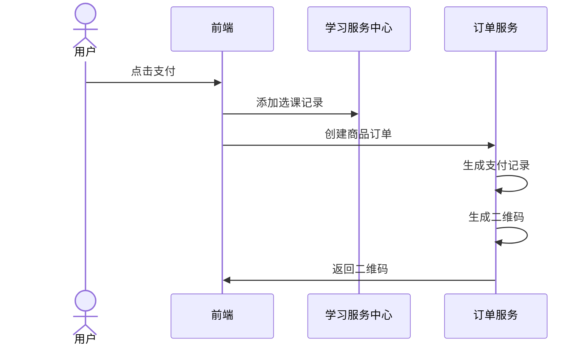
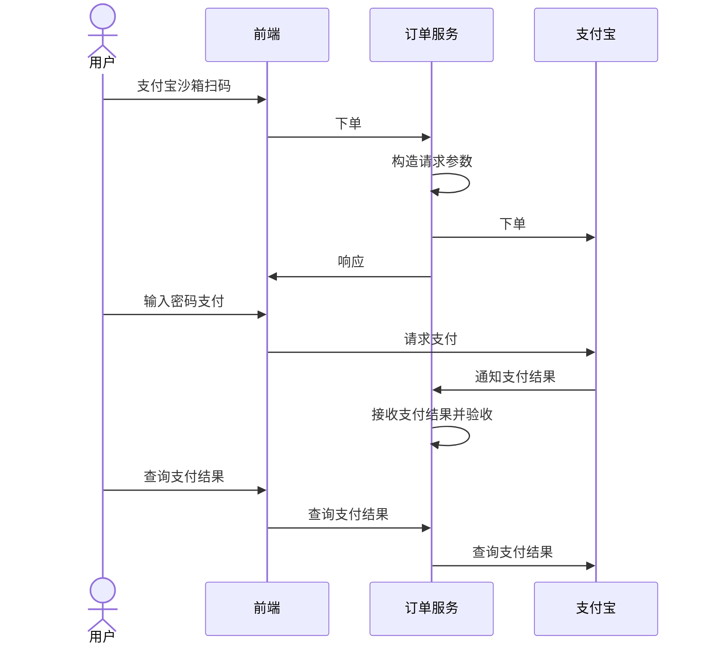

# 学成在线Day12

## 生成支付二维码

### 需求分析

#### 执行流程

再次打开课程支付引导界面，点击“支付宝支付”按钮系统该如何处理？


点击`支付宝支付`此时打开支付二维码，用户扫码支付。

所以首先需要生成支付二维码，用户扫描二维码开始请求支付宝下单，在向支付宝下单前需要添加选课记录、创建商品订单、生成支付交易记录。

生成二维码执行流程如下：




执行流程：

1. 前端调用学习中心服务的添加选课接口。

2. 添加选课成功请求订单服务生成支付二维码接口。

3. 生成二维码接口：创建商品订单、生成支付交易记录、生成二维码。

4. 将二维码返回到前端，用户扫码。

用户扫码支付流程如下：



执行流程：

1. 用户输入支付密码，支付成功。

2. 接收第三方平台通知的支付结果。

3. 根据支付结果更新支付交易记录的支付状态为支付成功。

#### 数据模型

订单支付模式的核心由三张表组成：订单表、订单明细表、支付交易记录表。


订单号注意唯一性、安全性、尽量短等特点，生成方案常用的如下：

1. `时间戳+随机数`

年月日时分秒毫秒+随机数

2. `高并发场景`

年月日时分秒毫秒+随机数+redis自增序列

3. `订单号中加上业务标识`

订单号加上业务标识方便客服，比如：第10位是业务类型，第11位是用户类型等。

4. `雪花算法`

雪花算法是`推特内部`使用的分布式环境下的唯一ID生成算法，它基于时间戳生成，保证有序递增，加以入计算机硬件等元素，可以满足高并发环境下ID不重复。

本项目订单号生成采用雪花算法。

### 接口开发

#### 保存商品订单

1. 定义保存订单信息接口:

```java
public interface OrderService {
    /**
     * 创建订单
     * @param userId 用户id
     * @param addOrderDto 订单信息
     * @return 订单id
     */
    PayRecordDto createOrder(String userId, AddOrderDto addOrderDto);
}
```

2. 在保存订单接口中需要完成创建商品订单、创建支付交易记录，接口实现方法如下：


```java
@Transactional
@Override
public PayRecordDto createOrder(String userId, AddOrderDto addOrderDto) {

    //添加商品订单

    //添加支付交易记录

    //生成二维码

    return null;
}
```

3. 编写创建商品订单方法，商品订单的数据来源于选课记录，在订单表需要存入选课记录的ID，这里需要作好幂等处理。

```java
public XcOrders saveXcOrders(String userId, AddOrderDto addOrderDto) {
    // 插入订单表

    // 进行幂等性判断,确定每一个选课记录只能有一个订单
    XcOrders xcOrdersByBusinessId = getXcOrdersByBusinessId(addOrderDto.getOutBusinessId());
    if(xcOrdersByBusinessId != null){
        return xcOrdersByBusinessId;
    }
    // 1.插入订单主表
    XcOrders xcOrders = new XcOrders();
    xcOrders.setId(IdWorkerUtils.getInstance().nextId()); //雪花算法生成订单号
    xcOrders.setTotalPrice(addOrderDto.getTotalPrice());
    xcOrders.setCreateDate(LocalDateTime.now());
    xcOrders.setStatus("600001");//未支付
    xcOrders.setUserId(userId);
    xcOrders.setOrderType("60201");//订单类型:课程
    xcOrders.setOrderName(addOrderDto.getOrderName());
    xcOrders.setOrderDescrip(addOrderDto.getOrderDescrip());
    xcOrders.setOrderDetail(addOrderDto.getOrderDetail());
    xcOrders.setOutBusinessId(addOrderDto.getOutBusinessId());//如果是购买课程此处是选课的ID
    int insert = xcOrdersMapper.insert(xcOrders);
    if(insert <= 0){
        XueChengPlusException.cast("插入订单失败");
    }
    Long orderId = xcOrders.getId();
    // 2.插入订单明细表
    String orderDetailJSON = addOrderDto.getOrderDetail();
    //解析JSON
    List<XcOrdersGoods> xcOrdersGoods = JSON.parseArray(orderDetailJSON, XcOrdersGoods.class);
    //遍历插入
    for (XcOrdersGoods xcOrdersGoods1 : xcOrdersGoods) {
        xcOrdersGoods1.setOrderId(orderId);
        int insert1 = xcOrdersGoodsMapper.insert(xcOrdersGoods1);
        if(insert1 <= 0){
            XueChengPlusException.cast("插入订单明细失败");
        }
    }
    return xcOrders;
}
```

4. 插入交易记录表

```java
/**
     * 插入支付记录
     * @param orders 订单信息
     * @return 支付记录
     */
private XcPayRecord createPayRecord(XcOrders orders) {
    //订单ID
    Long orderId = orders.getId();
    //如果订单不存在,不添加支付记录
    XcOrders xcOrders = xcOrdersMapper.selectById(orderId);
    if(xcOrders == null){
        XueChengPlusException.cast("订单不存在");
    }
    //如果订单支付已成功,也不添加支付记录
    String status = xcOrders.getStatus();
    if("601002".equals(status)){
        XueChengPlusException.cast("订单已支付");
    }
    //插入支付记录
    XcPayRecord xcPayRecord = new XcPayRecord();
    xcPayRecord.setPayNo(IdWorkerUtils.getInstance().nextId());//雪花算法生成支付号
    xcPayRecord.setOrderId(orderId);
    xcPayRecord.setOrderName(xcOrders.getOrderName());
    xcPayRecord.setTotalPrice(xcOrders.getTotalPrice());
    xcPayRecord.setCurrency("CNY");
    xcPayRecord.setCreateDate(LocalDateTime.now());
    xcPayRecord.setStatus("601001");//支付类型:未支付
    xcPayRecord.setUserId(xcOrders.getUserId());
    int insert = xcPayRecordMapper.insert(xcPayRecord);
    if(insert <= 0){
        XueChengPlusException.cast("插入支付记录失败");
    }
    //返回支付记录
    return xcPayRecord;
}
```

#### 创建支付交易记录

为什么创建支付交易记录？

在请求微信或支付宝下单接口时需要传入 商品订单号，在与第三方支付平台对接时发现，当用户支付失败或因为其它原因最终该订单没有支付成功，此时再次调用第三方支付平台的下单接口发现报错“订单号已存在”，此时如果我们传入一个没有使用过的订单号就可以解决问题，但是商品订单已经创建，因为没有支付成功重新创建一个新订单是不合理的。

解决以上问题的方案是：

1. 用户每次发起都创建一个新的支付交易记录 ，此交易记录与商品订单关联。

2. 将支付交易记录的流水号传给第三方支付系统下单接口，这样就即使没有支付成功就不会出现上边的问题。

3. 需要提醒用户不要重复支付。


编写创建支付交易记录的方法:

```java
public XcPayRecord createPayRecord(XcOrders orders){
    if(order==null){
        XueChengPlusException.cast("订单不存在");
    }
    if(orders.getStatus().equals("600002")){
        XueChengPlusException.cast("订单已支付");
    }
    XcPayRecord payRecord = new XcPayRecord();
    //生成支付交易流水号
    long payNo = IdWorkerUtils.getInstance().nextId();
    payRecord.setPayNo(payNo);
    payRecord.setOrderId(orders.getId());//商品订单号
    payRecord.setOrderName(orders.getOrderName());
    payRecord.setTotalPrice(orders.getTotalPrice());
    payRecord.setCurrency("CNY");
    payRecord.setCreateDate(LocalDateTime.now());
    payRecord.setStatus("601001");//未支付
    payRecord.setUserId(orders.getUserId());
    payRecordMapper.insert(payRecord);
    return payRecord;
}
```

#### 生成支付二维码

1. 在nacos中order-service-dev.yaml配置二维码url

```yaml
pay:
  qrcodeurl: http://192.168.101.1/api/orders/requestpay?payNo=%s
```

2. 完善创建订单service方法

```java
@Value("${pay.qrcodeurl}")
private String qrcodeUrl;

@Transactional
@Override
public PayRecordDto createOrder(String userId, AddOrderDto addOrderDto) {


    //插入订单主表,订单明细表
    XcOrders xcOrders = saveXcOrders(userId, addOrderDto);

    //插入支付记录
    XcPayRecord xcPayRecord = createPayRecord(xcOrders);
    Long payNo = xcPayRecord.getPayNo();

    //生成支付二维码
    QRCodeUtil qrCodeUtil = new QRCodeUtil();
    String url = String.format(qrcodeUrl, payNo);
    String qrCode = null;
    try {
        qrCode = qrCodeUtil.createQRCode(url, 200, 200);
    } catch (IOException e) {
        XueChengPlusException.cast("生成支付二维码失败");
    }
    PayRecordDto payRecordDto = new PayRecordDto();
    BeanUtils.copyProperties(xcPayRecord, payRecordDto);
    payRecordDto.setQrcode(qrCode);//二维码

    return payRecordDto;
}
```

#### 生成二维码接口完善

完善生成支付二维码controller接口

```java
@Autowired
OrderService orderService;

@ApiOperation("生成支付二维码")
@PostMapping("/generatepaycode")
@ResponseBody
public PayRecordDto generatePayCode(@RequestBody AddOrderDto addOrderDto) {
    //登录用户
    SecurityUtil.XcUser user = SecurityUtil.getUser();
    if(user == null){
        XueChengPlusException.cast("请登录后继续选课");
    }
    return orderService.createOrder(user.getId(), addOrderDto);
}
```

#### 扫码下单接口完善

生成了支付二维码，用户扫码请求第三方支付平台下单、支付。

1. 定义查询支付交易记录的Service接口与实现方法

```java
/**
 * 根据支付流水号查询支付记录
 * @param payNo 支付流水号
 * @return 支付记录
 */
XcPayRecord getPayRecordByPayno(String payNo);
```

实现方法:

```java
@Override
public XcPayRecord getPayRecordByPayno(String payNo) {
    //根据支付流水号查询支付记录
    return xcPayRecordMapper.selectOne(new LambdaQueryWrapper<XcPayRecord>().eq(XcPayRecord::getPayNo, payNo));
}
```

2. 下单接口

```java
@ApiOperation("扫码下单接口")
@GetMapping("/requestpay")
public void requestpay(String payNo, HttpServletResponse httpResponse) throws IOException, AlipayApiException {
    //传入支付记录号,判断支付记录是否存在
    XcPayRecord xcPayRecordByPayNo = orderService.getPayRecordByPayno(payNo);
    if ( xcPayRecordByPayNo == null ) {
        XueChengPlusException.cast("支付记录不存在");
    }
    //判断有没有支付成功
    if ( "601002".equals(xcPayRecordByPayNo.getStatus()) ) {
        XueChengPlusException.cast("支付已经成功,无需重复支付");
    }
    //请求支付宝下单
    AlipayClient alipayClient = new DefaultAlipayClient(AlipayConfig.URL, APP_ID, APP_PRIVATE_KEY, AlipayConfig.FORMAT, AlipayConfig.CHARSET, ALIPAY_PUBLIC_KEY, AlipayConfig.SIGNTYPE);
    //获得初始化的AlipayClient
    AlipayTradeWapPayRequest alipayRequest = new AlipayTradeWapPayRequest();//创建API对应的request
    //        alipayRequest.setReturnUrl("http://domain.com/CallBack/return_url.jsp");
    //alipayRequest.setNotifyUrl("http://318f68d075.vicp.fun:45930/orders/paynotify");//在公共参数中设置回跳和通知地址
    alipayRequest.setBizContent("{" +
                                "    \"out_trade_no\":\"" + payNo + "\"," +
                                "    \"total_amount\":" + xcPayRecordByPayNo.getTotalPrice() + "," +
                                "    \"subject\":\"" + xcPayRecordByPayNo.getOrderName() + "\"," +
                                "    \"product_code\":\"QUICK_WAP_WAY\"" +
                                "  }");//填充业务参数
    String form = alipayClient.pageExecute(alipayRequest).getBody(); //调用SDK生成表单
    httpResponse.setContentType("text/html;charset=" + AlipayConfig.CHARSET);
    httpResponse.getWriter().write(form);//直接将完整的表单html输出到页面
    httpResponse.getWriter().flush();

}
```

### 支付测试

测试准备：

1. 启动网关服务、认证服务、验证码服务、学习中心服务、订单服务、内容管理服务。

2. 发布一门收费课程。

3. 使用资料目录中的新模板course_template.ftl 

测试流程：

1. 进入收费课程详细页面，点击马上学习。

2. 跟踪浏览器及微服务，观察选课记录是否创建成功、商品订单是否创建成功、支付交易记录是否创建成功。

3. 观察生成二维码是否成功

4. 使用模拟器扫码测试，是否可以正常支付。

最终结果


手机沙箱测试成功

## 查询支付结果

### 接口定义

根据前边我们调研的获取支付结果的接口，包括：主动查询支付结果、被动接收支付结果。

这里先实现主动查询支付结果，当支付完成用户点击“支付结果”将请求第三方支付平台查询支付结果。

在`OrderController`类中定义接口如下：

```java
@ApiOperation("查询支付结果")
@GetMapping("/payresult")
@ResponseBody
public PayRecordDto payresult(String payNo) throws IOException {
    //查询支付结果
    return null;
}
```

### 接口实现

#### `service`总体接口

```java
/**
 * 查询支付结果
 * @param payNo 支付流水号
 * @return 支付结果
 */
PayRecordDto queryPayResult(String payNo);
```

`service`实现

```java
@Override
public PayRecordDto queryPayResult(String payNo) throws AlipayApiException {
    //调用支付宝接口查询结果
    XcPayRecord payRecord = getPayRecordByPayno(payNo);
    if(payRecord == null){
        XueChengPlusException.cast("请重新点击获取二维码");
    }
    //根据支付流水号查询支付记录
    PayStatusDto payStatusDto = queryPayResultFromAlipay(payNo);
    System.out.println("payStatusDto = " + payStatusDto);
    if(payStatusDto == null){
        XueChengPlusException.cast("支付记录不存在");
    }

    //保存支付宝支付结果
    currentProxy.saveAliPayStatus(payStatusDto);

    //返回最新支付记录信息
    XcPayRecord payRecordByPayno = getPayRecordByPayno(payNo);
    PayRecordDto payRecordDto = new PayRecordDto();
    BeanUtils.copyProperties(payRecordByPayno, payRecordDto);
    return payRecordDto;
}
```

#### 查询支付结果

```java

/**
     * 请求支付宝查询支付结果
     * @param payNo 支付交易号
     * @return 支付结果
     */
public PayStatusDto queryPayResultFromAlipay(String payNo) throws AlipayApiException {
    AlipayClient alipayClient = new DefaultAlipayClient("https://openapi-sandbox.dl.alipaydev.com/gateway.do", APP_ID, APP_PRIVATE_KEY, AlipayConfig.FORMAT, AlipayConfig.CHARSET, ALIPAY_PUBLIC_KEY, AlipayConfig.SIGNTYPE);
    AlipayTradeQueryRequest request = new AlipayTradeQueryRequest();
    JSONObject bizContent = new JSONObject();
    bizContent.put("out_trade_no", payNo);           //out_trade_no和trade_no二选一即可
    //bizContent.put("trade_no", "2014112611001004680073956707");
    request.setBizContent(bizContent.toString());
    String resultJson = null;
    try{
        AlipayTradeQueryResponse response = alipayClient.execute(request);
        //交易不成功
        if(!response.isSuccess()){
            XueChengPlusException.cast("交易不成功");
        }
        resultJson = response.getBody();
    }catch (AlipayApiException e){
        e.printStackTrace();
        XueChengPlusException.cast("调用支付宝查询接口失败");
    }
    //转map
    Map resultMap = JSON.parseObject(resultJson, Map.class);
    Map alipay_trade_query_response = (Map) resultMap.get("alipay_trade_query_response");
    //支付结果
    String trade_status = (String) alipay_trade_query_response.get("trade_status");
    String total_amount = (String) alipay_trade_query_response.get("total_amount");
    String trade_no = (String) alipay_trade_query_response.get("trade_no");
    //保存支付结果
    PayStatusDto payStatusDto = new PayStatusDto();
    payStatusDto.setOut_trade_no(payNo);
    payStatusDto.setTrade_status(trade_status);
    payStatusDto.setApp_id(APP_ID);
    payStatusDto.setTrade_no(trade_no);
    payStatusDto.setTotal_amount(total_amount);
    return payStatusDto;
}
```

#### 保存支付结果

1. 定义接口

```java
/**
 * 保存支付宝支付状态
 * @param payStatusDto 支付状态
 */
void saveAliPayStatus(PayStatusDto payStatusDto);
```

2. 实现

```java
@Transactional
public void saveAliPayStatus(PayStatusDto payStatusDto){

    //如果支付成功
    String payNO = payStatusDto.getOut_trade_no();
    XcPayRecord payRecordByPayno = getPayRecordByPayno(payNO);
    if(payRecordByPayno == null){
        XueChengPlusException.cast("找不到相关支付记录");
    }
    //拿到相关联订单id
    Long orderId = payRecordByPayno.getOrderId();
    XcOrders xcOrders = xcOrdersMapper.selectById(orderId);
    if(xcOrders == null){
        XueChengPlusException.cast("找不到相关订单");
    }
    //支付状态
    String statusFromDb = payRecordByPayno.getStatus();
    //如果数据库支付状态已经成功,不再处理
    if("601002".equals(statusFromDb)){
        //支付已经成功
        return;
    }
    //如果支付成功
    String tradeStatus = payStatusDto.getTrade_status();
    //返回信息为支付成功
    if("TRADE_SUCCESS".equals(tradeStatus)){
        //更新支付记录表支付状态为支付成功
        payRecordByPayno.setStatus("601002");
        //支付宝订单号
        payRecordByPayno.setOutPayNo(payStatusDto.getTrade_no());
        //第三方支付渠道编号
        payRecordByPayno.setOutPayChannel("Alipay");
        //支付成功时间
        payRecordByPayno.setPaySuccessTime(LocalDateTime.now());
        int update = xcPayRecordMapper.updateById(payRecordByPayno);
        if(update <= 0){
            XueChengPlusException.cast("更新支付记录失败");
        }
        //更新订单表支付状态为支付成功
        xcOrders.setStatus("600002");//订单已经支付成功

        int update1 = xcOrdersMapper.updateById(xcOrders);
        if(update1 <= 0){
            XueChengPlusException.cast("更新订单失败");
        }
    }
}
```

#### 接口测试

对界面扫码后查数据库验证即可


#### 接口问题

由于雪花ID发送到前端会产生精度丢失,所以我们需要在后端的base包下处理格式

日后在遇到相同问题百度可以搜到相应答案

## 接收支付通知

### 接口定义

支付完成后第三方支付系统会主动通知支付结果，要实现主动通知需要在请求支付系统下单时传入NotifyUrl，这里有两个url：NotifyUrl和ReturnUrl，ReturnUrl是支付完成后支付系统携带支付结果重定向到ReturnUrl地址，NotifyUrl是支付完成后支付系统在后台定时去通知，使用NotifyUrl比使用ReturnUrl有保证。

根据接口描述：https://opendocs.alipay.com/open/203/105286的内容下边在订单服务定义接收支付结果通知的接口。

首先在下单时指定NotifyUrl:

```java
@ApiOperation("接收支付结果通知")
@PostMapping("/receivenotify")
public void receivenotify(HttpServletRequest request, HttpServletResponse response) throws IOException, AlipayApiException {
    //获取支付宝POST过来反馈信息
    Map<String, String> params = new HashMap<>();
    Map requestParams = request.getParameterMap();
    for ( Iterator iter = requestParams.keySet().iterator(); iter.hasNext(); ) {
        String name = (String) iter.next();
        String[] values = (String[]) requestParams.get(name);
        String valueStr = "";
        for ( int i = 0; i < values.length; i++ ) {
            valueStr = (i == values.length - 1) ? valueStr + values[i]
                : valueStr + values[i] + ",";
        }
        //乱码解决，这段代码在出现乱码时使用。如果mysign和sign不相等也可以使用这段代码转化
        //valueStr = new String(valueStr.getBytes("ISO-8859-1"), "gbk");
        params.put(name, valueStr);
    }

    boolean verify_result = AlipaySignature.rsaCheckV1(params, ALIPAY_PUBLIC_KEY, AlipayConfig.CHARSET, "RSA2");

    if ( verify_result ) {//验证成功
        //获取支付宝的通知返回参数，可参考技术文档中页面跳转同步通知参数列表(以下仅供参考)//
        //商户订单号

        String out_trade_no = new String(request.getParameter("out_trade_no").getBytes("ISO-8859-1"), "UTF-8");
        //支付宝交易号

        String trade_no = new String(request.getParameter("trade_no").getBytes("ISO-8859-1"), "UTF-8");

        //交易状态
        String trade_status = new String(request.getParameter("trade_status").getBytes("ISO-8859-1"), "UTF-8");
        //交易金额
        String total_amount = new String(request.getParameter("total_amount").getBytes("ISO-8859-1"), "UTF-8");
        if ( trade_status.equals("TRADE_SUCCESS") ) {
            //更新支付记录表状态为成功,订单表未成功
            PayStatusDto payStatusDto = new PayStatusDto();
            payStatusDto.setTrade_status(trade_status);
            payStatusDto.setTrade_no(trade_no);
            payStatusDto.setOut_trade_no(out_trade_no);
            payStatusDto.setTotal_amount(total_amount);
            payStatusDto.setApp_id(APP_ID);
            orderService.saveAliPayStatus(payStatusDto);
        }
        //——请根据您的业务逻辑来编写程序（以上代码仅作参考）——
        response.getWriter().write("success");    //请不要修改或删除
    } else {//验证失败
        response.getWriter().write("fail");    //请不要修改或删除
    }
}
```

### 接口测试

**接口测试**

测试准备：

1. 启动网关服务、认证服务、验证码服务、学习中心服务、内容管理服务。

2. 发布一门收费课程。

测试流程：

1. 对选课进行支付

2. 支付成功跟踪service方法的日志，支付成功需要更新支付交易表记录的状态、通知时间、支付宝交易号、支付渠道(Alipay)

支付成功更新订单表的状态为空。
