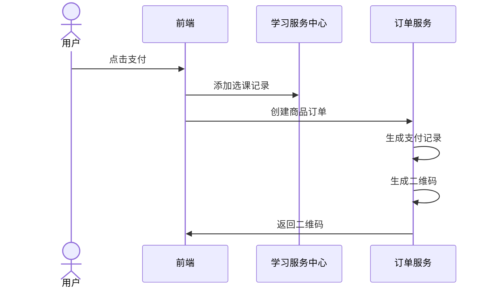
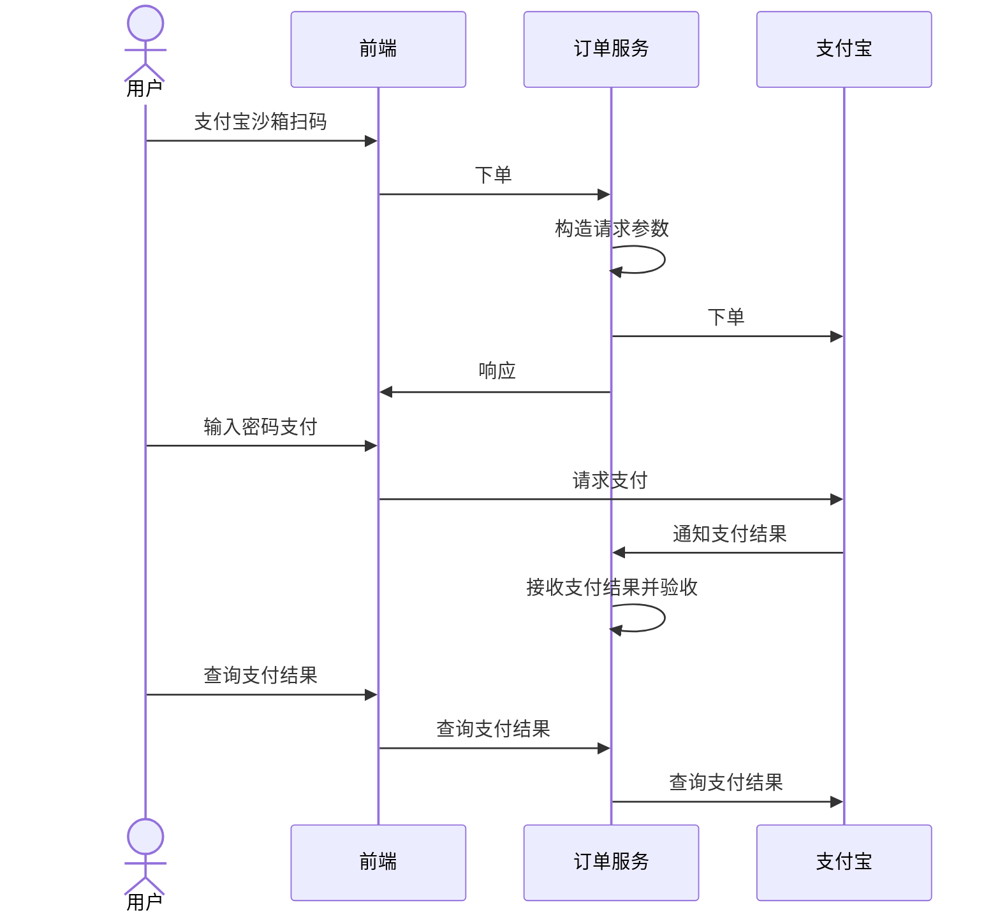

# 学成在线Day12

## 生成支付二维码

### 需求分析

#### 执行流程

再次打开课程支付引导界面，点击“支付宝支付”按钮系统该如何处理？


点击`支付宝支付`此时打开支付二维码，用户扫码支付。

所以首先需要生成支付二维码，用户扫描二维码开始请求支付宝下单，在向支付宝下单前需要添加选课记录、创建商品订单、生成支付交易记录。

生成二维码执行流程如下：




执行流程：

1. 前端调用学习中心服务的添加选课接口。

2. 添加选课成功请求订单服务生成支付二维码接口。

3. 生成二维码接口：创建商品订单、生成支付交易记录、生成二维码。

4. 将二维码返回到前端，用户扫码。

用户扫码支付流程如下：



执行流程：

1. 用户输入支付密码，支付成功。

2. 接收第三方平台通知的支付结果。

3. 根据支付结果更新支付交易记录的支付状态为支付成功。

#### 数据模型

订单支付模式的核心由三张表组成：订单表、订单明细表、支付交易记录表。


订单号注意唯一性、安全性、尽量短等特点，生成方案常用的如下：

1. `时间戳+随机数`

年月日时分秒毫秒+随机数

2. `高并发场景`

年月日时分秒毫秒+随机数+redis自增序列

3. `订单号中加上业务标识`

订单号加上业务标识方便客服，比如：第10位是业务类型，第11位是用户类型等。

4. `雪花算法`

雪花算法是`推特内部`使用的分布式环境下的唯一ID生成算法，它基于时间戳生成，保证有序递增，加以入计算机硬件等元素，可以满足高并发环境下ID不重复。

本项目订单号生成采用雪花算法。

### 接口开发

在订单服务中定义生成支付二维码接口。

请求：订单信息

**Controller层**

```java
@ApiOperation("生成支付二维码")
@PostMapping("/generatepaycode")
@ResponseBody
public PayRecordDto generatePayCode(@RequestBody AddOrderDto addOrderDto) {

    SecurityUtil.XcUser user = SecurityUtil.getUser();
    String userId = user.getId();
    //调用service完成插入订单信息,插入支付记录,生成支付二维码
    return orderService.createOrder(userId, addOrderDto);
}
```

**Service层**

1. 创建交易记录

```java
@Transactional
@Override
public PayRecordDto createOrder(String userId, AddOrderDto addOrderDto) {


    //插入订单主表,订单明细表
    XcOrders xcOrders = saveXcOrders(userId, addOrderDto);

    //插入支付记录
    XcPayRecord xcPayRecord = createPayRecord(xcOrders);
    Long payNo = xcPayRecord.getPayNo();

    //生成支付二维码
    QRCodeUtil qrCodeUtil = new QRCodeUtil();
    String url = String.format(qrcodeUrl, payNo);
    String qrCode = null;
    try {
        qrCode = qrCodeUtil.createQRCode(url, 200, 200);
    } catch (IOException e) {
        XueChengPlusException.cast("生成支付二维码失败");
    }
    PayRecordDto payRecordDto = new PayRecordDto();
    BeanUtils.copyProperties(xcPayRecord, payRecordDto);
    payRecordDto.setQrcode(qrCode);//二维码

    return payRecordDto;
}
```

2. 根据交易ID查询订单

```java
/**
     * 根据业务ID查询订单
     * @param outBusinessId 业务ID
     * @return 订单信息
     */
public XcOrders getXcOrdersByBusinessId(String outBusinessId) {
    //根据业务ID查询订单
    return xcOrdersMapper.selectOne(new LambdaQueryWrapper<XcOrders>().eq(XcOrders::getOutBusinessId, outBusinessId));
}
```

3. 保存订单

```java
// 保存订单
public XcOrders saveXcOrders(String userId, AddOrderDto addOrderDto) {
    // 插入订单表

    // 进行幂等性判断,确定每一个选课记录只能有一个订单
    XcOrders xcOrdersByBusinessId = getXcOrdersByBusinessId(addOrderDto.getOutBusinessId());
    if(xcOrdersByBusinessId != null){
        return xcOrdersByBusinessId;
    }
    // 1.插入订单主表
    XcOrders xcOrders = new XcOrders();
    xcOrders.setId(IdWorkerUtils.getInstance().nextId()); //雪花算法生成订单号
    xcOrders.setTotalPrice(addOrderDto.getTotalPrice());
    xcOrders.setCreateDate(LocalDateTime.now());
    xcOrders.setStatus("600001");//未支付
    xcOrders.setUserId(userId);
    xcOrders.setOrderType("60201");//订单类型:课程
    xcOrders.setOrderName(addOrderDto.getOrderName());
    xcOrders.setOrderDescrip(addOrderDto.getOrderDescrip());
    xcOrders.setOrderDetail(addOrderDto.getOrderDetail());
    xcOrders.setOutBusinessId(addOrderDto.getOutBusinessId());//如果是购买课程此处是选课的ID
    int insert = xcOrdersMapper.insert(xcOrders);
    if(insert <= 0){
        XueChengPlusException.cast("插入订单失败");
    }
    Long orderId = xcOrders.getId();
    // 2.插入订单明细表
    String orderDetailJSON = addOrderDto.getOrderDetail();
    //解析JSON
    List<XcOrdersGoods> xcOrdersGoods = JSON.parseArray(orderDetailJSON, XcOrdersGoods.class);
    //遍历插入
    for (XcOrdersGoods xcOrdersGoods1 : xcOrdersGoods) {
        xcOrdersGoods1.setOrderId(orderId);
        int insert1 = xcOrdersGoodsMapper.insert(xcOrdersGoods1);
        if(insert1 <= 0){
            XueChengPlusException.cast("插入订单明细失败");
        }
    }
    return xcOrders;
}
```

4. 插入交易记录表

```java
/**
     * 插入支付记录
     * @param orders 订单信息
     * @return 支付记录
     */
private XcPayRecord createPayRecord(XcOrders orders) {
    //订单ID
    Long orderId = orders.getId();
    //如果订单不存在,不添加支付记录
    XcOrders xcOrders = xcOrdersMapper.selectById(orderId);
    if(xcOrders == null){
        XueChengPlusException.cast("订单不存在");
    }
    //如果订单支付已成功,也不添加支付记录
    String status = xcOrders.getStatus();
    if("601002".equals(status)){
        XueChengPlusException.cast("订单已支付");
    }
    //插入支付记录
    XcPayRecord xcPayRecord = new XcPayRecord();
    xcPayRecord.setPayNo(IdWorkerUtils.getInstance().nextId());//雪花算法生成支付号
    xcPayRecord.setOrderId(orderId);
    xcPayRecord.setOrderName(xcOrders.getOrderName());
    xcPayRecord.setTotalPrice(xcOrders.getTotalPrice());
    xcPayRecord.setCurrency("CNY");
    xcPayRecord.setCreateDate(LocalDateTime.now());
    xcPayRecord.setStatus("601001");//支付类型:未支付
    xcPayRecord.setUserId(xcOrders.getUserId());
    int insert = xcPayRecordMapper.insert(xcPayRecord);
    if(insert <= 0){
        XueChengPlusException.cast("插入支付记录失败");
    }
    //返回支付记录
    return xcPayRecord;
}
```

### 二维码支付测试

测试准备：

1、启动网关服务、认证服务、验证码服务、学习中心服务、订单服务、内容管理服务。

2、发布一门收费课程。

3、使用资料目录中的新模板course_template.ftl 

测试流程：

1、进入收费课程详细页面，点击马上学习。

2、跟踪浏览器及微服务，观察选课记录是否创建成功、商品订单是否创建成功、支付交易记录是否创建成功。

3、观察生成二维码是否成功

4、使用模拟器扫码测试，是否可以正常支付。

最终结果


