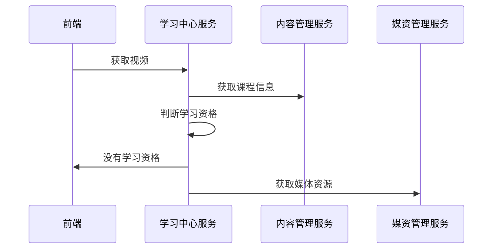

# 学成在线Day13

# 在线学习

## 需求分析

用户通过课程详情界面点击马上学习 进入 视频插放界面进行视频点播。

获取视频资源时进行学习资格校验，如下图:


拥有学习资格则继续播放视频，不具有学习资格则引导去购买、续期等操作。

如何判断是否拥有学习资格？

首先判断是否为试学视频，如果为试学视频则可以正常学习。

如果为非试学课程首先判断用户是否登录，如果已登录则判断是否选课，如果已经选课且没有过期可以正常学习。

详细流程如下图:


## **查询课程信息**

在视频点播页面需要查询课程信息，课程上线后也需要访问/api/content/course/whole/{courseId}

课程预览时请求获取课程的接口为：/open/content/course/whole/{courseId}

在nginx中进行配置：

/open、/api在nginx的配置如下：(已经配置的不要重复配置)

```properties
location /api/ {
        proxy_pass http://gatewayserver/;
} 
#openapi
location /open/content/ {
        proxy_pass http://gatewayserver/content/open/;
} 
location /open/media/ {
        proxy_pass http://gatewayserver/media/open/;
} 
```

下边实现/api/content/course/whole/{courseId} 获取课程发布信息接口。

进入内容管理服务api工程CoursePublishController 类，定义查询课程预览信息接口如下：

```java
@ApiOperation("获取课程发布信息")
@ResponseBody
@GetMapping("/course/whole/{courseId}")
public CoursePreviewDTO getCoursePublish(@PathVariable("courseId") Long courseId) {
    //封装数据
    CoursePreviewDTO coursePreviewDTO = new CoursePreviewDTO();
    //查询课程发布表
    CoursePublish coursePublish = coursePublishService.getCoursePublish(courseId);
    if(coursePublish == null){
        return coursePreviewDTO;
    }
    //向dto中封装数据
    CourseBaseInfoDTO courseBaseInfoDTO = new CourseBaseInfoDTO();
    BeanUtils.copyProperties(coursePublish, courseBaseInfoDTO);
    coursePreviewDTO.setCourseBase(courseBaseInfoDTO);
    //查询课程计划
    //从CouseBaseInfoDTO中获取课程计划
    String teachPlanJson = coursePublish.getTeachplan();
    List<TeachplanDTO> teachplanDTOS = JSON.parseArray(teachPlanJson, TeachplanDTO.class);
    coursePreviewDTO.setTeachPlans(teachplanDTOS);
    return coursePreviewDTO;
}
```

重启内容管理服务，进入学习界面查看课程计划、课程名称等信息是否显示正常。

## 获取视频

### 需求分析



### 接口定义

```java
@Api(value = "学习过程管理接口", tags = "学习过程管理接口")
@Slf4j
@RestController
public class MyLearningController {

    @Autowired
    LearningService learningService;

    @ApiOperation("获取视频")
    @GetMapping("/open/learn/getvideo/{courseId}/{teachplanId}/{mediaId}")
    public RestResponse<String> getvideo(@PathVariable("courseId") Long courseId, @PathVariable("teachplanId") Long teachplanId, @PathVariable("mediaId") String mediaId) {
        SecurityUtil.XcUser user = SecurityUtil.getUser();
        String userId = null;
        if (user != null) {
            userId = user.getId();
        }
        //调用媒资服务查询视频播放地址
        return learningService.getVideo(userId, courseId, teachplanId, mediaId);
    }
}
```

定义service接口

```java
/**
 * @author Wwh
 * @ProjectName xuecheng-plus-project
 * @dateTime 2024/3/10 16:13
 * @description 在线学习相关接口
 **/
public interface LearningService {
    /**
     * 获取视频
     * @param userId     用户id
     * @param courseId   课程id
     * @param teachplanId 计划id
     * @param mediaId    媒体id
     * @return RestResponse<String> 视频播放地址
     */
    RestResponse<String> getVideo(String userId, Long courseId, Long teachplanId, String mediaId);
}
```

### 获取视频远程接口

在学习中心服务service工程中定义媒资管理Feignclient

```java
@FeignClient(value = "media-api", fallbackFactory = MediaServiceClientFallbackFactory.class)
@RequestMapping("/media")
public interface MediaServiceClient {
    @GetMapping("/open/preview/{mediaId}")
    RestResponse<String> getPlayUrlByMediaId(@PathVariable("mediaId") String mediaId);
}
```

定义降级类

```java
@Slf4j
@Component
public class MediaServiceClientFallbackFactory implements FallbackFactory<MediaServiceClient> {
    @Override
    public MediaServiceClient create(Throwable throwable) {
        return mediaId -> {
            log.error("远程调用媒资管理服务熔断异常：{}", throwable.getMessage());
            return null;
        };
    }
}
```

### 学习资格校验

```java
@Override
public RestResponse<String> getVideo(String userId, Long courseId, Long teachplanId, String mediaId) {
    //查询课程信息
    CoursePublish coursepublish = contentServiceClient.getCoursepublish(courseId);
    if ( coursepublish == null ) {
        return RestResponse.validfail("课程信息不存在");
    }
    //远程调用内容管理服务根据课程计划ID查询课程计划,如果is_preview为1则支持试学
    //也可以从coursepublish解析出课程计划是否支持试学

    //1.判断是否登录
    if ( StringUtil.isNotEmpty(userId) ) {

        //获取学习资格
        //学习资格，[{"code":"702001","desc":"正常学习"},{"code":"702002","desc":"没有选课或选课后没有支付"},{"code":"702003","desc":"已过期需要申请续期或重新支付"}]
        XcCourseTablesDto learning = myCourseTableService.getLearningStatus(userId, courseId);
        String learnStatus = learning.getLearnStatus();
        if ( "702002".equals(learnStatus) ) {
            return RestResponse.validfail("无法学习,没有选课或选课后没有支付");
        } else if ( "702003".equals(learnStatus) ) {
            return RestResponse.validfail("无法学习,已过期需要申请续期或重新支付");
        } else {
            //远程调用媒资获取视频播放地址
            return mediaServiceClient.getPlayUrlByMediaId(mediaId);
        }
    }
    //2.如果用户没有登录
    //查询课程信息判断是否为免费课程
    String charge = coursepublish.getCharge();
    if ( "201000".equals(charge) ) {
        //免费课程
        //远程调用媒资获取视频播放地址
        return mediaServiceClient.getPlayUrlByMediaId(mediaId);
    }
    return RestResponse.validfail("课程需要购买");
}
```

### 测试

1. 完善接口

```java
@ApiOperation("获取视频")
@GetMapping("/open/learn/getvideo/{courseId}/{teachplanId}/{mediaId}")
public RestResponse<String> getvideo(@PathVariable("courseId") Long courseId, @PathVariable("teachplanId") Long teachplanId, @PathVariable("mediaId") String mediaId) {
    SecurityUtil.XcUser user = SecurityUtil.getUser();
    String userId = null;
    if (user != null) {
        userId = user.getId();
    }
    //调用媒资服务查询视频播放地址
    return learningService.getVideo(userId, courseId, teachplanId, mediaId);
}
```

2. 测试准备

   选课成功一门课程。

   没有选课的免费课程、收费课程各一门，其中收费课程具有试学课程。

3. 
   1. 选课成功的课程是否可以正常获取视频

   2. 免费课程没有选课是否可以正常学习

   可修改选课记录表中的课程id为不存在进行测试，测试完再恢复原样。

   3. 收费课程没有选课是否可以正常学习

   可修改选课记录表中的课程id为不存在进行测试，测试完再恢复原样。

## 我的课程表

### 需求分析

#### 业务流程

登录网站，点击“我的学习”进入个人中心，


个人中心首页显示我的课程表：


我的课表中显示了选课成功的免费课程、收费课程。最近学习课程显示了当前用户最近学习的课程信息。

点击继续学习进入当前学习章节的视频继续学习。

```properties
server {
    listen       80;
    server_name  ucenter.51xuecheng.cn;
    #charset koi8-r;
    ssi on;
    ssi_silent_errors on;
    #access_log  logs/host.access.log  main;
    location / {
        alias  D:/Programming_Learning/Project/xc-ui-pc-static-portal/ucenter/;
        index  index.html index.htm;
    }
    location /include {
        proxy_pass   http://127.0.0.1;
    }
    location /img/ {
        proxy_pass   http://127.0.0.1/static/img/;
    }
    location /api/ {
            proxy_pass http://gatewayserver/;
    } 
}
```

### 接口定义

```java
@ApiOperation("我的课程表")
@GetMapping("/mycoursetable")
public PageResult<XcCourseTables> mycoursetable(MyCourseTableParams params) {


}
```

### 接口开发

service接口:

```java
/**
 * @param params 查询参数
 * @return com.xuecheng.base.model.PageResult<com.xuecheng.learning.model.po.XcCourseTables>
 * @description 我的课程表查询接口
 * @date 2024/3/11 11：47
 */
PageResult<XcCourseTables> mycourestabls(MyCourseTableParams params);
```

service接口实现:

```java
@Override
public PageResult<XcCourseTables> mycourestabls(MyCourseTableParams params) {
    int pageNo = params.getPage();
    int size = params.getSize();
    Page<XcCourseTables> xcCourseTablesPage = new Page<>(pageNo, size);
    LambdaQueryWrapper<XcCourseTables> eq = new LambdaQueryWrapper<XcCourseTables>()
        .eq(XcCourseTables::getUserId, params.getUserId());
    Page<XcCourseTables> result = xcCourseTablesMapper.selectPage(xcCourseTablesPage, eq);
    PageResult<XcCourseTables> xcCourseTablesPageResult = new PageResult<>(result.getRecords(), result.getTotal(), size, pageNo);
    return xcCourseTablesPageResult;
}
```

controller完善:

```java
@ApiOperation("我的课程表")
@GetMapping("/mycoursetable")
public PageResult<XcCourseTables> mycoursetable(MyCourseTableParams params) {
    //获取用户信息
    SecurityUtil.XcUser user = SecurityUtil.getUser();
    if(user == null){
        XueChengPlusException.cast("请登录后再操作");
    }
    //获取用户id
    String userId = user.getId();
    params.setUserId(userId);
    PageResult<XcCourseTables> mycourestabls = myCourseTableService.mycourestabls(params);
    return mycourestabls;
}
```

### 接口测试


# 项目部署

## 什么是DevOps

一个软件的生命周期包括：需求分析阶、设计、开发、测试、上线、维护、升级、废弃。

通过示例说明如下：

1. 产品人员进行需求分析

2. 设计人员进行软件架构设计和模块设计。

3. 每个模块的开发人员并行开发，设计接口、进行编码，并进行单元测试

4. 开发完毕，将代码集成部署到测试服务器，测试人员进行测试。

5. 测试人员发现bug，提交bug、开发人员修改bug

6. bug修改完毕再次集成、测试。

7. 测试完毕，项目上线。

8. 运维人员进行安装部署、培训。

9. 用户提出问题，返回给运维人员。

10. 运维人员反馈给开发人员，开发人员进行问题处理。

11. 再次提交测试。

12. 测试完毕再次部署升级。

....

最后软件下线。

所以，在整体生命周期中比较核心的两个阶段是：开发阶段、维护阶段，开发阶段的成果是软件开发完成并成功上线，运维阶段则负责对软件进行维护和升级，而运维阶段通常在一个软件 的生命周期中占比最多。

提高开发阶段、运维阶段的工作效率是企业在进行软件项目管理的重点。

因此，专家提出了DevOps，DevOps是什么呢？

下边是摘自百度百科的定义：

DevOps（Development和Operations的组合词）是一组过程、方法与系统的统称，用于促进开发（[应用程序](https://baike.baidu.com/item/应用程序/5985445?fromModule=lemma_inlink)/软件工程）、技术运营和质量保障（[QA](https://baike.baidu.com/item/QA/476016?fromModule=lemma_inlink)）部门之间的沟通、协作与整合。

它是一种重视“[软件开发](https://baike.baidu.com/item/软件开发/3448966?fromModule=lemma_inlink)人员（Dev）”和“[IT运维](https://baike.baidu.com/item/IT运维/5727814?fromModule=lemma_inlink)技术人员（Ops）”之间沟通合作的文化、运动或惯例。透过自动化“[软件交付](https://baike.baidu.com/item/软件交付/638479?fromModule=lemma_inlink)”和“架构变更”的流程，来使得构建、测试、发布软件能够更加地快捷、频繁和可靠。

它的出现是由于软件行业日益清晰地认识到：为了按时交付[软件产品](https://baike.baidu.com/item/软件产品/6800028?fromModule=lemma_inlink)和服务，开发和运维工作必须紧密合作。


DevOps是一个工具吗？

DevOps是一个工作职位吗？

都不是。

DevOps是一种思想理念，它涵盖开发、测试、运维的整个过程。DevOps追求的目标是提高软件开发、测试、运维、运营等各部门的沟通与协作质量，DevOps强调软件开发人员与软件测试、软件运维、质量保障（QA）部门之间有效的沟通与协作，强调通过自动化的方法去管理软件变更、软件集成，使软件从构建到测试、发布更加快捷、可靠，最终按时交付软件。


## 什么是CI/CD

如何来落地实现DevOps呢？

DevOps兴起于2009年，近年来由于云计算、互联网的发展，促进了DevOps的基础设施及工具链的发展，涌现了一大批优秀的工具，这些工具包括开发、测试、运维的各各领域，例如：GitHub、Docker、Jenkins、Hudson、K8S、Ant/Maven/Gradle、Selenium、QUnit、JMeter等。下图是DevOps相关的工具集：


好的工具有利于DevOps的实施，但并不代表实施DevOps就一定需要去引入一堆工具。

问题的关键：如何解决问题，而不是具体应用工具。

CI/CD 是近年来企业有效实施DevOps的具体方案。

CI/CD 包含了一个 CI 和两个 CD，CI全称 Continuous Integration，表示持续集成，CD包含 Continuous Delivery和 Continuous Deployment，分别是持续交付和持续部署，三者具有前后依赖关系。

CI 持续集成：

持续集成倡导团队成员需要频繁的集成他们的工作，将开发分支合并到主分支，每次集成都通过自动化构建（包括编译、构建、自动化测试）来验证，从而尽快地发现集成中的错误，让产品可以快速迭代，同时还能保持高质量。


CD持续交付:

持续交付将集成后的代码部署到类生产环境(预发布)，除了交付到类生产环境之外，还会执行一些集成测试、API测试。持续交付强调的是“交付”，交付给测试、产品验收，不管怎么更新，软件是随时随地可以交付的。


CD持续部署：

在持续交付的基础上由开发人员或运维人员自助式的定期向生产环境部署稳定的构建版本，持续部署的目标是代码在任何时刻都是可部署的，并可自动进入到生产环境。


## DevOps实战

### 技术方案

下图是比较流行的一种CI/CD的技术方案：


下边我们参考该技术方案将学成在线项目使用Docker进行部署。

本次项目部署实战旨在理解CI/CD的流程，考虑Kubernates的复杂性课堂上我们用Jenkins代替Kubernates完成容器部署。

### 准备环境

准备一台Centos7 虚拟机，安装Docker、jdk、maven，通过Docker容器安装jenkins、Docker私服软件，其它软件为学成在线项目所需要的，如下：

| Mysql         | 8.x                | docker |
| ------------- | ------------------ | ------ |
| nacos         | 1.4.1              | docker |
| rabbitmq      | 3.8.34             | docker |
| redis         | 6.2.7              | docker |
| xxl-job-admin | 2.3.1              | docker |
| minio         | RELEASE.2022-09-07 | docker |
| elasticsearch | 7.12.1             | docker |
| kibana        | 7.12.1             | docker |
| gogs          | 0.13.0             | docker |
| nginx         | 1.12.2             | docker |

### 人工部署方式

如果不使用CI/CD则需要人工手动对工程进行测试、打包、部署。使用CI/CD后通过自动化的工具去完成。

下边先演示手动部署方式，之后采用工具进行部署。

#### 项目打包

1. 在父工程聚合各模块

首先在父工程添加models，聚合各各模块

```xml
<modules>
    <module>../xuecheng-plus-base</module>
    <module>../xuecheng-plus-checkcode</module>
    <module>../xuecheng-plus-gateway</module>
    <module>../xuecheng-plus-auth</module>
    <module>../xuecheng-plus-content</module>
    <module>../xuecheng-plus-learning</module>
    <module>../xuecheng-plus-media</module>
    <module>../xuecheng-plus-orders</module>
    <module>../xuecheng-plus-message-sdk</module>
    <module>../xuecheng-plus-search</module>
    <module>../xuecheng-plus-system</module>
</modules>
```

2. 配置打包插件

使用springboot打包插件进行打包，在需要打可执行包的工程中配置spring-boot-maven-plugin插件否则报 “jar中没有主清单属性” 。

注意:在要打可执行jar包的工程中配置该插件。

例如:base工程是不用添加插件的,而auth和checkcode工程需要添加打包插件

内容如下:

```xml
<build>
    <finalName>${project.artifactId}-${project.version}</finalName> 
    <plugins>
        <plugin>
            <groupId>org.springframework.boot</groupId>
            <artifactId>spring-boot-maven-plugin</artifactId>
            <version>${spring-boot.version}</version>
            <executions>
                <execution>
                    <goals>
                        <goal>repackage</goal>
                    </goals>
                </execution>
            </executions>
        </plugin>
    </plugins>
</build>
```

这段配置文件是Maven的POM文件（Project Object Model）的一部分，用于构建Spring Boot项目。

- `<finalName>${project.artifactId}-${project.version}</finalName>`：这行设置了构建的最终产物的名称，它将会是`${project.artifactId}-${project.version}`，其中`${project.artifactId}`和`${project.version}`是Maven项目的artifactId和version。
- `<plugins>`：这个标签包含了项目中使用的所有插件。
- `<plugin>`：这个标签定义了一个插件。在这个例子中，定义的插件是Spring Boot Maven插件。
- `<groupId>org.springframework.boot</groupId>`、`<artifactId>spring-boot-maven-plugin</artifactId>`和`<version>${spring-boot.version}</version>`：这些标签定义了插件的groupId，artifactId和version。在这个例子中，插件的groupId是`org.springframework.boot`，artifactId是`spring-boot-maven-plugin`，version是`${spring-boot.version}`。
- `<executions>`：这个标签定义了插件的执行方式。
- `<execution>`：这个标签定义了一个执行。在这个例子中，只定义了一个执行。
- `<goals>`：这个标签定义了执行的目标。
- `<goal>repackage</goal>`：这个标签定义了目标是`repackage`。这意味着在构建过程中，Spring Boot Maven插件会自动创建一个可执行的jar或war文件。

说明：
配置了springboot打包插件即可在maven窗口显示如下：


功能说明：

build-info：生成项目的构建信息文件 build-info.properties

repackage：这个是默认 goal，在 mvn package 执行之后，这个命令再次打包生成可执行的 jar，同时将 mvn package 生成的 jar 重命名为 *.origin

run：这个可以用来运行 Spring Boot 应用

start：这个在 mvn integration-test 阶段，进行 Spring Boot 应用生命周期的管理

stop：这个在 mvn integration-test 阶段，进行 Spring Boot 应用生命周期的管理

在父工程执行：`clean install -DskipTests -f pom.xml` 对所有工程进行打包

这是一个Maven命令，用于构建Java项目。下面是每个部分的解释：

- `clean`：这是一个Maven生命周期阶段，它会清理之前构建生成的所有文件。
- `install`：这也是一个Maven生命周期阶段，它会编译、测试和打包项目，并将包安装到本地仓库，以便其他项目可以使用。
- `-DskipTests`：这是一个命令行选项，它告诉Maven跳过测试阶段。这在你只想构建项目，但不想运行测试时很有用。
- `-f pom.xml`：这是一个命令行选项，它指定了Maven应该使用哪个文件作为项目的POM（Project Object Model）。在这个例子中，它是`pom.xml`，这是Maven项目的默认POM文件名。

所以，整个命令的意思是：清理之前的构建文件，然后编译、打包项目，并将包安装到本地仓库，但是跳过测试阶段。并且，所有这些操作都是基于`pom.xml`文件的配置进行的。

打包时遇到如下问题:

>[ERROR] Failed to execute goal on project xuecheng-plus-checkcode: Could not resolve dependencies for project com.xuecheng:xuecheng-plus-checkcode:jar:0.0.1-SNAPSHOT: Could not find artifact com.xuecheng:xuecheng-plus-base:jar:0.0.1-SNAPSHOT -> [Help 1]

检查后发现原因是base工程下的`pom.xml`文件中的标签`<packing>pom</packing>`导致的,去掉后正常

生成的文件位于checkcode工程的`target`文件夹下


打包完成可在本地通过java -jar 运行jar包观察是否可以正常运行。

下边测试验证码服务：

进入验证码服务的target目录，cmd运行：

```shell
java -Dfile.encoding=utf-8 -jar xuecheng-plus-checkcode-0.0.1-SNAPSHOT.jar 
```

如下图:


可以通过发送请求验证是否正常运行：

```http
### 申请验证码
POST {{checkcode_host}}/checkcode/pic
```

发送请求后遇到问题请先尝试启动IDEA内的项目查看是否有问题

如果没问题请查看自己电脑环境变量中的jdk版本是否为jdk-8,其他版本会报错

#### 部署到Linux

将打成的jar包拷贝到Linux，生成镜像，并创建容器。

1. 编写Dockerfile文件

```text
FROM java:8u20
MAINTAINER docker_maven docker_maven@email.com
WORKDIR /ROOT
ADD xuecheng-plus-checkcode-0.0.1-SNAPSHOT.jar xuecheng-plus-checkcode.jar
CMD ["java", "-version"]
ENTRYPOINT ["java", "-Dfile.encoding=utf-8","-jar", "xuecheng-plus-checkcode.jar"]
EXPOSE 63075
```

2. 创建镜像

```shell
docker build -t checkcode:1.0 .
```

这是一个Docker命令，用于构建Docker镜像。下面是每个部分的解释：

- `docker build`：这是Docker的一个命令，用于从Dockerfile构建镜像。
- `-t checkcode:1.0`：`-t`选项用于给构建的镜像指定一个名字（和可选的标签）。在这个例子中，镜像的名字是`checkcode`，标签是`1.0`。
- `.`：这是Docker build命令的最后一个参数，它指定了Dockerfile的位置。在这个例子中，`.`表示Dockerfile在当前目录。

所以，整个命令的意思是：使用当前目录下的Dockerfile构建一个名为`checkcode`，标签为`1.0`的Docker镜像。

创建成功，查询镜像:


3. 创建容器运行

```shell
docker run --name xuecheng-plus-checkcode -p 63075:63075 -idt checkcode:1.0
```

如果出现`Error: Invalid or corrupt jarfile xuecheng-plus-checkcode.jar`

那建议检查一下jar包完整性,最好是删掉原jar包重新往虚拟机发一遍

