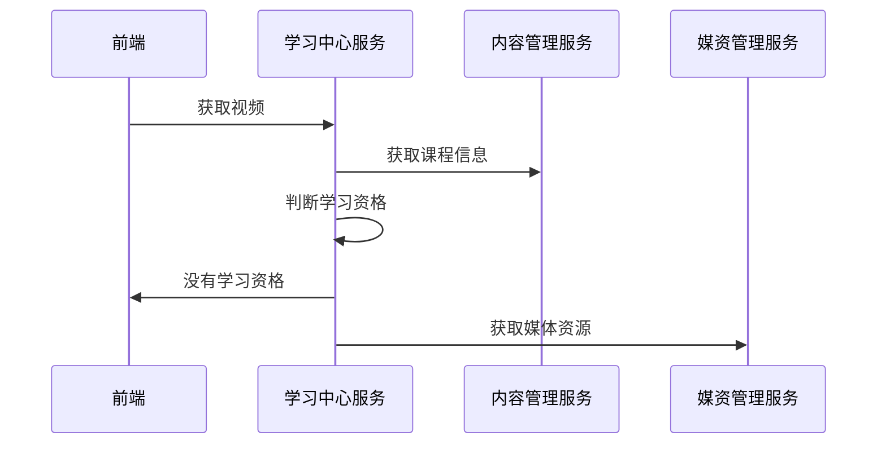

# 学成在线Day13

# 在线学习

## 需求分析

用户通过课程详情界面点击马上学习 进入 视频插放界面进行视频点播。

获取视频资源时进行学习资格校验，如下图:


拥有学习资格则继续播放视频，不具有学习资格则引导去购买、续期等操作。

如何判断是否拥有学习资格？

首先判断是否为试学视频，如果为试学视频则可以正常学习。

如果为非试学课程首先判断用户是否登录，如果已登录则判断是否选课，如果已经选课且没有过期可以正常学习。

详细流程如下图:


## **查询课程信息**

在视频点播页面需要查询课程信息，课程上线后也需要访问/api/content/course/whole/{courseId}

课程预览时请求获取课程的接口为：/open/content/course/whole/{courseId}

在nginx中进行配置：

/open、/api在nginx的配置如下：(已经配置的不要重复配置)

```properties
location /api/ {
        proxy_pass http://gatewayserver/;
} 
#openapi
location /open/content/ {
        proxy_pass http://gatewayserver/content/open/;
} 
location /open/media/ {
        proxy_pass http://gatewayserver/media/open/;
} 
```

下边实现/api/content/course/whole/{courseId} 获取课程发布信息接口。

进入内容管理服务api工程CoursePublishController 类，定义查询课程预览信息接口如下：

```java
@ApiOperation("获取课程发布信息")
@ResponseBody
@GetMapping("/course/whole/{courseId}")
public CoursePreviewDTO getCoursePublish(@PathVariable("courseId") Long courseId) {
    //封装数据
    CoursePreviewDTO coursePreviewDTO = new CoursePreviewDTO();
    //查询课程发布表
    CoursePublish coursePublish = coursePublishService.getCoursePublish(courseId);
    if(coursePublish == null){
        return coursePreviewDTO;
    }
    //向dto中封装数据
    CourseBaseInfoDTO courseBaseInfoDTO = new CourseBaseInfoDTO();
    BeanUtils.copyProperties(coursePublish, courseBaseInfoDTO);
    coursePreviewDTO.setCourseBase(courseBaseInfoDTO);
    //查询课程计划
    //从CouseBaseInfoDTO中获取课程计划
    String teachPlanJson = coursePublish.getTeachplan();
    List<TeachplanDTO> teachplanDTOS = JSON.parseArray(teachPlanJson, TeachplanDTO.class);
    coursePreviewDTO.setTeachPlans(teachplanDTOS);
    return coursePreviewDTO;
}
```

重启内容管理服务，进入学习界面查看课程计划、课程名称等信息是否显示正常。

## 获取视频

### 需求分析



### 接口定义

```java
@Api(value = "学习过程管理接口", tags = "学习过程管理接口")
@Slf4j
@RestController
public class MyLearningController {

    @Autowired
    LearningService learningService;

    @ApiOperation("获取视频")
    @GetMapping("/open/learn/getvideo/{courseId}/{teachplanId}/{mediaId}")
    public RestResponse<String> getvideo(@PathVariable("courseId") Long courseId, @PathVariable("teachplanId") Long teachplanId, @PathVariable("mediaId") String mediaId) {
        SecurityUtil.XcUser user = SecurityUtil.getUser();
        String userId = null;
        if (user != null) {
            userId = user.getId();
        }
        //调用媒资服务查询视频播放地址
        return learningService.getVideo(userId, courseId, teachplanId, mediaId);
    }
}
```

定义service接口

```java
/**
 * @author Wwh
 * @ProjectName xuecheng-plus-project
 * @dateTime 2024/3/10 16:13
 * @description 在线学习相关接口
 **/
public interface LearningService {
    /**
     * 获取视频
     * @param userId     用户id
     * @param courseId   课程id
     * @param teachplanId 计划id
     * @param mediaId    媒体id
     * @return RestResponse<String> 视频播放地址
     */
    RestResponse<String> getVideo(String userId, Long courseId, Long teachplanId, String mediaId);
}
```

### 获取视频远程接口

在学习中心服务service工程中定义媒资管理Feignclient

```java
@FeignClient(value = "media-api", fallbackFactory = MediaServiceClientFallbackFactory.class)
@RequestMapping("/media")
public interface MediaServiceClient {
    @GetMapping("/open/preview/{mediaId}")
    RestResponse<String> getPlayUrlByMediaId(@PathVariable("mediaId") String mediaId);
}
```

定义降级类

```java
@Slf4j
@Component
public class MediaServiceClientFallbackFactory implements FallbackFactory<MediaServiceClient> {
    @Override
    public MediaServiceClient create(Throwable throwable) {
        return mediaId -> {
            log.error("远程调用媒资管理服务熔断异常：{}", throwable.getMessage());
            return null;
        };
    }
}
```

### 学习资格校验

```java
@Override
public RestResponse<String> getVideo(String userId, Long courseId, Long teachplanId, String mediaId) {
    //查询课程信息
    CoursePublish coursepublish = contentServiceClient.getCoursepublish(courseId);
    if ( coursepublish == null ) {
        return RestResponse.validfail("课程信息不存在");
    }
    //远程调用内容管理服务根据课程计划ID查询课程计划,如果is_preview为1则支持试学
    //也可以从coursepublish解析出课程计划是否支持试学

    //1.判断是否登录
    if ( StringUtil.isNotEmpty(userId) ) {

        //获取学习资格
        //学习资格，[{"code":"702001","desc":"正常学习"},{"code":"702002","desc":"没有选课或选课后没有支付"},{"code":"702003","desc":"已过期需要申请续期或重新支付"}]
        XcCourseTablesDto learning = myCourseTableService.getLearningStatus(userId, courseId);
        String learnStatus = learning.getLearnStatus();
        if ( "702002".equals(learnStatus) ) {
            return RestResponse.validfail("无法学习,没有选课或选课后没有支付");
        } else if ( "702003".equals(learnStatus) ) {
            return RestResponse.validfail("无法学习,已过期需要申请续期或重新支付");
        } else {
            //远程调用媒资获取视频播放地址
            return mediaServiceClient.getPlayUrlByMediaId(mediaId);
        }
    }
    //2.如果用户没有登录
    //查询课程信息判断是否为免费课程
    String charge = coursepublish.getCharge();
    if ( "201000".equals(charge) ) {
        //免费课程
        //远程调用媒资获取视频播放地址
        return mediaServiceClient.getPlayUrlByMediaId(mediaId);
    }
    return RestResponse.validfail("课程需要购买");
}
```

### 测试

1. 完善接口

```java
@ApiOperation("获取视频")
@GetMapping("/open/learn/getvideo/{courseId}/{teachplanId}/{mediaId}")
public RestResponse<String> getvideo(@PathVariable("courseId") Long courseId, @PathVariable("teachplanId") Long teachplanId, @PathVariable("mediaId") String mediaId) {
    SecurityUtil.XcUser user = SecurityUtil.getUser();
    String userId = null;
    if (user != null) {
        userId = user.getId();
    }
    //调用媒资服务查询视频播放地址
    return learningService.getVideo(userId, courseId, teachplanId, mediaId);
}
```

2. 测试准备

   选课成功一门课程。

   没有选课的免费课程、收费课程各一门，其中收费课程具有试学课程。

3. 
   1. 选课成功的课程是否可以正常获取视频

   2. 免费课程没有选课是否可以正常学习

   可修改选课记录表中的课程id为不存在进行测试，测试完再恢复原样。

   3. 收费课程没有选课是否可以正常学习

   可修改选课记录表中的课程id为不存在进行测试，测试完再恢复原样。

