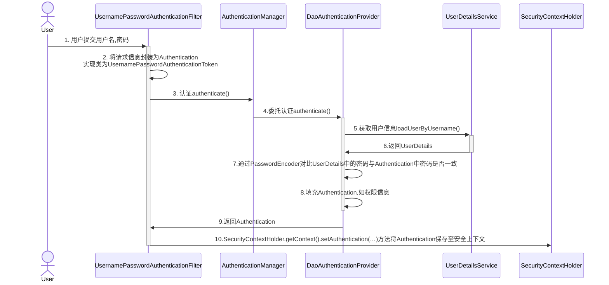

# 将项目拆分成内容管理服务、媒资管理服务、搜索服务、订单支付服务、 学习中心服务、系统管理服务、认证授权服务、网关 服务、注册中心服务、配置中心服务，并在nacos注册，使用Feign进行互相调用

首先定义接口

```java
@FeignClient(value = "media-api",
             configuration = {MultipartSupportConfig.class},
             fallbackFactory = MediaServiceClientFallbackFactory.class)
public interface MediaServiceClient {

    @PostMapping(value = "/media/upload/coursefile",
                 consumes = MediaType.MULTIPART_FORM_DATA_VALUE)
    String upload(@RequestPart("filedata") MultipartFile file,
                  @RequestParam(value = "objectName", required = false) String objectName) throws Exception;
}
```

降级工厂定义如下，相较于`fallback`它的优势是可以返回错误信息。

```java
@Component
@Slf4j
public class MediaServiceClientFallbackFactory implements FallbackFactory<MediaServiceClient> {
    //发生熔断时上级服务会调用此方法
    //拿到当时熔断异常信息
    @Override
    public MediaServiceClient create(Throwable throwable) {
        return new MediaServiceClient() {
            @Override
            public String upload(MultipartFile file, String objectName) throws Exception {
                log.info("远程调用文件上传接口触发熔断异常信息：{}",throwable.toString(),throwable);
                return null;
            }
        };
    }
}
```

`fallback`定义如下

```java
public class MediaServiceClientFallback implements MediaServiceClient{
    @Override
    public String upload(MultipartFile file, String objectName) throws Exception {
        return null;
    }
}
```

在课程发布服务中被调用，内容如下

```java
@Override
public void uploadCourseHtml(Long courseId, File file) {
    try {
        MultipartFile multipartFile = MultipartSupportConfig.getMultipartFile(file);
        String upload = mediaServiceClient.upload(multipartFile, "course/" + courseId + ".html");
        if ( StringUtils.isEmpty(upload) ) {
            log.info("远程调用走降级逻辑,上传结果为null,课程id:{}", courseId);
            XueChengPlusException.cast("上传课程静态化页面失败");
        }
    } catch (Exception e) {
        e.printStackTrace();
        XueChengPlusException.cast("上传课程静态化页面失败");
    }
}
```

# 完成认证授权模块，支持微信，扫码等多种登录方式，使用Sprint Security整合OAuth和JWT完成统一认证。

Sprint Security登录流程图



用户提交账号和密码由DaoAuthenticationProvider调用UserDetailsService的loadUserByUsername()方法获取UserDetails用户信息。

UserDetailService是一个接口：

```java
public interface UserDetailsService {
    UserDetails loadUserByUsername(String var1) throws UsernameNotFoundException;
}
```

UserDetails是用户信息接口:

```java
public interface UserDetails extends Serializable {
    Collection<? extends GrantedAuthority> getAuthorities();

    String getPassword();

    String getUsername();

    boolean isAccountNonExpired();

    boolean isAccountNonLocked();

    boolean isCredentialsNonExpired();

    boolean isEnabled();
}
```

我们只要实现UserDetailsService 接口查询数据库得到用户信息返回UserDetails 类型的用户信息即可,框架调用loadUserByUsername()方法拿到用户信息之后是如何执行的，见下图：


我们需要扩展用户身份的信息，在jwt令牌中存储用户的昵称、头像、qq等信息。

如何扩展Spring Security的用户身份信息呢？

在认证阶段DaoAuthenticationProvider会调用UserDetailService查询用户的信息，这里是可以获取到齐全的用户信息的。由于JWT令牌中用户身份信息来源于UserDetails，UserDetails中仅定义了username为用户的身份信息，这里有两个思路：

1. 是可以扩展UserDetails，使之包括更多的自定义属性

2. 也可以扩展username的内容 ，比如存入json数据内容作为username的内容。相比较而言，方案二比较简单还不用破坏UserDetails的结构，我们采用方案二。


```java
@Override
public UserDetails loadUserByUsername(String s) throws UsernameNotFoundException {
    //查询数据库
    XcUser xcUser = xcUserMapper.selectOne(new LambdaQueryWrapper<XcUser>().eq(XcUser::getUsername, s));

    //查询用户不存在,返回null即可,spring security同时抛出异常提示用户不存在
    if ( xcUser == null ) {
        return null;
    }
    //如果查到了正确的用户拿到了正确的密码,返回UserDetails对象给spring security框架,由框架进行密码比对
    String password = xcUser.getPassword();
    //权限
    String[] authorities = {"test"};
    xcUser.setPassword(null);
    //将用户信息转json
    String userJson = JSON.toJSONString(xcUser);
    UserDetails userDetails = User
        .builder()
        .username(userJson)
        .password(password)
        .authorities(authorities).build();
    return userDetails;
}
```
